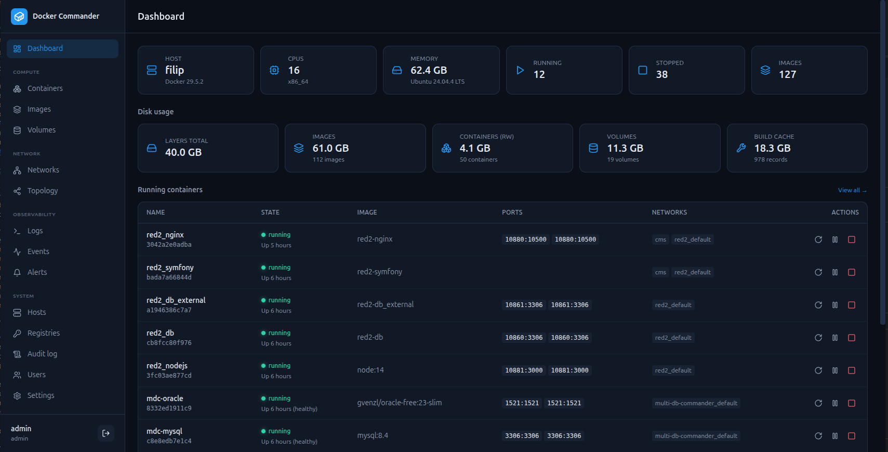
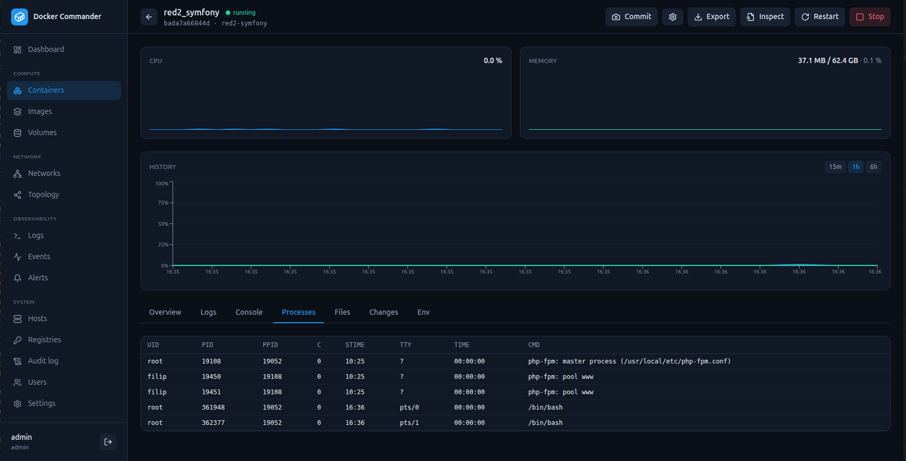
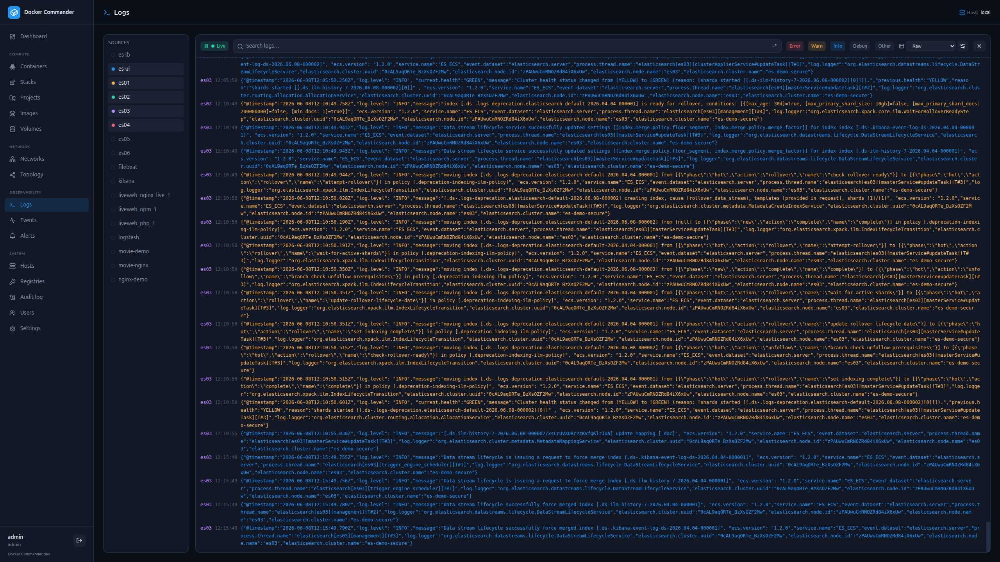

# 🐳 Docker Commander

A self-hosted, open-source **Docker monitoring & control panel** with an
enterprise-grade UI — monitor containers in real time, control their full
lifecycle, browse logs and files, manage images, networks and volumes, alert on
problems, and administer it all from one binary.

> **One Go binary** with the web UI embedded. No external database, no runtime
> dependencies, CGO-free. Runs on **Linux, macOS and Windows**.

<!-- Add badges here once CI/releases are live, e.g. build status + latest release. -->

---

## 📸 Screenshots

**Dashboard** — host overview, disk usage, and running containers at a glance.



**Container detail** — live CPU / memory with history, and tabs for logs, an
interactive console, processes, the file browser, filesystem changes and env.



**Aggregated logs** — many containers in one stream, color-coded by source with
level filters, regex search and structured parsing.



## ✨ Features

**Monitor**
- Live **CPU / memory graphs** over WebSockets and **historical charts** (Redis or in-memory).
- **Logs** — per-container tail, plus a global **aggregated** view with level detection, **regex search** and saved **parsing rules** that turn lines into structured columns.
- Live **events** feed, container **diff** / **top**, **disk usage**, and raw JSON **inspect** for any object.
- **Networks & topology** — an interactive containers ↔ networks graph (pan / zoom / fullscreen, filters).

**Control**
- Containers: **create/run**, start/stop/restart/pause/kill, **rename**, **update** limits & restart policy, **commit** to an image, and an interactive **shell** (xterm.js).
- **File browser** inside containers — list, download, upload, delete (`docker cp`).
- Images: pull (live progress), build, push, tag, save/load/import, history, prune.
- Volumes & networks: list, inspect, create, remove, prune (see which containers use each volume).

**Multi-host**
- Manage **local**, **TCP(+TLS)** and **SSH** daemons; SSH **host keys are verified** (known_hosts / trust-on-first-use). Every view rebinds to the selected host, and the alert engine watches **all** hosts.

**Alerting & integrations**
- Rules on **state**, **resource thresholds**, **log patterns** and **restart/crash-loops** — editable, with severity & cooldown.
- Notify via **webhooks**, **email (SMTP, per-host routing)**, an in-app feed, and a **Prometheus `/metrics`** exporter.

**Security & administration**
- **Argon2id** passwords + **TOTP 2FA** (optionally exempt for localhost), rate limiting, strict headers, signed `HttpOnly` cookies.
- **Multi-user** with **roles**, **per-section permissions**, **read-only** mode, global **feature flags**, and an **audit log**.
- Optional **LDAP / Active Directory** login with auto-provisioning. Registry / SMTP / LDAP secrets are **encrypted at rest** (AES-256-GCM).

## 🏗️ Architecture

```
React + TypeScript SPA  ──REST──▶  Go backend  ──Docker Engine API──▶  dockerd
   (Tailwind, Recharts)  ◀─WebSocket (live stats + logs)─┘
```

The Go server embeds the built SPA (`go:embed`) and serves everything from one
origin, so the production artifact is a single executable.

| Layer    | Technology |
|----------|------------|
| Backend  | Go, [chi](https://github.com/go-chi/chi), [coder/websocket](https://github.com/coder/websocket), official Docker SDK |
| Storage  | SQLite via [modernc.org/sqlite](https://modernc.org/sqlite) (pure Go, no CGO); metric history in Redis or memory |
| Auth     | Argon2id, TOTP ([pquerna/otp](https://github.com/pquerna/otp)), JWT, optional LDAP |
| Frontend | React, TypeScript, Vite, Tailwind CSS, Recharts, React Flow, xterm.js |

## 🚀 Quick start

### Option A — download a release binary

Grab the binary for your OS/arch from the [Releases](../../releases) page, then:

```bash
chmod +x dockercmd-linux-amd64
./dockercmd-linux-amd64           # serves on http://127.0.0.1:8080
```

On Windows, run `dockercmd-windows-amd64.exe` from a terminal.

### Option B — build from source

Requires **Go ≥ 1.25**, **Node.js ≥ 18** (to build the UI) and a running Docker
daemon. See [Building](#-building) for per-OS details.

```bash
git clone https://github.com/koduj-dev/docker-commander.git
cd docker-commander
make build      # builds the UI, then the binary with the UI embedded
./dockercmd     # http://127.0.0.1:8080
```

Open <http://127.0.0.1:8080>, create the admin account, scan the QR code to
enable 2FA — done.

## ⚙️ Configuration

Every option is a flag with an environment-variable equivalent (handy with the
[`.env.example`](.env.example) + systemd). The Docker connection also honours
the standard `DOCKER_HOST` / `DOCKER_CERT_PATH` variables.

| Flag                 | Env                    | Default            | Description |
|----------------------|------------------------|--------------------|-------------|
| `-addr`              | `DC_ADDR`              | `127.0.0.1:8080`   | Listen address. Bind beyond loopback only deliberately. |
| `-data-dir`          | `DC_DATA_DIR`          | OS config dir      | SQLite DB + signing/encryption keys. |
| `-session-ttl`       | —                      | `12h`              | Session token lifetime. |
| `-dev`               | `DC_DEV=1`             | off                | Dev mode: API only + permissive CORS for Vite. |
| `-metrics-token`     | `DC_METRICS_TOKEN`     | (open)             | If set, `/metrics` needs `Authorization: Bearer <token>` (or `?token=`). |
| `-redis-addr`        | `DC_REDIS_ADDR`        | (memory)           | Redis `host:port` for metric history; empty = in-memory ring. |
| `-redis-password`    | `DC_REDIS_PASSWORD`    | (empty)            | Redis password; `DC_REDIS_DB` selects the DB index. |
| `-metrics-retention` | `DC_METRICS_RETENTION` | `6h`               | History retention (e.g. `30m`, `24h`). |

## 🖥️ Run as a service (Linux / systemd)

The server keeps monitoring, alerting and metric history running 24/7 whether or
not a browser is connected — on a server, run it under systemd:

```bash
sudo install -m755 dockercmd /usr/local/bin/dockercmd
sudo useradd --system --no-create-home --shell /usr/sbin/nologin dockercmd
sudo usermod -aG docker dockercmd
sudo install -d /etc/dockercmd && sudo cp deploy/dockercmd.env.example /etc/dockercmd/dockercmd.env   # edit
sudo cp deploy/dockercmd.service /etc/systemd/system/
sudo systemctl daemon-reload && sudo systemctl enable --now dockercmd
```

It binds to loopback by default — put it behind a TLS reverse proxy (nginx,
Caddy) to expose it, and keep the **localhost 2FA exemption off** on servers.

## 🔨 Building

The UI is built with Node and embedded into the Go binary; the result is a
single CGO-free static executable.

```bash
make build          # current platform → ./dockercmd
make release        # cross-compile all platforms → dist-bin/ (+ SHA256SUMS)
make test vet       # tests + static checks
VERSION=v1.0.0 make release   # stamp the version into the binary
```

Per OS (building **from source** — end users can just download a release):

| Host OS | Notes |
|---------|-------|
| **Linux**   | `make build`. Default target for releases. |
| **macOS**   | `make build` (Intel or Apple Silicon). Cross-compiles to both `darwin/amd64` and `darwin/arm64`. |
| **Windows** | Use WSL or Git Bash for `make`, or run the two steps manually: `cd web && npm ci && npm run build` then `go build -o dockercmd.exe ./cmd/dockercmd`. Releases ship `windows/amd64` + `windows/arm64` `.exe`. |

`make release` builds `linux/{amd64,arm64}`, `darwin/{amd64,arm64}` and
`windows/{amd64,arm64}` from any host (no C toolchain needed).

## 🧑‍💻 Development

```bash
make dev                       # API on :8080 (dev mode)
cd web && npm install && npm run dev   # UI on :5173, proxies /api → :8080
```

## 📈 Monitoring & alerting

Define rules on the **Alerts** screen:

| Type       | Fires when… |
|------------|-------------|
| `state`    | a container emits a lifecycle event (die, kill, oom, stop, unhealthy) |
| `resource` | CPU% or MEM% crosses a threshold for N seconds |
| `log`      | a log line matches a substring / regex |
| `restart`  | a container restarts too often within a window (crash loop) |

Rules target containers by name substring, carry a severity + cooldown, and can
notify webhooks (Go-template bodies) and/or email. **Prometheus:** scrape
`/metrics` for `dockercmd_container_cpu_percent`, `_mem_bytes`, `_mem_percent`,
`_container_running` (labelled by `id`, `name`, `host`).

## 🔒 Security notes

- Local-by-default (binds to loopback). Behind a server, terminate TLS at a reverse proxy.
- **2FA is enforced everywhere** unless an admin enables the *localhost exemption* (Settings), which trusts `RemoteAddr` only — keep it **off** behind a proxy.
- **SSH hosts** verify the daemon host key (known_hosts / trust-on-first-use); a changed key is refused as a possible MITM.
- Signing key and at-rest encryption key are generated on first run and stored in the data dir; stored secrets are never returned by the API.

## 📚 Documentation

A per-feature user manual lives in **[docs/](docs/README.md)** — one page per
agenda (Containers, Images, Logs, Alerts, Hosts, Users, Settings…) plus
[Getting started](docs/getting-started.md) and [Deployment](docs/deployment.md).

## 🗺️ Roadmap

See **[NEXT.md](./NEXT.md)** for the current status and future ideas.

## 📄 License

[MIT](./LICENSE).
