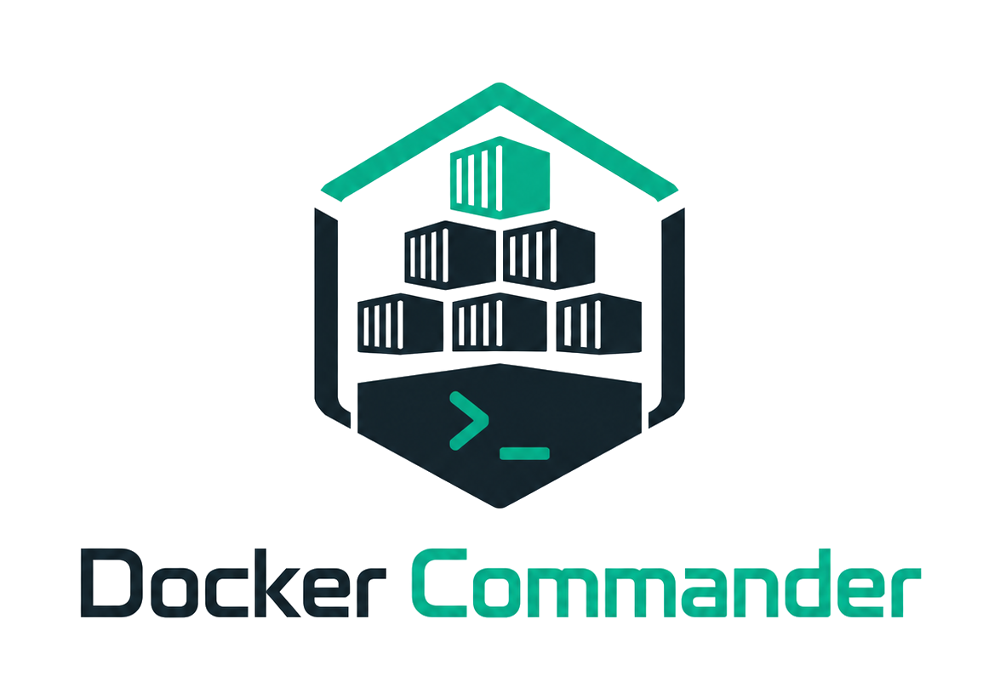

<p align="center">
  
</p>

A self-hosted, open-source **Docker monitoring & control panel** with an
enterprise-grade UI — monitor containers in real time, control their full
lifecycle, browse logs and files, manage images, networks and volumes, alert on
problems, and administer it all from one binary.

> **One Go binary** with the web UI embedded. No external database, no runtime
> dependencies, CGO-free. Runs on **Linux, macOS and Windows**.

[](https://github.com/koduj-dev/docker-commander/actions/workflows/ci.yml)
[](https://github.com/koduj-dev/docker-commander/releases)
[](https://goreportcard.com/report/github.com/koduj-dev/docker-commander)
[](go.mod)
[](LICENSE)

---

## 📸 Screenshots

**Dashboard** — host overview, disk usage, and running containers at a glance.


**Container detail** — live CPU / memory with history, and tabs for logs, an
interactive console, processes, the file browser, filesystem changes and env.


**Aggregated logs** — many containers in one stream, color-coded by source with
level filters, regex search and structured parsing.


## ✨ Features

**Monitor**
- Live **CPU / memory graphs** over WebSockets and **historical charts** (Redis or in-memory).
- **Dashboard** that updates in near real time (Docker events stream): host facts, disk usage, a **resource breakdown** (each container's share of host CPU/memory), and a **port scan** that fingerprints what's actually listening.
- **Logs** — per-container tail, plus a global **aggregated** view with level detection, **regex search** and saved **parsing rules** that turn lines into structured columns.
- Live **events** feed, container **diff** / **top**, **disk usage**, and raw JSON **inspect** for any object.
- **Networks & topology** — an interactive containers ↔ networks graph (force-directed, pan / zoom / fullscreen, **search**, **filter by compose stack**) with a compact **list view** (state, image, stack, ports, networks).

**Control**
- Containers: **create/run**, start/stop/restart/pause/kill, **rename**, **update** limits & restart policy, **commit** to an image, and an interactive **shell** (xterm.js).
- **File browser** inside containers **and volumes** — list, download, upload (incl. **upload & extract** a `.zip`/`.tar`/`.tar.gz`), delete, create folders.
- Images: pull (live progress), build, push, tag, save/load/import, history, prune.
- Volumes & networks: list, inspect, create, remove, prune; networks also **connect / disconnect** containers, with a per-network detail (graph or list).
- **Compose** — discover & manage **Stacks** by label (CLI-created ones too: start/stop/restart/remove, view compose file), and **Projects**: managed compose *folders* edited in a built-in **code editor** (CodeMirror) with **live, inline validation** — compose (anchors/`${VAR}`-aware), **Dockerfile** (`docker build --check`), YAML/JSON/`.env` — plus a **Resolved** preview, a services/ports **Summary**, **templates**, and **deploy via the `docker compose` CLI** with **profiles** and `.zip` import/export.

**Multi-host**
- Manage **local**, **TCP(+TLS)** and **SSH** daemons; SSH **host keys are verified** (known_hosts / trust-on-first-use). Every view rebinds to the selected host, and the alert engine watches **all** hosts. A per-host **detail** panel shows the hardware / OS / engine, and a host can be **disabled** to take it out of monitoring (e.g. an offline laptop).

**Alerting & integrations**
- Rules on **state**, **resource thresholds**, **log patterns** and **restart/crash-loops** — editable, with severity & cooldown.
- Notify via **webhooks**, **email (SMTP, per-host routing)**, an in-app feed, and a **Prometheus `/metrics`** exporter.

**Remote control from AI tools (MCP)**
- An optional, **off-by-default** **Model Context Protocol** server lets AI tools (**Claude Code**, **Claude Desktop**, **Cursor**) **monitor and *safely* operate** Docker **as you**: read tools (containers, logs, images, projects, stats, events, audit…) plus *safe* control (**start/stop/restart**, **deploy/down**), with MCP **resources** & **prompts**.
- Authenticate with a **bearer API token** (self-service page) or **OAuth 2.1** (PKCE, dynamic client registration). Every call reuses the app's **RBAC**, and a token can only **narrow** your rights (a section subset + **read-only**). Deliberately **no exec / image export / file read / prune / remove**. See [MCP](docs/mcp.md).

**Security & administration**
- **Argon2id** passwords + **TOTP 2FA** (optionally exempt for localhost), rate limiting, strict headers, signed `HttpOnly` cookies.
- **Multi-user** with **roles**, **per-section permissions**, **read-only** mode, global **feature flags**, and an **audit log**. Per-user UI preferences (filters) follow the account across browsers.
- Optional **LDAP / Active Directory** login with auto-provisioning. Registry / SMTP / LDAP secrets are **encrypted at rest** (AES-256-GCM).

**Ops**
- Single CGO-free binary, embedded UI, systemd unit, config file, **native HTTPS** (or behind a proxy), `/healthz` probe, and structured alert logging to the journal/syslog. See [Deployment](docs/deployment.md).
- **Self-update** — an admin "update available" banner and a `dockercmd --self-upgrade` command (SHA-256-verified, atomic binary replace).

## 🏗️ Architecture

```
React + TypeScript SPA  ──REST──▶  Go backend  ──Docker Engine API──▶  dockerd
   (Tailwind, Recharts)  ◀─WebSocket (live stats + logs)─┘
```

The Go server embeds the built SPA (`go:embed`) and serves everything from one
origin, so the production artifact is a single executable.

| Layer    | Technology |
|----------|------------|
| Backend  | Go, [chi](https://github.com/go-chi/chi), [coder/websocket](https://github.com/coder/websocket), official Docker SDK |
| Storage  | SQLite via [modernc.org/sqlite](https://modernc.org/sqlite) (pure Go, no CGO); metric history in Redis or memory |
| Auth     | Argon2id, TOTP ([pquerna/otp](https://github.com/pquerna/otp)), JWT, optional LDAP |
| Frontend | React, TypeScript, Vite, Tailwind CSS, Recharts, React Flow, xterm.js |

## 🚀 Quick start

### Option A — download a release binary

Grab the binary for your OS/arch from the [Releases](../../releases) page, then:

```bash
chmod +x dockercmd-linux-amd64
./dockercmd-linux-amd64           # serves on http://127.0.0.1:8470
```

On Windows, run `dockercmd-windows-amd64.exe` from a terminal.

### Option B — build from source

Requires **Go ≥ 1.25**, **Node.js ≥ 18** (to build the UI) and a running Docker
daemon. See [Building](#-building) for per-OS details.

```bash
git clone https://github.com/koduj-dev/docker-commander.git
cd docker-commander
make build      # builds the UI, then the binary with the UI embedded
./dockercmd     # http://127.0.0.1:8470
```

### Option C — Docker

```bash
docker run -d --name dockercmd \
  -p 127.0.0.1:8470:8470 \
  --group-add "$(stat -c '%g' /var/run/docker.sock 2>/dev/null || stat -f '%g' /var/run/docker.sock)" \
  --read-only --tmpfs /tmp \
  --security-opt no-new-privileges \
  --cap-drop ALL \
  -v /var/run/docker.sock:/var/run/docker.sock \
  -v dockercmd-data:/data \
  ghcr.io/koduj-dev/docker-commander:latest
```

Multi-arch (amd64/arm64), distroless, runs as a **non-root** user with a
**read-only** root filesystem and **no added capabilities**. Notes:

- **⚠️ Mounting the Docker socket grants host-root-equivalent access** — whoever
  reaches the UI (or escapes the app) controls the daemon, i.e. the host. Keep
  the UI on **localhost** (as above) or behind **HTTPS + strong auth**; never
  expose it unauthenticated. The `--group-add` line gives the non-root user the
  **owning GID of the Docker socket** — read from `/var/run/docker.sock` itself
  (`stat`, with a BSD fallback), so it works even without a `docker` group. On
  **rootless / Docker Desktop**, where the socket is owned by your user, drop the
  `--group-add` line.
- Data lives in the named volume `dockercmd-data` (a fresh one inherits the
  right ownership). A **bind mount** (`-v /srv/dc:/data`) must be writable by uid
  **65532** first: `sudo chown 65532:65532 /srv/dc`.
- In production, pin an **immutable digest** (`...@sha256:…`) instead of
  `:latest`, and verify the image (see below).

### Option D — `go install`

```bash
go install github.com/koduj-dev/docker-commander/cmd/dockercmd@latest
```

Installs to `$(go env GOPATH)/bin/dockercmd`. (Built this way the version reports
`dev`; the release binaries and the image carry the real version.)

### Verifying a download

Every release ships a `SHA256SUMS` plus a keyless **cosign** signature
(`SHA256SUMS.sig` / `.pem`) covering the binaries **and** the SPDX **SBOM**, plus
per-binary build **provenance**:

```bash
sha256sum -c SHA256SUMS --ignore-missing        # checksums (binaries + SBOM)

cosign verify-blob --certificate SHA256SUMS.pem --signature SHA256SUMS.sig \
  --certificate-identity-regexp '^https://github\.com/koduj-dev/docker-commander/\.github/workflows/release\.yml@refs/tags/v' \
  --certificate-oidc-issuer https://token.actions.githubusercontent.com SHA256SUMS

gh attestation verify dockercmd-linux-amd64 --repo koduj-dev/docker-commander
```

The container image is signed and carries SLSA provenance + an SBOM as well:

```bash
# verify the exact digest you'll run (copy it from the release notes or
# `docker buildx imagetools inspect ghcr.io/koduj-dev/docker-commander:1.4.0`):
IMAGE=ghcr.io/koduj-dev/docker-commander@sha256:<digest>
cosign verify "$IMAGE" \
  --certificate-identity-regexp '^https://github\.com/koduj-dev/docker-commander/\.github/workflows/release\.yml@refs/tags/v' \
  --certificate-oidc-issuer https://token.actions.githubusercontent.com

gh attestation verify "oci://$IMAGE" --repo koduj-dev/docker-commander
```

Open <http://127.0.0.1:8470>, create the admin account, scan the QR code to
enable 2FA — done.

## ⚙️ Configuration

Every option is a flag with an environment-variable equivalent, and can also
live in a config file — see
[`deploy/commander.conf.example`](deploy/commander.conf.example) for the full
list. The Docker connection also honours the standard `DOCKER_HOST` /
`DOCKER_CERT_PATH` variables.

| Flag                 | Env                    | Default            | Description |
|----------------------|------------------------|--------------------|-------------|
| `-host`              | `DC_HOST`              | `127.0.0.1`        | Listen host/interface. Use `0.0.0.0` to bind all (deliberate). |
| `-port` / `-p`       | `DC_PORT`              | `8470`             | Listen port. |
| `-addr`              | `DC_ADDR`              | (unset)            | Legacy full `host:port`; overrides `-host`/`-port`. |
| `-tls-cert`          | `DC_TLS_CERT`          | (off)              | PEM certificate path; with `-tls-key`, serves **HTTPS** directly. |
| `-tls-key`           | `DC_TLS_KEY`           | (off)              | PEM private-key path. |
| `-mcp-enabled`       | `DC_MCP_ENABLED=1`     | off                | Enable the remote **MCP** server for AI tools. Off by default; serve behind HTTPS. See [MCP](docs/mcp.md). |
| `-mcp-public-url`    | `DC_MCP_PUBLIC_URL`    | (unset)            | Externally reachable base URL (`https://host`) — required for the MCP **OAuth** flow (bearer tokens work without it). |
| `-data-dir`          | `DC_DATA_DIR`          | OS config dir      | SQLite DB + signing/encryption keys. |
| `-session-ttl`       | —                      | `12h`              | Session token lifetime. |
| `-dev`               | `DC_DEV=1`             | off                | Dev mode: API only + permissive CORS for Vite. |
| `-metrics-token`     | `DC_METRICS_TOKEN`     | (open)             | If set, `/metrics` needs `Authorization: Bearer <token>` (or `?token=`). |
| `-redis-addr`        | `DC_REDIS_ADDR`        | (memory)           | Redis `host:port` for metric history; empty = in-memory ring. |
| `-redis-password`    | `DC_REDIS_PASSWORD`    | (empty)            | Redis password; `DC_REDIS_DB` selects the DB index. |
| `-metrics-retention` | `DC_METRICS_RETENTION` | `6h`               | History retention (e.g. `30m`, `24h`). |

## 🖥️ Run as a service

The server keeps monitoring, alerting and metric history running 24/7 whether or
not a browser is connected — so run it as a background service. On Linux/macOS
the binary installs itself:

```bash
sudo ./dockercmd --install-service     # Linux — systemd (needs root)
./dockercmd --install-service          # macOS — launchd LaunchAgent (your user, not sudo)
```

It creates a dedicated user, writes the (hardened) service definition and starts
it. On Windows, or to read exactly what gets installed, use the equivalent
scripts in [`deploy/`](deploy/):

```bash
sudo ./deploy/install-linux.sh ./dockercmd                  # Linux  — systemd
./deploy/install-macos.sh ./dockercmd                       # macOS  — launchd
.\deploy\install-windows.ps1 -BinPath .\dockercmd.exe       # Windows — Scheduled Task (elevated PowerShell)
```

See **[Deployment](docs/deployment.md)** for what each installer does, the manual
systemd steps, HTTPS, logging and the config reference.

It binds to loopback by default — put it behind a TLS reverse proxy (nginx,
Caddy) to expose it, and keep the **localhost 2FA exemption off** on servers.

## 🔨 Building

The UI is built with Node and embedded into the Go binary; the result is a
single CGO-free static executable.

```bash
make build          # current platform → ./dockercmd
make release        # cross-compile all platforms → dist-bin/ (+ SHA256SUMS)
make test vet       # tests + static checks
VERSION=v1.0.0 make release   # stamp the version into the binary
```

Per OS (building **from source** — end users can just download a release):

| Host OS | Notes |
|---------|-------|
| **Linux**   | `make build`. Default target for releases. |
| **macOS**   | `make build` (Intel or Apple Silicon). Cross-compiles to both `darwin/amd64` and `darwin/arm64`. |
| **Windows** | Use WSL or Git Bash for `make`, or run the two steps manually: `cd web && npm ci && npm run build` then `go build -o dockercmd.exe ./cmd/dockercmd`. Releases ship `windows/amd64` + `windows/arm64` `.exe`. |

`make release` builds `linux/{amd64,arm64}`, `darwin/{amd64,arm64}` and
`windows/{amd64,arm64}` from any host (no C toolchain needed).

## 🧑‍💻 Development

```bash
make dev                       # API on :8470 (dev mode)
cd web && npm install && npm run dev   # UI on :5173, proxies /api → :8470
```

### Tests

```bash
go test -short ./...   # fast unit tests (what CI runs)
go test ./...          # + integration tests — needs a local Docker daemon
                       #   (spins throwaway Redis / OpenLDAP / MailHog containers)
```

## 📈 Monitoring & alerting

Define rules on the **Alerts** screen:

| Type       | Fires when… |
|------------|-------------|
| `state`    | a container emits a lifecycle event (die, kill, oom, stop, unhealthy) |
| `resource` | CPU% or MEM% crosses a threshold for N seconds |
| `log`      | a log line matches a substring / regex |
| `restart`  | a container restarts too often within a window (crash loop) |

Rules target containers by name substring, carry a severity + cooldown, and can
notify webhooks (Go-template bodies) and/or email. **Prometheus:** scrape
`/metrics` for `dockercmd_container_cpu_percent`, `_mem_bytes`, `_mem_percent`,
`_container_running` (labelled by `id`, `name`, `host`).

## 🔒 Security notes

- Local-by-default (binds to loopback). Behind a server, terminate TLS at a reverse proxy.
- **2FA is enforced everywhere** unless an admin enables the *localhost exemption* (Settings), which trusts `RemoteAddr` only — keep it **off** behind a proxy.
- **SSH hosts** verify the daemon host key (known_hosts / trust-on-first-use); a changed key is refused as a possible MITM.
- Signing key and at-rest encryption key are generated on first run and stored in the data dir; stored secrets are never returned by the API.
- The **MCP server is off by default** (`DC_MCP_ENABLED`); when on, it's bearer/OAuth-authenticated, reuses the app's RBAC (with per-token **read-only** / section scope), and exposes only reads + *safe* control — no exec, image export, file reads or prune/remove. See [MCP](docs/mcp.md).

## 📚 Documentation

A per-feature user manual lives in **[docs/](docs/README.md)** — one page per
agenda (Containers, Images, Logs, Alerts, Hosts, Users, Settings…) plus
[Getting started](docs/getting-started.md) and [Deployment](docs/deployment.md).

## 🗺️ Roadmap & changelog

See **[NEXT.md](./NEXT.md)** for the status and future ideas, and
**[CHANGELOG.md](./CHANGELOG.md)** for what shipped in each release.

## 🤝 Contributing

Issues and pull requests are welcome! See **[CONTRIBUTING.md](./CONTRIBUTING.md)**
for build/test/style guidelines, **[CODE_OF_CONDUCT.md](./CODE_OF_CONDUCT.md)**,
and **[SECURITY.md](./SECURITY.md)** for reporting vulnerabilities (privately,
please).

## 🤖 Made with AI

Roughly **95 % of this project was built with AI** (Claude Code) — code,
tests, and docs — under human direction and review. 🎉

## 📄 License

[MIT](./LICENSE).
