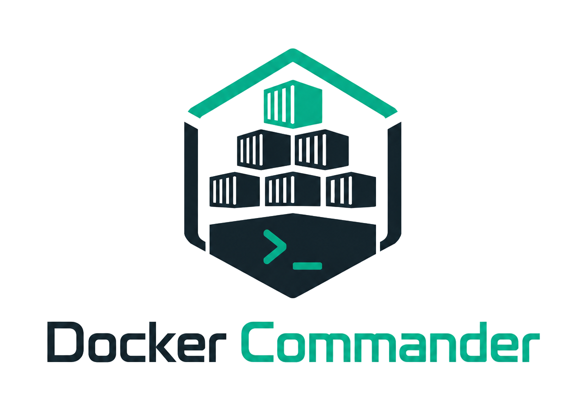
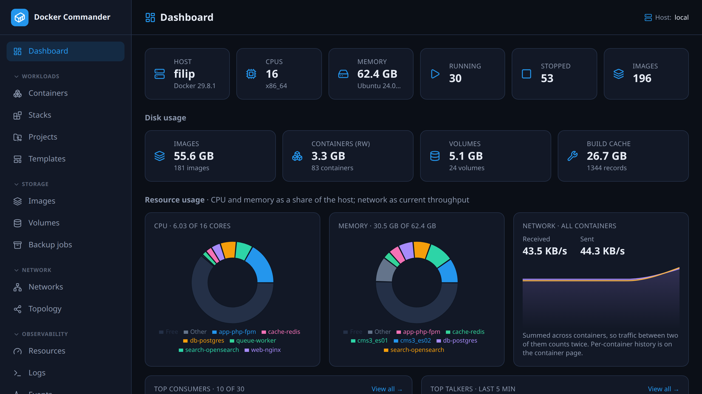

<p align="center">
  
</p>

<h3 align="center">Self-hosted Docker operations, built for safe changes.</h3>

<p align="center">
See what a deploy will change, check it against your rules, keep every revision,
and roll back when something goes wrong.
</p>

<p align="center">
  <a href="https://docker-commander.app"><b>docker-commander.app</b></a> ·
  <a href="docs/">Documentation</a> ·
  <a href="https://github.com/koduj-dev/docker-commander/releases">Releases</a> ·
  <a href="https://github.com/sponsors/koduj-dev">Sponsor</a>
</p>

<p align="center">
  <a href="https://github.com/koduj-dev/docker-commander/actions/workflows/ci.yml"></a>
  <a href="https://github.com/koduj-dev/docker-commander/releases"></a>
  <a href="go.mod"></a>
  <a href="LICENSE"></a>
</p>

---

## Why Docker Commander?

- **Safe changes.** Preview a deploy, check it against policy rules, keep every
  revision and restore a known-good one.
- **One binary.** The web UI is embedded, there is no external database and no
  runtime dependency. Linux, macOS and Windows.
- **Many hosts.** Local, TCP+TLS and SSH daemons from one place, with alerts
  watching all of them.
- **See what happens.** Live and historical CPU, memory and network, logs,
  events, disk usage and alerts that tell you when something breaks.
- **AI access without a shell.** An optional MCP server lets AI tools read and
  safely operate Docker as you, within your permissions.



More screenshots are on each page of the [manual](docs/README.md).

## ✨ Features

**Safe changes**
- **Projects:** Compose folders edited in the browser, with live validation. Deploy to any host. [Projects](docs/projects.md)
- **Deploy Preview:** see per service what a deploy changes and what gets recreated. [Projects](docs/projects.md#lifecycle)
- **Drift detection:** compare the files with what actually runs; ignore or reconcile. [Projects](docs/projects.md#lifecycle)
- **Revisions and rollback:** every deploy is kept, with its image digests. Restore one. [Projects](docs/projects.md#lifecycle)
- **Policy rules:** seven checks (privileged, host network, socket mounts, `:latest`…), each off, warn or block. [Policy rules](docs/policy-rules.md)
- **Project secrets:** encrypted at rest, write-only, masked everywhere they would show. [Projects](docs/projects.md#secrets)
- **Image updates:** an alert when a newer image is behind a running tag. [Alerts](docs/alerts.md)

**Operate**
- **Containers:** run, start/stop/restart, limits, console, file browser, commit, bulk actions. [Containers](docs/containers.md)
- **Stacks:** every Compose project on a host, CLI-started ones too; edit and redeploy in place. [Stacks](docs/stacks.md)
- **Images, volumes, networks:** pull, build, push, scan with Trivy; browse volume files; connect networks. [Images](docs/images.md)
- **Domains and reverse proxy:** route a domain to a project's service, with Let's Encrypt certificates. [Projects](docs/projects.md#domains)
- **Backup jobs:** run your own backup command (restic, borg…) against volumes, with history. [Backup jobs](docs/backup-jobs.md)
- **Recovery bundle:** move projects, hosts, registries and rules to another instance. [Recovery](docs/recovery.md)

**Observe and alert**
- **Dashboard and Resources:** CPU, memory, network and disk per container and stack, top talkers. [Resources](docs/resources.md)
- **Logs and events:** many containers in one stream, regex search, parsing rules. [Logs](docs/logs.md)
- **Alerts:** state, resource, network, log and crash-loop rules; webhooks, e-mail, Prometheus. [Alerts](docs/alerts.md)
- **Maintenance windows:** silence delivery during planned work; deploys silence themselves. [Alerts](docs/alerts.md)
- **Troubleshooting:** subnet overlaps, MTU, duplicate ports, log rotation, disk space. [Troubleshooting](docs/troubleshooting.md)

**Hosts and access**
- **Multi-host:** local, TCP+TLS and SSH daemons, with SSH host-key verification. [Hosts](docs/hosts.md)
- **Users and roles:** per-section permissions, read-only accounts, optional LDAP. [Users & roles](docs/users.md)
- **Sign-in:** passwords with TOTP or passkeys, revocable sessions, audit log. [Your profile](docs/profile.md)
- **HTTPS:** your own certificate, a self-signed one, or Let's Encrypt. [Deployment](docs/deployment.md)
- **Self-update:** one click, or opt-in automatic updates within a version range. [Settings](docs/settings.md)

**AI tools (MCP)**
- **Optional and off by default:** Claude Code, Claude Desktop or Cursor can read and safely operate Docker as you. [MCP](docs/mcp.md)
- **Bounded:** your permissions, narrowed per token; changes are rate limited and audited; no exec, file reads or prune.

## 🚀 Quick start

**Binary.** Download the file for your OS from [Releases](https://github.com/koduj-dev/docker-commander/releases) and run it:

```bash
chmod +x dockercmd-linux-amd64
./dockercmd-linux-amd64           # http://127.0.0.1:8470
```

**Homebrew** (macOS and Linux):

```bash
brew install koduj-dev/tap/dockercmd
```

**Debian / Ubuntu:** `apt install dockercmd` from the
[signed APT repository](docs/deployment.md#debian--ubuntu--fedora-packages-deb--rpm); Fedora and others get a `.rpm`
(and `.deb`) on every release, with the systemd service. **Docker:** `ghcr.io/koduj-dev/docker-commander`, multi-arch
and non-root; mounting the Docker socket gives it control of the host.

Then open <http://127.0.0.1:8470>, create the admin account and pair an
authenticator.

**[Installing](docs/install.md)** has every option in full (the Docker command,
`go install`, building from source, running as a service) and how to verify a
download's signature. **[Configuration](docs/configuration.md)** lists every
setting.

## 🧪 Tested

Alongside **~1200 Go unit tests** and **~420 frontend tests**, the repo carries
**150 adversarial "pentest" cases** that assert attacks are rejected, an
integration tier against real Docker daemons, and deploys to separate daemons
over TCP and SSH. Engine 24 to 29 and recent Compose releases are tested
nightly. See [How it's tested](docs/testing.md) and
[Docker versions](docs/compatibility.md).

## 📚 Documentation

- [Getting started](docs/getting-started.md) and [Installing](docs/install.md)
- [Manual](docs/README.md): one page per screen
- [Deployment](docs/deployment.md), [Configuration](docs/configuration.md), [Security model](docs/security.md)
- [Architecture](docs/architecture.md), [How it's tested](docs/testing.md)

## 🗺️ Roadmap

What's next is in **[NEXT.md](./NEXT.md)**; what shipped is in
**[CHANGELOG.md](./CHANGELOG.md)**.

## 🤝 Contributing

Issues and pull requests are welcome. See [CONTRIBUTING.md](./CONTRIBUTING.md),
the [Code of Conduct](./CODE_OF_CONDUCT.md), and [SECURITY.md](./SECURITY.md)
to report a vulnerability privately.

## 🤖 Made with AI

Roughly **95 % of this project was built with AI** (Claude Code), under human
direction and review.

## 📄 License

[MIT](./LICENSE)
