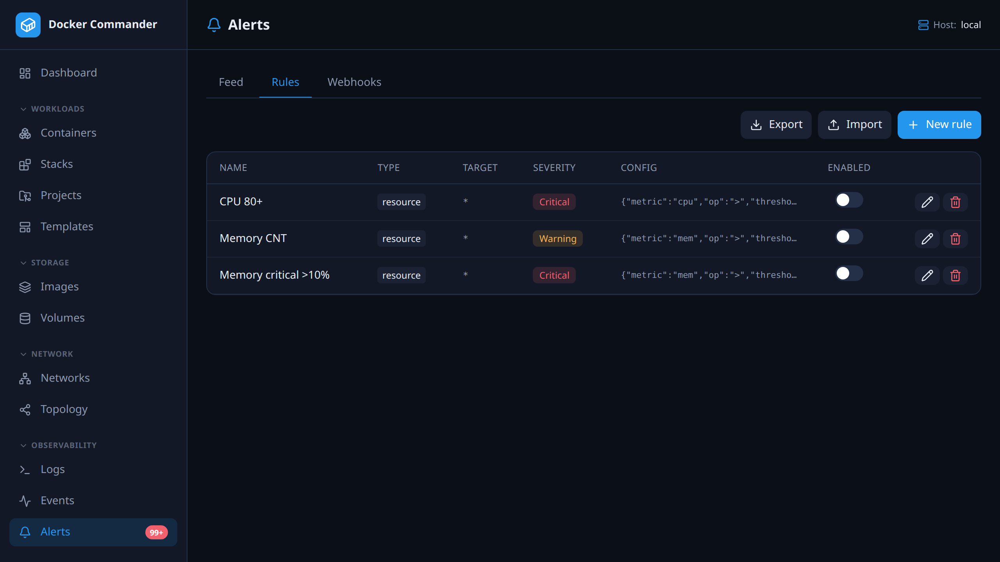

# Alerts


> The **SMTP server** moved to [Settings → Email](settings.md#email-smtp) and is
> now admin-only — it is one relay for the whole installation. Alert rules still
> opt into e-mail here.
[← Manual index](README.md)



The alert engine runs on the **server**, watching **all configured hosts** 24/7
— it keeps working whether or not anyone has the UI open.

## Tabs
- **Feed** — fired alerts (time, severity, host, container, message). Acknowledge
  to clear the unread badge.
- **Rules** — define and edit what fires (below).
- **Webhooks** — HTTP destinations.
- **Email** — the SMTP server.

## Rules
Create or edit a rule (rules are fully editable, not just create/delete):

| Type       | Fires when… |
|------------|-------------|
| `state`    | a container emits a lifecycle event (die, kill, oom, stop, unhealthy) |
| `resource` | CPU% or MEM% crosses a threshold for *N* seconds |
| `log`      | a log line matches a substring or regex |
| `restart`  | a container restarts too often within a window (crash loop) |

Each rule has a **target** (container-name substring; blank/`*` = all), a
**severity**, a **re-notify interval** (the *cooldown* field — how long a
condition stays quiet while it is still true), and optional **webhook** and
**email** delivery.

## Threshold alerts are conditions, not lines

A `resource` rule describes a state of the world that is either true or not, so
it is tracked as a **condition** with a lifetime rather than re-announced on
every evaluation. A condition is one per **container + metric** — not per rule —
and you see it exactly at the moments something changes:

| Event | Meaning |
|---|---|
| `firing` | the threshold was crossed and held for the rule's duration |
| `escalated` | still on, and a more severe rule now applies |
| `eased` | still on, but only a less severe rule still applies |
| `repeat` | still on, and the re-notify interval elapsed |
| `resolved` | it stopped; the event says how long it lasted |

Two consequences worth knowing, because they are the point:

- **Overlapping rules produce one alert, not one each.** If a container is over
  both a *warning >5%* and a *critical >10%* memory rule, that is one fact, and
  the most severe rule speaks for it. Crossing into critical later **escalates
  the existing condition** — the incident clock keeps running rather than
  restarting.
- **A condition that is still true says nothing.** Silence between `firing` and
  `resolved` means "unchanged", not "not checked".

`state`, `log` and `restart` rules stay **edge-triggered**: a container that died
or a log line that matched has no later moment at which it stops being true, so
those still use the plain cooldown and never resolve.

## The feed

The event feed is **paged** (50 at a time) and filterable by severity, lifecycle
kind, rule, container and message text, plus an *unacknowledged only* toggle.
Filtering happens in the database rather than in the browser, so the counts and
the paging describe the whole result set, not the page you happen to be on.

Filter by severity, lifecycle kind, **host**, rule, container and message text.

**Acknowledging records who did it**, and when. "Someone dealt with this" is only
useful if you can go and ask them. **Ack all** acknowledges everything matching
the *current filters* — not the whole table — behind a confirm that says which of
the two it is about to do.

**A toast appears when an alert arrives while the app is open**, so you learn
about it without sitting on the Alerts page. It is a nudge, not a record — the
feed is the record. Resolved conditions toast in green, a countdown bar shows how
long is left, and hovering pauses it. Turn them off per account under
**Profile → Preferences**; the alerts themselves are unaffected — still recorded,
still counted in the sidebar badge, still delivered by webhook and e-mail.

The feed, the badge and the toasts share **one** poll. They used to have separate
timers, which meant a row could appear in the table seconds before the toast
announcing it — the same event telling you about itself twice, out of order.

## Was it actually delivered?

Every webhook call and e-mail send is recorded against the alert, with the
outcome. Click the **Delivery** cell to see the attempts:

```text
delivered  EMAIL    ops@example.com            2026-07-31 13:02:11
failed     WEBHOOK  ops (hooks.example.com)    HTTP 500  — upstream unavailable
```

This closes a real gap: a webhook returning 500, an SMTP server refusing the
connection, or a rule with *e-mail* ticked while **no recipient is configured
anywhere** all used to fail silently. The alert appeared in the feed and looked
handled, while nothing had left the building.

Two deliberate limits:

- **The webhook's name and host are stored, never its full URL.** Webhook URLs
  routinely carry a token in the path or query, and this record is readable by
  anyone with the alerts section.
- **Response bodies are truncated** (~500 characters). The endpoint's own words
  usually say why it refused, but a remote server must not be able to write
  unbounded text into the database.

There is no automatic retry yet — a failed delivery is recorded, not re-attempted.

## What the CPU threshold is a percentage *of*

This trips people up, so the rule editor now asks explicitly:

- **CPU % (of one core)** — Docker's own figure, the one `docker stats` prints.
  100% is a single core, so a container busy on four cores reads ~400%. A fixed
  `> 80%` rule here is over threshold essentially always on a multi-core host.
- **CPU % (of all cores)** — the same usage divided by the host's core count, so
  it is 0–100% whatever the machine. Usually what people mean.
- **Memory %** — share of the **container's limit**, not of host RAM.

Existing rules keep the *of one core* meaning, so nothing changes underneath a
rule you already wrote. Alert messages now state their basis and carry absolute
values — `MEM 3.0 GB / 5.0 GB (61.9% of limit) > 5%` rather than `MEM 61.9% > 5%`.

> **Host reachability is watched automatically** — no rule needed. When a host's
> Docker daemon goes **unreachable** you get a *critical* `host` alert, and a
> *recover* (*info*) when it comes back. See
> [Hosts → Reachability monitoring](hosts.md#reachability-monitoring).

### Import / export
**Export** downloads every rule as a portable JSON bundle (`alert-rules.json`)
you can keep in version control or move to another instance. **Import** reads such
a bundle and creates the rules it contains — it never overwrites or deletes
existing rules, and every rule is re-validated on the way in.

Webhooks are referenced **by name**, and a webhook's URL/headers/secrets are
never part of the bundle. On import a rule is re-linked to a local webhook only
if one with the same name already exists; otherwise it's imported without a
destination and the skipped link is reported. Recreate any missing webhooks (in
the **Webhooks** tab) before or after importing, then edit the rule to attach it.

## Webhooks
Fire to any HTTP endpoint (Slack, Discord, Grafana, n8n…). The body is a Go
template over `{{.RuleName}} {{.Severity}} {{.Type}} {{.Container}} {{.Message}}
{{.Value}} {{.Time}}`; with no template the alert is sent as JSON.

## Email (SMTP)
Configure host/port, optional username + password (encrypted at rest), from and
to, and TLS (implicit or STARTTLS). **Send test** verifies it. Per-host routing:
a host's *alert email* (set on the [Hosts](hosts.md) page) overrides the global
recipient for alerts from that host.

## Prometheus
Scrape `/metrics` for `dockercmd_container_cpu_percent`, `_mem_bytes`,
`_mem_percent` and `_container_running`, labelled by `id`, `name` and `host`.
Protect it with `DC_METRICS_TOKEN` if exposed.

## System log
Beyond these channels, every fired alert is also written to the process log
(stderr) as a structured line, so under systemd it lands in the journal — and,
if you enable forwarding, in syslog. See
[Deployment → Logs](deployment.md#logs).

## Who receives an alert e-mail
A rule that has **Also send an email** ticked resolves its recipients in this
order, most specific first:

1. **The rule's own recipients** — the comma-separated list on the rule.
2. **The host's alert address** — set per host under [Hosts](hosts.md), for a host
   whose alerts should go elsewhere.
3. **The instance-wide recipient** — the *To* field under
   [Settings → Email](settings.md#email-smtp).

Rules created before per-rule recipients existed have an empty list, so they keep
using 2 or 3 exactly as before.

Set an **alert e-mail on your account** (the icon beside *Sign out*) and it
prefills as the recipient the first time you enable e-mail on a rule — clear the
field to fall back to the instance-wide address instead. If your LDAP directory
publishes a `mail` attribute, it is filled in for you on login; a directory with no
address never clears one you set by hand.
