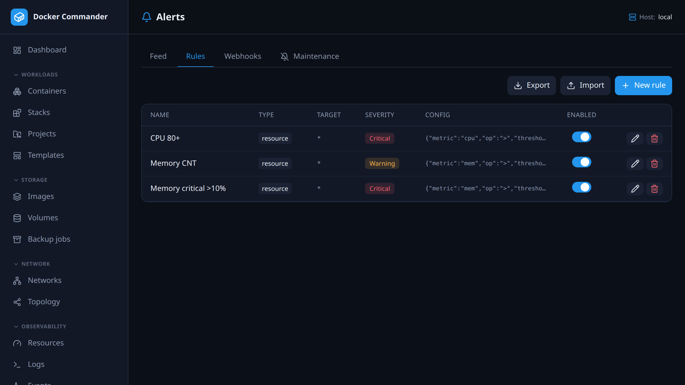
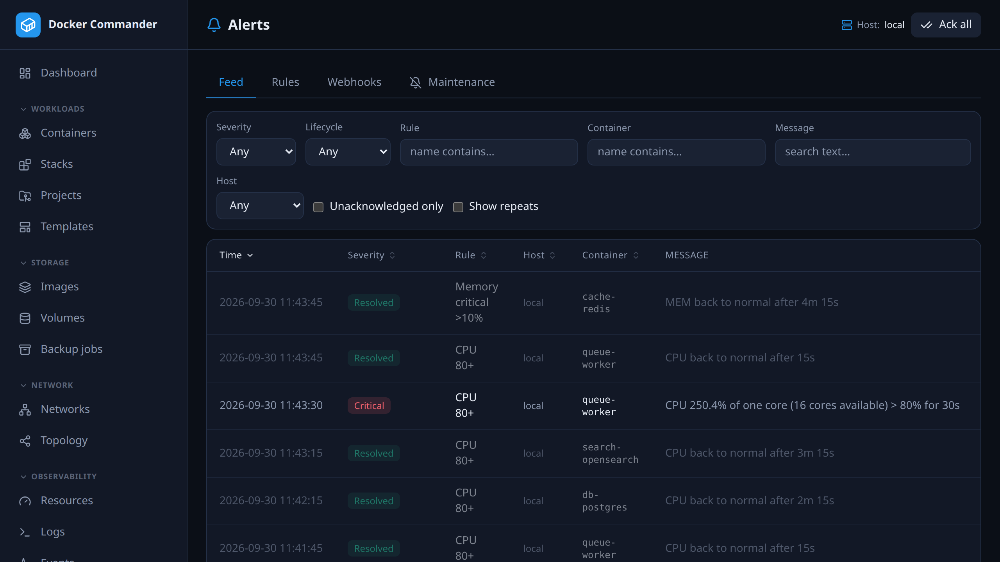
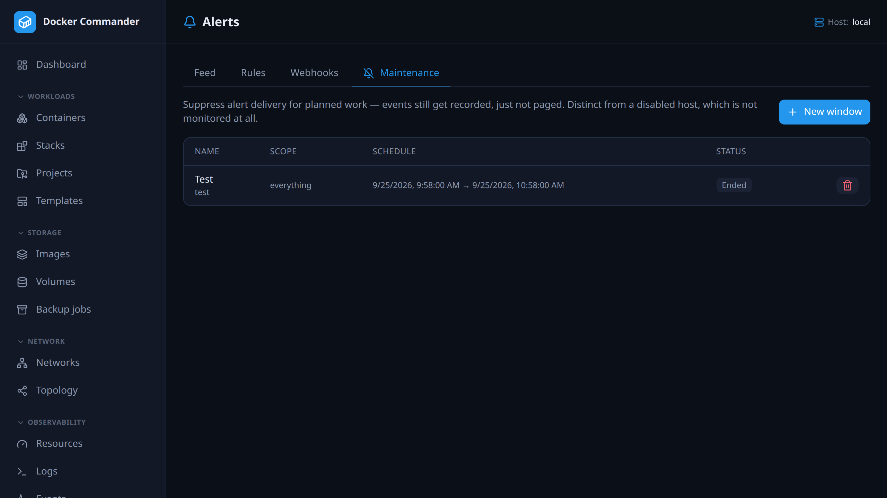

# Alerts

[← Manual index](README.md)

Rules that watch your containers and notify you by webhook or e-mail. The
engine runs on the **server** and watches **all configured hosts** around the
clock, whether or not anyone has the UI open. The SMTP relay is set up by an
admin under [Settings → Email](settings.md#email-smtp); rules only opt into
e-mail here.



## Common tasks

**Alert when a container uses more than 80% CPU for 30 seconds.** On **Rules**,
add a **Resource threshold** rule: metric **CPU % (of all cores)**, *above*
`80`, for `30` seconds, then pick a webhook or tick **Also send an email**.
Avoid *of one core* here: a container busy on four cores reads ~400% there, so
`80%` fires almost constantly.

**Alert on a log line.** Add a **Log pattern** rule, e.g. `ERROR|panic` with
**Treat as regular expression** ticked (otherwise it is a substring match). The
**Cooldown** keeps a noisy container from sending one alert per line.

**Catch a crash loop.** Add a **Restart / crash loop** rule, e.g. 3 restarts
within 60 seconds. **Target** narrows it to container names containing a
string; blank watches everything.

**Post alerts to Slack or Discord.** On **Webhooks**, add the endpoint URL and,
if the service needs its own format, a body template such as
`{"text":"[{{.Severity}}] {{.Container}}: {{.Message}}"}`. Then select the
webhook on each rule. The payload doesn't say which host fired, so route per
host by e-mail instead.

**Silence alerts during planned work.** On **Maintenance**, create a window
scoped to the project or host, with a duration and a reason. Alerts are still
recorded; only webhook and e-mail stay quiet. Deploys open a short window on
their own.

**Check that an alert reached anyone.** Click the alert's row to see every
webhook call and e-mail with its outcome. Temporary failures are
retried up to 5 times.

## Rules

Tabs: **Feed** (fired alerts), **Rules**, **Webhooks**, **Maintenance**. Rules
can be created, edited, enabled/disabled, deleted, exported and imported.
Webhooks can only be added and deleted; to change one, add a new one and switch
the rules over.

| Type | Fires when |
|---|---|
| `state` | A container emits a lifecycle event: die, kill, oom, stop, unhealthy. |
| `resource` | CPU %, memory % or network RX/TX rate crosses a threshold for *N* seconds. |
| `log` | A log line matches a substring or regex. |
| `restart` | A container restarts too often within a window (crash loop). |
| `network` | Dropped packets or interface errors *increase* by at least *N* within a window. |

Each rule has a **target** (container-name substring; blank or `*` = all), a
**severity**, a **cooldown** (the re-notify interval: how long a condition stays
quiet while still true), and optional **webhook** and **e-mail** delivery.

A new rule starts at severity *warning* and a 60-second cooldown. The type
fields start at: resource **CPU % (of one core)** above `80` for `30` seconds;
restart `3` within `60` seconds; network an increase of `1` within `300`
seconds. A rule created over the API or by import with these fields left out
is evaluated with the same values (resource metric *of one core*, 30 seconds).

**What the percentages mean:**

| Metric | Meaning |
|---|---|
| **CPU % (of one core)** | Docker's own figure, as in `docker stats`. 100% is one core, so four busy cores read ~400%. A fixed `> 80%` rule is over threshold almost always on a multi-core host. |
| **CPU % (of all cores)** | The same divided by the host's core count: 0–100% on any machine. Usually what people mean. |
| **Memory %** | Share of the **container's limit**, not of host RAM. |

Older rules keep the *of one core* meaning, so nothing changes under them.
Messages state their basis with absolute values:
`MEM 3.0 GiB / 5.0 GiB (61.9% of limit) > 5% for 30s`.

**The two network rules answer different questions.**

- `resource` on **RX/TX rate**: a plain threshold, "is the rate above or below
  *N* MiB/s for *N* seconds". It reads the same live per-poll rate the dashboard
  shows. Entered in MiB/s (1 MiB = 1024 × 1024 bytes), stored as bytes/s. Alert
  messages state sizes the same way: `KiB`, `MiB`, `GiB`.
- `network` on **drops/errors**: fires on the **increase** within a window,
  never the absolute counter. Drops that have sat at a high total since last
  month are not an incident; packets being lost right now are. Drops and errors
  are each counted **RX+TX combined**, as elsewhere in the app.

### Threshold alerts: firing to resolved

A `resource` rule describes something that is either true or not, so it is
tracked as a **condition** with a lifetime. There is one condition per
**container + metric**, not per rule, and you hear about it only when it
changes:

| Event | Meaning |
|---|---|
| `firing` | Threshold crossed and held for the rule's duration. |
| `escalated` | Still on, and a more severe rule now applies. |
| `eased` | Still on, but only a less severe rule still applies. |
| `repeat` | Still on, and the cooldown elapsed. |
| `resolved` | It stopped. The event says how long it lasted. |

- **Overlapping rules give one alert.** Over both a *warning > 5%* and a
  *critical > 10%* memory rule is one fact; the most severe rule speaks for it.
  Crossing into critical later **escalates** the same condition, so the
  incident clock keeps running.
- **Silence means unchanged**, not unchecked.

`state`, `log`, `restart` and `network` rules are **edge-triggered**: a death,
a matching line or a counter that grew never stops being true later. They use
the plain cooldown and never resolve.

## The feed



Paged 50 at a time. Filter by severity, lifecycle kind, **host**, rule,
container, message text and *unacknowledged only*; sort by any of the first
five columns. All of it runs in the database, so counts and order cover the
whole result, not the visible page. Severity sorts by importance, not
alphabetically.

**Repeats are hidden by default**, because they would bury `firing` and
`resolved`. Tick **Show repeats** or pick *repeat* in the lifecycle filter. The
choice is saved per account.

The row that started a condition shows **still firing · 27m** (counted from the
start, also after an escalation) and **↻ 12**, the number of repeats, with the
last one's time in the tooltip. Only threshold conditions have these. Repeats
silenced by a [maintenance window](#maintenance-windows) are not stored, so the
count is lower during a window. Other flags: ↗ escalated, ↘ eased, and a
crossed-out bell for **silenced**.

**Acknowledging** records who and when. **Ack all** (page header) acknowledges
everything matching the *current filters*, not the whole table, and its confirm
says which. A `resolved` event is stored already settled: no Acknowledge
action, never outstanding, never in the badge.

**The sidebar badge** counts unacknowledged **warnings and criticals** only.
Endings are recorded as `info`, so the number never grows because something got
better. Info alerts still show in the feed and its totals.

**Toasts** announce new alerts on any page while the app is open. Resolved ones
are green, a countdown bar shows the time left, and hovering pauses it. Turn
them off under **Profile → Preferences**; alerts are still recorded, counted
and delivered. Silenced events don't toast but stay in the feed. The feed,
badge and toasts share **one** poll, so a row never appears before its toast.

**Retention:** events and delivery records are deleted after **90 days** by
default; see [Settings → Data retention](settings.md#data-retention).

### Alert detail

Click a row for the full message, measured value, duration (or time firing and
repeat count), host, a link to the **container**, who acknowledged it, and
every delivery attempt with the endpoint's response. You can acknowledge it
there too.

## Delivery

Each webhook call and e-mail send is recorded against the alert. Click
**Delivery** to see them:

```text
delivered  EMAIL    ops@example.com            2026-07-31 13:02:11
failed     WEBHOOK  ops (hooks.example.com)    HTTP 500  — upstream unavailable
```

A webhook returning 500, a refusing SMTP server, or e-mail ticked with **no
recipient configured anywhere** all show here as failures.

- **Only the webhook's name and host are stored**, never the full URL, which
  often carries a token. This record is readable by anyone with the alerts
  section.
- **Response bodies are truncated** to 500 bytes before they are stored, so a
  remote server can't write unbounded text into the database.

**Retries.** Transient failures are retried; configuration problems are not.

| | |
|---|---|
| **Retried** | Webhook timeout, unreachable, or `429`/`5xx`. A failed e-mail send. |
| **Not retried** | Any other webhook `4xx` (bad payload or auth won't fix itself). SMTP not configured. No recipient anywhere. |
| **Backoff** | Up to 5 retries at 1, 2, 4, 8, 16 minutes (about half an hour), then it gives up. |

Each attempt adds a row to the same Delivery list. A retry due inside a
[maintenance window](#maintenance-windows) waits it out, without using up one
of its 5 attempts.

### Webhooks

Any HTTP endpoint: Slack, Discord, Grafana, n8n… The optional body is a Go
template over `{{.RuleName}}`, `{{.Type}}`, `{{.Severity}}`, `{{.Container}}`,
`{{.ContainerID}}`, `{{.Message}}`, `{{.Value}}` and `{{.Time}}` (RFC 3339,
UTC). Without a template, those fields are sent as JSON; `value` is omitted when
there is no measurement.

The payload does **not** carry the **host** or the lifecycle **kind**
(`firing`, `resolved`…), except as far as the message says. Per-host routing
exists for e-mail only.

### Who receives an alert e-mail

A rule with **Also send an email** uses the first of these that is set:

1. **The rule's own recipients** (comma-separated).
2. **The host's alert e-mail**, set on [Hosts](hosts.md).
3. **The instance-wide recipient**, *To* under
   [Settings → Email](settings.md#email-smtp).

Rules older than per-rule recipients have an empty list, so they use 2 or 3.

The **alert e-mail on your account** (Profile, the icon beside *Sign out*)
prefills the recipients the first time you enable e-mail on a rule; clear it to
use the instance-wide address. An LDAP `mail` attribute fills it on login. A
directory without an address never clears one you set by hand.

## Maintenance windows



A window stops **delivery** (webhook and e-mail) for planned work. Alerts still
**fire and are recorded**, with a crossed-out bell. A **disabled host** is
different: the engine doesn't watch it at all.

**Scope.** Blank means no restriction, so an all-blank window silences
everything. A blank **Hosts** field needs access to all hosts: a user limited
to some hosts must pick hosts, or the window is refused.

| Field | Matches |
|---|---|
| **Hosts** | One or more Docker hosts. |
| **Project** | Compose project (stack) name, substring. |
| **Container** | Container name, substring. |
| **Rule** | One rule, or any. |
| **Severities** | Any of info, warning, critical. |

**Schedule.** **One-off** starts now or at a set time, for a duration.
**Recurring** runs weekly on chosen weekdays at a time of day, for a duration,
in the timezone of the browser that created it. An optional end date stops the
series; otherwise it recurs indefinitely. One occurrence lasts at most 24 hours.

Every window records a **reason** and an **author**, audited on create, update,
end and delete, so "why was this silenced?" stays answerable.

- **During a window**, `firing`, `resolved` and escalations are stored with the
  silenced flag. `repeat` rows are not stored but go to the
  [process log](#system-log).
- **After it ends**, a condition that is still true is delivered as `firing` at
  the next check, since nobody was told. This needs a rule cooldown above 0;
  with a cooldown of 0 the silenced condition stays undelivered until it
  changes. One already delivered before the window gets its next repeat after
  the normal cooldown.
- **End early** stops it but keeps the record. Neither End nor Delete undoes
  suppression that already happened.
- **Windows are history.** Nothing deletes them automatically, including the
  `auto: <project> deploy` ones. Finished windows sit under **Past windows**,
  50 at a time. **Delete** is offered on a window that hasn't started yet or is
  already over. A running window (or an open recurring series) has to be ended
  first; the API refuses with `409`.
- **A closed window can't be edited.** Once ended early or past its end (a
  series: its end date), Edit and End disappear and the API refuses an edit
  with `409`.
  Delete still works. A series past its end date shows *Expired*.

**Deploys silence themselves.** A deploy opens a window for the project's host
and stack, since restarts right after a deploy are expected. Default 3 minutes,
set by `-deploy-silence-grace` / `DC_DEPLOY_SILENCE_GRACE`; `0` disables it.
They show on the Maintenance tab as `auto: <project> deploy`.

## Watched without a rule

- **Host reachability.** An **unreachable** Docker daemon raises a *critical*
  `host` alert, and its recovery an *info* one. See
  [Hosts → Reachability monitoring](hosts.md#reachability-monitoring).
- **Newer images.** Each project's running services are checked every 6 hours
  against what the registry reports for their compose tag (the deploy preview's
  check). A new digest raises one *info* `image_update` alert, not one per
  check. Detection only, nothing is deployed. See [Projects](projects.md).

## Import and export

**Export** downloads every rule as `alert-rules.json`. **Import** creates the
rules in such a bundle, never overwriting or deleting existing ones, and
validates each again. Webhooks are referenced **by name**; URLs, headers and
secrets are never exported. A rule is re-linked only to a local webhook of the
same name, otherwise it is imported without one and the skipped link is
reported. Create the webhook, then edit the rule to attach it.

A bundle holds at most 1000 rules. Names and targets may be up to 200
characters and a rule's config up to 16 KiB. A cooldown above 24 hours is cut
to 24 hours on import.

## Prometheus

Scrape `/metrics`. Container series are labelled `id` (the **short**,
12-character form), `name` and `host`:

| Metric | Meaning |
|---|---|
| `dockercmd_container_running` | 1 if running. |
| `dockercmd_container_cpu_percent` | **docker-stats convention: 100 = one core**, so four busy cores read ~400. |
| `dockercmd_container_cpu_cores` | Cores the daemon reports. Divide the above by this for a share of the machine. |
| `dockercmd_container_mem_bytes` | Memory in use. |
| `dockercmd_container_mem_percent` | Share of the container's limit. |
| `dockercmd_alert_firing` | 1 per condition over threshold, labelled `host`, `container`, `metric`, `severity`, `rule`. |
| `dockercmd_alerts_firing_count` | How many conditions are firing. |
| `dockercmd_alerts_outstanding` | Unacknowledged warnings and criticals, same as the sidebar badge. |

Page on `dockercmd_alert_firing`: it is the live condition and disappears on
resolve, so no `for:` window is needed.

## From an AI tool

With the [MCP server](mcp.md) enabled, an assistant can read the history
(`list_alerts`, filtered by severity, kind, host, container, rule or text; up to
200 at a time), what is over threshold now (`active_alert_conditions`), the
rules (`list_alert_rules`) and delivery (`alert_delivery`: a webhook's name and
host, never its URL, or the e-mail recipients), and
`acknowledge_alert`, attributed like any acknowledgement. It can also run
`list_maintenance_windows`, `create_maintenance_window` (starts now, for a
duration) and `end_maintenance_window`. Editing a window is UI/REST only.
Everything follows the caller's permissions and host scope.

### Technical notes

- **Prometheus coverage.** Only `dockercmd_container_running` covers every
  container; the usage series cover **running** ones, so a stopped container's
  series ends instead of reading zero. Join on `_running` to tell "stopped" from
  "not scraped". **Network counters are not exported yet**: they are charted
  and kept in history, but `/metrics` has CPU and memory only.
- **`cpu_percent` was never host-relative**, though its help text once said so.
  Read that way it is four times too high on a four-core host.
- **`/metrics` ignores host scope.** It needs no user session, so a scrape sees
  every host. Set `DC_METRICS_TOKEN` to require a token, sent as
  `Authorization: Bearer <token>` or `?token=<token>`; without one the endpoint
  is open.

### Top talkers and rate rules

The [Top talkers](resources.md#network) ranking averages each container's rate
over a **stored window** (5 minutes by default), never one poll sample, because
bursty traffic would reorder a live ranking on every poll. An RX/TX rate rule
instead checks the live per-poll rate, which must hold for the rule's duration.

### System log

Every fired alert is also written to the process log (stderr) as a structured
line: the journal under systemd, and syslog if forwarding is on. A silenced
alert says so: `silenced=true maintenance_window=3 window_name="…"`.

Window starts and ends are logged with scope and duration. The check runs every
30 seconds, and once at startup for windows already running:

```text
maintenance window started id=3 name="DB upgrade" scope="project~shop" until=… duration=1h30m0s — matching alerts are recorded but not delivered
maintenance window ended id=3 name="DB upgrade" after=1h30m0s — alert delivery resumes
```

`ended early` and `removed` are logged the same way. See
[Deployment → Logs](deployment.md#logs).
