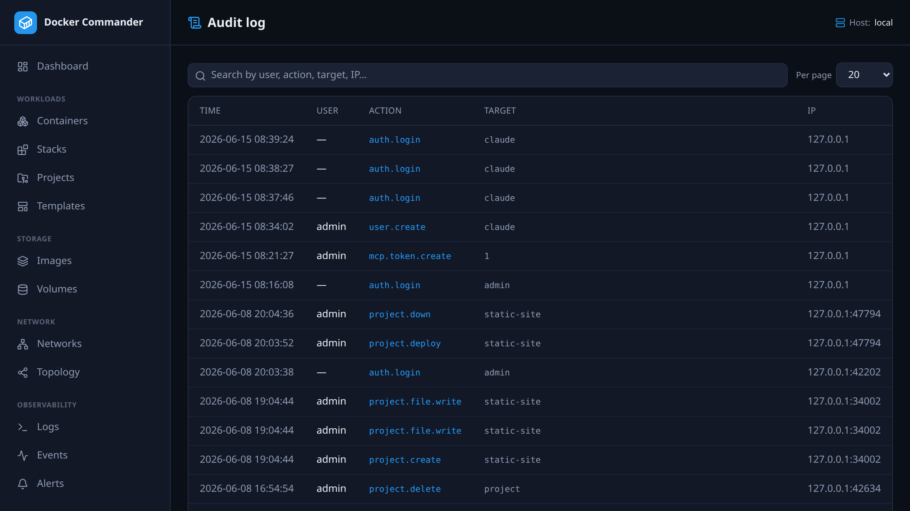

# Audit log

[← Manual index](README.md)

A record of **privileged actions**: who did what, when, and from where.

Each entry has the **user**, an **action** (e.g. `container.stop`, `image.pull`,
`user.create`, `host.trust`, `settings.update`, and `mcp.*` for AI-tool actions
such as `mcp.token.create` or `mcp.container.start`), the **target**, an optional
**detail**, the source **IP**, and a timestamp.

Read-only views (listing, inspecting, streaming) are not audited — only changes
and security-relevant operations are, which keeps the log signal-dense.

## Tips
- Use it to answer “who stopped that container?” or “when was this user created?”
- The most recent ~200 entries are shown.
