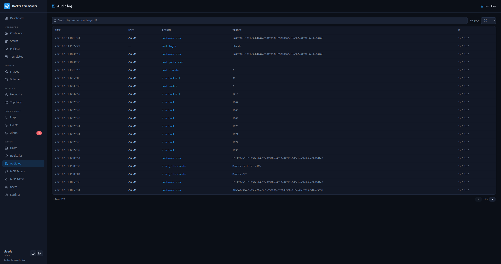

# Audit log

[← Manual index](README.md)

A record of **privileged actions**: who did what, when, and from where.

Each entry has the **user**, an **action** (e.g. `container.stop`, `image.pull`,
`user.create`, `host.trust`, `settings.update`, and `mcp.*` for AI-tool actions
such as `mcp.token.create` or `mcp.container.start`), the **target**, an optional
**detail**, the source **IP**, the **Docker host** the action targeted (0 = the
local daemon), and a timestamp. The host is recorded because a
[host-scoped](users.md) action is only meaningful with the *where* alongside the
*what*.

Read-only views (listing, inspecting, streaming) are not audited — only changes
and security-relevant operations are, which keeps the log signal-dense.

## Sign-in and second factors

The `auth.*` actions are the ones worth reading when something feels wrong.

| Action | Means |
| --- | --- |
| `auth.setup` | The first admin account was created. Should appear exactly once, on first run. |
| `auth.login` | A completed sign-in. The detail says how: `password only`, `password + 2fa`, `password + passkey`, or `passkey (passwordless)`. |
| `auth.login.failed` | A sign-in that got as far as a **valid signature** and was then refused — a passkey that did not verify the user, or an account that has not enabled passwordless sign-in. |
| `auth.2fa.failed` | A rejected second factor. |
| `auth.2fa.enable` / `auth.2fa.repair.denied` | An authenticator paired / a pairing refused for a wrong password. |
| `auth.2fa.remove` / `auth.2fa.remove.denied` | An authenticator unpaired / an unpairing refused. Removing one needs the password, and the last one cannot be removed at all. |
| `auth.session.revoke` | A signed-in session was ended from *Profile → Security*. |
| `auth.passkey.add` / `auth.passkey.add.denied` | A passkey paired / refused. |
| `auth.passwordless` / `auth.passwordless.denied` | Signing in with a passkey alone turned on or off / refused for a wrong password. |
| `auth.passkey.cloned` | **Read this one.** A passkey's signature counter went backwards, which is what a *copied* credential looks like: the same key answering from two places. The sign-in is refused. One entry can be a quirky authenticator; a pattern is not. |

Failures before a signature verifies are deliberately **not** attributed to an
account. The user handle a sign-in attempt carries is attacker-chosen until the
signature is checked, so naming it would let anyone write failed-sign-in lines
against a username they guessed.

## Every action, by area

All **146** of them, generated from the source and kept in step with it by a
test: an audited action with no entry here fails the build, and an entry the code
never writes fails it too. The `auth.*` table above explains the ones worth reading
when something feels wrong; this is the complete set, for looking up what you found
in the log.

**Sign-in and second factors** — `auth.2fa.enable`, `auth.2fa.failed`, `auth.2fa.remove`, `auth.2fa.remove.denied`, `auth.2fa.repair.denied`, `auth.login`, `auth.login.failed`, `auth.passkey.add`, `auth.passkey.add.denied`, `auth.passkey.cloned`, `auth.password.reset`, `auth.passwordless`, `auth.passwordless.denied`, `auth.session.revoke`, `auth.session.revoke_others`, `auth.setup`

**Accounts** — `user.create`, `user.delete`, `user.email`, `user.password_reset`, `user.update`

**Roles** — `role.create`, `role.delete`, `role.duplicate`, `role.update`

**Containers** — `container.commit`, `container.cp.download`, `container.cp.extract`, `container.cp.upload`, `container.create`, `container.exec`, `container.export`, `container.file.delete`, `container.file.mkdir`, `container.kill`, `container.pause`, `container.probe`, `container.rename`, `container.restart`, `container.start`, `container.stop`, `container.unpause`, `container.update`

**Stacks** — `stack.compose.write`, `stack.redeploy`, `stack.redeploy.failed`, `stack.remove`, `stack.restart`, `stack.start`, `stack.stop`

**Projects** — `project.create`, `project.delete`, `project.deploy`, `project.dir.create`, `project.down`, `project.drift.ignore`, `project.drift.unignore`, `project.file.delete`, `project.file.download`, `project.file.upload`, `project.file.write`, `project.import`, `project.remote_host_paths`, `project.rename`, `project.restart`, `project.retarget`, `project.revision.restore`, `project.seed_volumes.remove`

**Project templates** — `project_template.create`, `project_template.delete`, `project_template.dir.create`, `project_template.duplicate`, `project_template.file.delete`, `project_template.file.download`, `project_template.file.upload`, `project_template.file.write`, `project_template.update`

**Service blocks** — `service_block.create`, `service_block.delete`, `service_block.duplicate`, `service_block.update`

**Shared definitions** — `compose_fragment.create`, `compose_fragment.delete`, `compose_fragment.duplicate`, `compose_fragment.update`

**Images** — `image.build`, `image.cve.ignore`, `image.cve.unignore`, `image.import`, `image.load`, `image.prune`, `image.pull`, `image.push`, `image.remove`, `image.save`, `image.scan`, `image.tag`

**Volumes** — `volume.cp.download`, `volume.cp.extract`, `volume.cp.upload`, `volume.create`, `volume.file.delete`, `volume.file.mkdir`, `volume.prune`, `volume.remove`

**Networks** — `network.connect`, `network.create`, `network.disconnect`, `network.prune`, `network.remove`

**Hosts** — `host.create`, `host.delete`, `host.ports.scan`, `host.trust`, `host.update`

**Diagnostics** — `diagnostics.run`

**Registries** — `registry.create`, `registry.delete`

**Alert rules** — `alert_rule.create`, `alert_rule.delete`, `alert_rule.update`

**Alert rules (bulk)** — `alert_rules.export`, `alert_rules.import`

**Alerts** — `alert.ack`

**Log parse rules** — `parse_rule.create`, `parse_rule.delete`

**Webhooks** — `webhook.create`, `webhook.delete`

**Settings** — `settings.update`

**LDAP** — `ldap.configure`

**Email** — `smtp.configure`

**MCP (AI-tool access)** — `mcp.admin.oauth_client.delete`, `mcp.admin.token.revoke`, `mcp.alert.ack`, `mcp.container.restart`, `mcp.container.start`, `mcp.container.stop`, `mcp.oauth.authorize`, `mcp.project.deploy`, `mcp.project.down`, `mcp.ratelimit`, `mcp.stack.restart`, `mcp.stack.start`, `mcp.stack.stop`, `mcp.token.create`, `mcp.token.revoke`, `mcp.token_policy.update`

**Self-update** — `update.apply`, `update.restart`

**Recovery bundle** — `recovery.export`, `recovery.import`, `recovery.inspect`

## Tips
- Use it to answer “who stopped that container?” or “when was this user created?”
- The most recent ~200 entries are shown.
