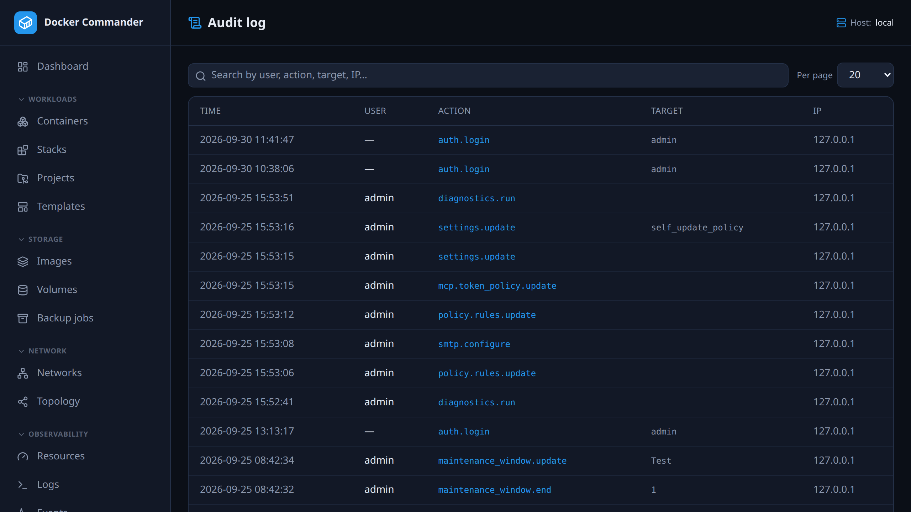

# Audit log

[← Manual index](README.md)

A record of **changes and security-relevant actions**: who did what, when, from
where and on which host. For what Docker itself did (a container dying, an image
pulled by something else), use [Events](events.md).

## Common tasks

**Find who stopped a container.** Search for the container's id: the target is
the id, not the name, and the first 12 characters are enough. Look for
`container.stop` or `container.kill`, or `mcp.container.stop` if an AI client did
it. A container stopped with its stack shows as `stack.stop` or `project.down`,
with the stack or project as the target.

**Check a sign-in you don't recognise.** Search for `auth.`. Every completed
sign-in is an `auth.login`. A run of `auth.2fa.failed` means someone has the
password but not the second factor: change the password. Treat any
`auth.passkey.cloned` as serious.

**See who changed the configuration.** Search for `settings.update`,
`ldap.configure`, `smtp.configure`, `retention.update` or `policy.rules.update`.

**See what AI clients have done.** Search for `mcp.`. Changes a client makes
through [MCP](mcp.md) are recorded under that prefix, as are token changes. What
it only reads is not.

**Keep entries longer.** Entries older than **365 days** are deleted by default.
Change it in [Settings → Data retention](settings.md#data-retention). The minimum
is 30 days.

## The page

The newest **1000** entries, newest first, with search (user, action, target or
IP) and paging. Columns are time, user, action, target and IP.

Each entry also stores an optional **detail** and the **Docker host** the action
targeted (0 = the local daemon). The host is recorded because a
[host-scoped](users.md#limiting-a-role-to-specific-hosts) action only makes sense
with the *where* next to the *what*.

Read-only views (listing, inspecting, streaming) are not audited. Only changes and
security-relevant operations are, which keeps the log useful.

## Sign-in and second factors

The `auth.*` actions are the ones to read when something feels wrong.

| Action | Means |
| --- | --- |
| `auth.setup` | The first admin account was created. Should appear exactly once, on first run. |
| `auth.login` | A completed sign-in. The detail says how: `password only`, `password + 2fa`, `password + passkey`, or `passkey (passwordless)`. |
| `auth.login.failed` | A sign-in that got as far as a **valid signature** and was then refused: a passkey that did not verify the user, or an account that has not enabled passwordless sign-in. |
| `auth.2fa.failed` | A rejected second factor. |
| `auth.2fa.enable` / `auth.2fa.repair.denied` | An authenticator paired / a pairing refused for a wrong password. |
| `auth.2fa.remove` / `auth.2fa.remove.denied` | An authenticator unpaired / an unpairing refused. Removing one needs the password, and the last one can't be removed at all. |
| `auth.password.change` / `auth.password.change.denied` | Own password changed from *Profile → Account*, which ends every other session / a change refused for a wrong current password. |
| `auth.session.revoke` | A signed-in session was ended from *Profile → Security*. |
| `auth.passkey.add` / `auth.passkey.add.denied` | A passkey paired / refused. |
| `auth.passwordless` / `auth.passwordless.denied` | Signing in with a passkey alone turned on or off / refused for a wrong password. |
| `auth.passkey.cloned` | **Read this one.** A passkey's signature counter went backwards, which is what a *copied* credential looks like: the same key answering from two places. The sign-in is refused. One entry can be a quirky authenticator; a pattern is not. |

Failures before a signature verifies are deliberately **not** attributed to an
account. Until the signature is checked, the user handle in a sign-in attempt is
chosen by the client. Naming it would let anyone write failed-sign-in lines
against a username they guessed.

## Every action, by area

All **185** of them, generated from the source and kept in step with it by a
test: an audited action with no entry here fails the build, and an entry the code
never writes fails it too. The `auth.*` table above explains the ones worth reading
when something feels wrong; this is the complete set, for looking up what you found
in the log.

**Sign-in and second factors** — `auth.2fa.enable`, `auth.2fa.failed`, `auth.2fa.remove`, `auth.2fa.remove.denied`, `auth.2fa.repair.denied`, `auth.login`, `auth.login.failed`, `auth.passkey.add`, `auth.passkey.add.denied`, `auth.passkey.cloned`, `auth.password.change`, `auth.password.change.denied`, `auth.password.reset`, `auth.passwordless`, `auth.passwordless.denied`, `auth.session.revoke`, `auth.session.revoke_others`, `auth.setup`

**Accounts** — `user.create`, `user.delete`, `user.email`, `user.password_reset`, `user.update`

**Roles** — `role.create`, `role.delete`, `role.duplicate`, `role.update`

**Containers** — `container.commit`, `container.cp.download`, `container.cp.extract`, `container.cp.upload`, `container.create`, `container.exec`, `container.export`, `container.file.delete`, `container.file.mkdir`, `container.kill`, `container.pause`, `container.probe`, `container.rename`, `container.restart`, `container.start`, `container.stop`, `container.unpause`, `container.update`

**Stacks** — `stack.compose.write`, `stack.redeploy`, `stack.redeploy.failed`, `stack.remove`, `stack.restart`, `stack.start`, `stack.stop`

**Projects** — `project.create`, `project.delete`, `project.deploy`, `project.deploy.policy_block`, `project.deploy.policy_check_failed`, `project.deploy.policy_warn_ack`, `project.dir.create`, `project.domain.create`, `project.domain.delete`, `project.domain.update`, `project.down`, `project.drift.ignore`, `project.drift.unignore`, `project.file.delete`, `project.file.download`, `project.file.upload`, `project.file.write`, `project.import`, `project.remote_host_paths`, `project.rename`, `project.restart`, `project.retarget`, `project.revision.restore`, `project.revision.restore.policy_block`, `project.revision.restore.policy_check_failed`, `project.revision.restore.policy_warn_ack`, `project.secret.create`, `project.secret.delete`, `project.secret.update`, `project.seed_volumes.remove`

**Project templates** — `project_template.create`, `project_template.delete`, `project_template.dir.create`, `project_template.duplicate`, `project_template.file.delete`, `project_template.file.download`, `project_template.file.upload`, `project_template.file.write`, `project_template.update`

**Service blocks** — `service_block.create`, `service_block.delete`, `service_block.duplicate`, `service_block.update`

**Shared definitions** — `compose_fragment.create`, `compose_fragment.delete`, `compose_fragment.duplicate`, `compose_fragment.update`

**Images** — `image.build`, `image.cve.ignore`, `image.cve.unignore`, `image.import`, `image.load`, `image.prune`, `image.pull`, `image.push`, `image.remove`, `image.save`, `image.scan`, `image.tag`

**Volumes** — `volume.cp.download`, `volume.cp.extract`, `volume.cp.upload`, `volume.create`, `volume.file.delete`, `volume.file.mkdir`, `volume.prune`, `volume.remove`

**Networks** — `network.connect`, `network.create`, `network.disconnect`, `network.prune`, `network.remove`

**Hosts** — `host.create`, `host.delete`, `host.ports.scan`, `host.trust`, `host.update`

**Diagnostics** — `diagnostics.run`

**Registries** — `registry.create`, `registry.delete`

**Alert rules** — `alert_rule.create`, `alert_rule.delete`, `alert_rule.update`

**Alert rules (bulk)** — `alert_rules.export`, `alert_rules.import`

**Alerts** — `alert.ack`

**Maintenance windows** — `maintenance_window.create`, `maintenance_window.delete`, `maintenance_window.end`, `maintenance_window.update`

**Log parse rules** — `parse_rule.create`, `parse_rule.delete`

**Webhooks** — `webhook.create`, `webhook.delete`

**Settings** — `settings.update`

**Policy rules** — `policy.rules.update`

**Data retention** — `retention.update`, `retention.purge` (a purge is recorded only when it deleted something or failed)

**LDAP** — `ldap.configure`

**Email** — `smtp.configure`

**MCP (AI-tool access)** — `mcp.admin.oauth_client.delete`, `mcp.admin.session.revoke`, `mcp.admin.token.revoke`, `mcp.alert.ack`, `mcp.container.restart`, `mcp.container.start`, `mcp.container.stop`, `mcp.diagnostics.run`, `mcp.image.scan`, `mcp.maintenance_window.create`, `mcp.maintenance_window.end`, `mcp.oauth.authorize`, `mcp.project.deploy`, `mcp.project.down`, `mcp.ratelimit`, `mcp.session.revoke`, `mcp.stack.restart`, `mcp.stack.start`, `mcp.stack.stop`, `mcp.token.create`, `mcp.token.revoke`, `mcp.token_policy.update`

**Self-update** — `update.apply`, `update.restart`

**Recovery bundle** — `recovery.export`, `recovery.import`, `recovery.inspect`

**Backup jobs** — `backup_job.create`, `backup_job.delete`, `backup_job.disable`, `backup_job.enable`, `backup_job.run`, `backup_job.update`

### Technical notes

- **Host scope.** A user whose roles are limited to some hosts doesn't see
  entries for other hosts. Entries with no host (host 0) are visible to everyone
  with the audit section. The filter is applied after the newest 1000 are loaded,
  so a scoped user may see fewer.
- **Who can read it.** The audit log is its own section. **Viewer** includes it
  read-only; **Operator** does not (see [Users & roles](users.md)).
- **Older entries.** The page loads only the newest 1000. The API,
  `GET /api/audit`, takes `limit` (up to 1000) and `before` (an entry id) to page
  further back. It also returns the detail and host of each entry.
