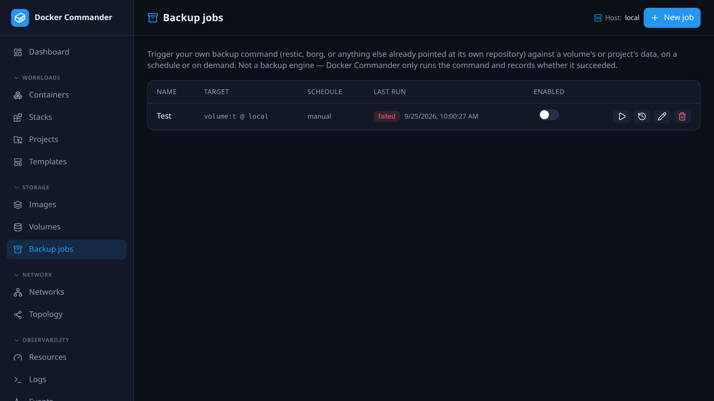

# Backup jobs

[← Manual index](README.md)

Run your own backup command against a volume or a project's volumes, on a
schedule or on demand, and keep a record of each run. To save Docker Commander's
own configuration instead, see the [recovery bundle](recovery.md).

Find it under **Storage → Backup jobs**. Admin only.

Docker Commander is not a backup engine. You bring the tool (restic, borg,
`rsync`, a script) in a container image, configured with its own destination.
Docker Commander mounts the data, runs the command and records the result.

## Common tasks

**Nightly restic backup of a volume.** Click **New job**, choose *Single
volume*, pick the host and type the volume name. Set the image to
`restic/restic`, the command to `restic backup /data`, and the schedule to
`1440` minutes. Put `RESTIC_REPOSITORY`, `RESTIC_PASSWORD` and the storage
credentials in **Environment**. Then press **Run now** once and read the output.

**Back up a whole project.** Choose *Project*. Every named volume of the project
is mounted under `/data/<volume name>`, so `restic backup /data` covers all of
them.

**See why the last run failed.** Hover the red **failed** badge for the error,
or click it to open **Run history** with the full output and exit code.

**Rotate credentials.** Edit the job and paste the complete new environment. It
replaces the old one. A blank box keeps the stored values.

**Check a restore.** Restore with your tool, then open the volume's
[file browser](volumes.md#file-browser) to see what came back.

## How a run works
Each run starts a short-lived helper container on the job's host:

1. The image is pulled if the host doesn't have it.
2. The container starts with the volume(s) mounted and your environment set, and
   runs `sh -c "<command>"`. The image needs `sh`.
3. Docker Commander waits for the exit, saves stdout and stderr, and removes the
   container, also after a failure or timeout.

| Scope | Runs on | Mounted |
|-------|---------|---------|
| **Single volume** | the host you pick (`local` or remote) | the volume at `/data` |
| **Project (all its volumes)** | the project's host | each named volume Compose created for the project, at `/data/<volume name>` |

A project's volumes are found by the `com.docker.compose.project` label. The
host is looked up on every run, so a moved project is followed. A project with
no named volumes fails the run.

A run succeeds only on exit code 0. It also fails when the command can't start:
image pull failure, helper start failure or a target that can't be found. All of
these show in the run history.

## Creating a job
**New job** asks for:

- **Job name**.
- **Scope**: *Single volume* (host and volume name) or *Project*.
- **Schedule (minutes, 0 = manual only)**.
- **Helper image**, for example `restic/restic`.
- **Command**, for example `restic backup /data`.
- **Environment**: one `KEY=VALUE` per line, for credentials. Lines without `=`
  are ignored.

New jobs start enabled.

### The environment is write-only
It is encrypted at rest and never returned by the list, the edit form or the
API. When editing:

- A blank box keeps the stored values.
- New lines replace the whole stored environment.
- **Clear stored environment** deletes it. A blank box does not.

## Schedule and Run now
**Schedule** is an interval in minutes, not a cron expression. `0` means manual
only.

- The scheduler checks once a minute. A job is due when it is enabled, has an
  interval, and has never run or last finished at least one interval ago. A
  failed run counts as a run. Due jobs run one after another.
- **Run now** (play button) runs the job at once, even when disabled. Closing
  the tab doesn't cancel it. If it fails, the run history opens by itself.
- **Enabled** switches scheduled runs on and off.
- A run is stopped after **30 minutes**, image pull included. It is recorded as
  failed with a timeout error and no output.
- At most **two** helpers run at once across the instance. A third fails with
  "too many backup jobs running — try again shortly".

## The job list and run history
Each row shows the name, the target (`volume:<name> @ <host>` or
`project:<name>`), the schedule, the last run, the enabled toggle, and **Run
now**, **Run history & logs**, **Edit** and **Delete**. The last-run badge reads
**never run**, **ok** or **failed**; **ok** and **failed** open the run
history.

**Run history** lists each run with result, start time, duration, trigger and
exit code. The newest is expanded; click another to expand it. An expanded run
shows the error (for example `exit code 2`, a pull failure or a timeout) and the
output, or "The command printed nothing".

- **Trigger** is `scheduled`, or `by <username>` for **Run now**.
- A run under one second shows no duration.

**What is stored:**

- The first 256 KiB of output per run. The rest is dropped.
- The latest 200 runs per job. The dialog lists the newest 50.
- Deleting a job deletes its history.

Output is stored in Docker Commander's database and is not redacted. Don't let
the command print secrets.

## Access and audit
Backup jobs are admin-only, on the page and on every `/api/backup-jobs`
endpoint. They can't be granted to other roles.

The [audit log](audit.md) records `backup_job.create`, `backup_job.update`,
`backup_job.enable`, `backup_job.disable`, `backup_job.delete` and
`backup_job.run` (a **Run now**). Scheduled runs are not audited; they are in
the run history. Environment values are never audited.

### Technical notes
- The helper is labelled `dc.backupjob=1`. It has no extra privileges and no
  host bind mounts. Volumes are **not** mounted read-only.
- The volume name isn't checked on save. Docker creates a missing volume on
  mount, so a typo backs up an empty volume. Copy the name from
  [Volumes](volumes.md).
- Backup jobs cover volume data. The [recovery bundle](recovery.md) covers
  configuration and has no volume data.
