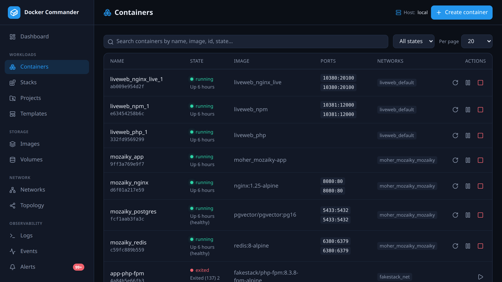

# Containers

[← Manual index](README.md)

## The list
Filter by **state** (running / stopped / all), search by name / image / id /
state, choose a page size (10–100), and act on a
row: **start**, **stop**, **restart**, **pause/unpause**, and **kill**. Kill sends
SIGKILL immediately — no shutdown handler runs and nothing in flight is flushed —
so it asks first, and is for a container that has stopped responding to Stop. Click a name
to open the detail page.

### Bulk restart / stop
Select several rows with the checkboxes (or the header checkbox to select every
row currently shown) and a toolbar appears with **Restart** and **Stop**. Both
open the app's confirm dialog first, listing exactly which containers are
targeted — nothing runs on a single click. The requests run with bounded
parallelism, and once they finish you get a per-container summary: which
containers succeeded and which failed, with the daemon's error for each
failure. Pull and per-host scoping for bulk actions aren't part of this pass —
see `NEXT.md`.

### Create / run
**Create container** opens a form covering the common `docker run` options:

- **Image** (required) and optional **name** and **command**.
- **Ports** — one `host:container[/proto]` per line (e.g. `8080:80`, `53:53/udp`).
- **Env** — `KEY=VALUE` per line. **Volumes** — `src:dst[:ro]` per line.
- **Restart policy**, **memory limit (MB)**, **CPUs**, and *start immediately*.

## Detail page

Live **CPU** and **memory** charts plus a **history** card over 15m / 1h / 6h,
which switches between two views: **CPU & memory** (percentages) and **Network**.
Header actions: **Commit** (snapshot to a new image), **Settings** (rename +
update limits/restart policy at runtime), **Export** (download the filesystem as
a tar), **Inspect** (raw JSON), and lifecycle buttons.

Tabs:

- **Overview** — status, health, command, networks, ports, mounts. Each port
  shows a passive **guess** from its number; the **Probe** button then actively
  connects to the published **TCP** ports and fingerprints what's *really*
  listening (SSH, HTTP(S), TLS, SMTP, POP3, IMAP, FTP, DNS, NTP, syslog, SNMP,
  Redis, Memcached, MongoDB, MySQL/MariaDB, PostgreSQL, MSSQL, AMQP,
  Elasticsearch, or a raw banner) — useful when the port number doesn't match the
  service. **UDP ports keep only the passive guess**: they cannot be
  banner-grabbed reliably, so nothing connects to them. For SSH hosts the probe is
  tunnelled through the same SSH connection; it only touches **your own** hosts.
- **Logs** — live `stdout`/`stderr` tail.
- **Console** — an interactive shell (xterm.js) into the running container.
- **Processes** — `docker top`, refreshed periodically.
- **Files** — a file browser: navigate directories, **create** folders,
  **download** a file or a whole directory (as a tar), **upload** files or
  **upload & extract** an archive (`.zip` / `.tar` / `.tar.gz`) into the current
  directory, and delete paths. Transfers are `docker cp`; listing, creating and
  deleting run a direct `ls`/`mkdir`/`rm` in the container — no shell is involved,
  but the image does need those binaries. Only **Console** needs `/bin/sh`.
  Uploads are capped at 2 GiB, and an archive that expands past 512 MiB is
  refused.
- **Changes** — filesystem changes since start (`docker diff`: added / modified
  / deleted).
- **Env** — environment variables.

## Network

The **Network** chart — live on this section, and as the history card's second
view — plots throughput: the derived rate, not the raw counter, since a chart of a
number that only ever goes up says nothing. History stores the cumulative counters
and derives the rate at read time, which is what lets an old window be re-read
correctly. Beneath it, the
totals since the container started, with packets, **dropped** and **errors**
called out: those are usually zero, and on the day they are not they are often
the only visible sign of the problem.

With more than one interface you get the **count**, not a per-interface table.
Docker reports interface names (`eth0`, `eth1`…) and **does not say which Docker
network each belongs to** — mapping that reliably needs MAC/namespace inspection,
which is Linux-only and awkward on remote hosts. A per-interface split would
therefore invite a question it cannot answer, so the aggregate is what you get
here; the per-network figures live on the [network detail](networks.md), where
the attachment is known.

> A **counter reset** (the container was recreated) shows as a gap at zero rather
> than a negative rate or a phantom spike.

## Tips
- **Commit** is handy to capture a debugged container as an image you can then
  [push](registries.md) or [save](images.md).
- A **read-only** user can view everything here but the action buttons (start,
  exec, upload, delete…) are blocked. See [Users & roles](users.md).
