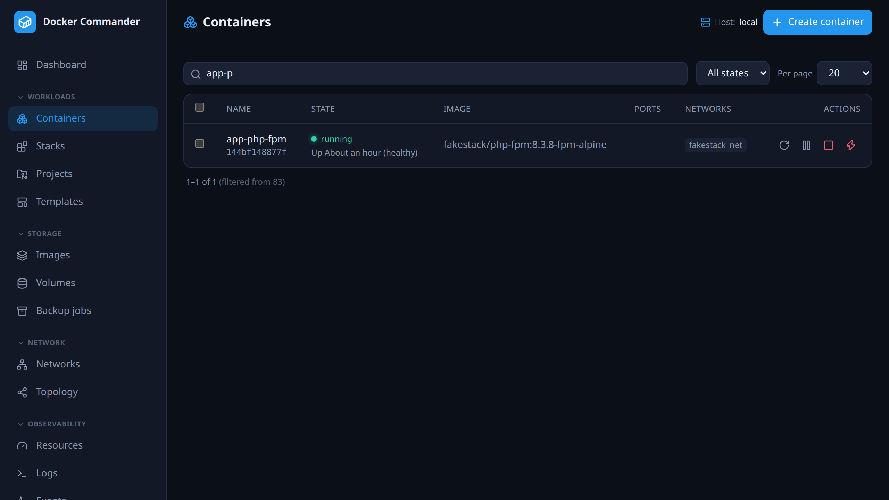
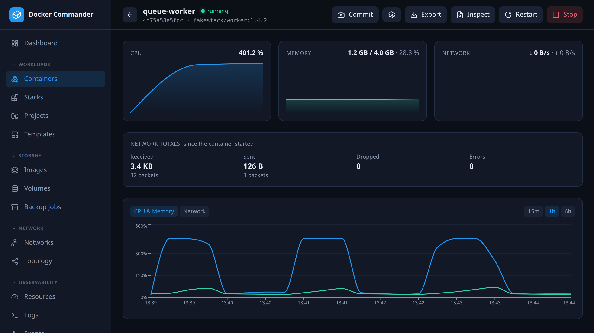

# Containers

[← Manual index](README.md)

Everything running on the selected host. Start and stop containers, open a shell,
move files in and out, and see what each one costs in CPU, memory and network.

A container that belongs to a stack can be managed here too, but change its
*definition* in [Stacks](stacks.md) or [Projects](projects.md). Changes made to
a single container are lost on the next redeploy.

## Common tasks

**A container stopped responding.** Click **Restart**. If it still hangs, use
**Kill**: it sends `SIGKILL`, so the process cannot clean up and unsaved data is
lost. That's why it asks first.

**It keeps restarting.** Open it and check **Restart count** on Overview. The
**Logs** tab usually shows why in the last lines before each restart. If the
logs are quiet and the memory chart climbs to the limit first, the kernel is
killing it for running out of memory. [Events](events.md), filtered by its name,
shows how often it happens.

**It needs more memory or CPU.** Click the **Settings** (gear) button on the
detail page. The new limit applies straight away, without a restart. For a stack
or project container, put the limit in the compose file as well, or the next
redeploy undoes it.

**Update several containers to a newer image.** Tick them, click **Pull**. This
only downloads the images. The containers switch to them once you **redeploy**
the stack or project. A plain restart keeps the old image.

**Copy files in or out.** Use the **Files** tab: download a file or a folder (as
`.tar`), upload files, or upload a `.zip`/`.tar`/`.tar.gz` and unpack it in
place.

**What is really listening on this port?** On Overview, click **Probe**. It
connects and identifies the service, which helps when it isn't on its usual port.

**Keep a container you fixed by hand.** Click **Commit** to save it as a new
image, then [push](registries.md) or [save](images.md) it. Fix the Dockerfile
too, or the next build loses the change.

## The list

Filter by state, search by name, image, id or state, and pick a page size
(10–100). Each row has **Start**, **Stop**, **Restart**, **Pause/Unpause** and
**Kill**. Click a name to open the detail page.

**Bulk actions.** Tick rows (the header checkbox selects the current page) to get
**Start**, **Restart**, **Stop** and **Pull**.

- Every bulk action confirms first and lists the containers it will touch.
- Start/Restart/Stop run a few at a time in parallel and end with a summary of
  what succeeded and what failed, with Docker's error for each failure.
- Pull downloads each image once, even when containers share it or spell it
  differently (`nginx` vs `nginx:latest`). Progress is per image, and **Cancel**
  stops the download on the server too.
- Pull needs access to both **Containers** and **Images**, because it uses
  registry credentials and writes to the image store.

**Create container** covers the common `docker run` options: image (required),
name, command, ports (`host:container[/proto]` per line), env (`KEY=VALUE` per
line), volumes (`src:dst[:ro]` per line), restart policy, memory limit (MB),
CPUs, and whether to start it now. For anything you'll run again, a
[project](projects.md) is better: its setup is saved in a compose file.

## Detail page

Live CPU, memory and network charts, and a history chart (15 min, 1 h, 6 h) with
a **CPU & memory** view and a **Network** view.

| Button | What it does |
|---|---|
| **Commit** | Saves the container's filesystem as a new image. |
| **Settings** | Rename; change memory/CPU limits and restart policy while running. |
| **Export** | Downloads the whole filesystem as a `.tar`. |
| **Inspect** | Docker's raw JSON for the container. |

| Tab | Shows |
|---|---|
| **Overview** | Status, health, restart count and policy, command, networks, ports, mounts. |
| **Logs** | Live `stdout`/`stderr`. To search many containers, use [Logs](logs.md). |
| **Console** | A shell inside the container. Needs `/bin/sh` in the image. |
| **Processes** | `docker top`, refreshed periodically. |
| **Files** | Browse, create folders, upload, download, delete. |
| **Changes** | Files added, changed or deleted since start (`docker diff`). |
| **Env** | Environment variables. |

### Technical notes
- **Memory limit and swap.** Setting a memory limit sets the swap limit to the
  same value, so the container gets no extra swap. Docker would otherwise reject
  the change when an existing swap limit is lower.
- **Probe.** Without it, a port shows a guess from its number. Probe connects to
  published **TCP** ports and recognises SSH, HTTP(S), TLS, SMTP, POP3, IMAP,
  FTP, DNS, NTP, syslog, SNMP, Redis, Memcached, MongoDB, MySQL/MariaDB,
  PostgreSQL, MSSQL, AMQP and Elasticsearch, or shows the raw banner. UDP ports
  keep the guess, since UDP services often don't answer an unknown client. On an
  [SSH host](hosts.md) the probe goes through the SSH connection. It only
  connects to your own hosts.
- **Files.** Transfers work like `docker cp`. Listing, creating and deleting run
  `ls`, `mkdir` and `rm` in the container without a shell, so an image without
  those binaries can't be browsed (use **Export** instead). Uploads are capped at
  **2 GiB**, and an archive that would unpack to more than **512 MiB** is refused
  ([Limits](limits.md)).

### Network
- Docker only reports counters that grow from container start, so the chart
  shows the rate calculated from them. History stores the
  counters and calculates the rate on read, so old windows stay correct. A
  recreated container restarts its counters, which shows as a gap, not a spike.
- **Dropped** and **errors** are shown under the chart because they are normally zero,
  and when they aren't, they're often the only sign of a network problem.
- **Several interfaces** are summed, with the count shown. Docker doesn't say
  which network each interface belongs to, so per-network figures live on the
  [network detail](networks.md), where that is known.

## Permissions
A **read-only** user sees everything here, but all actions are blocked. See
[Users & roles](users.md).
