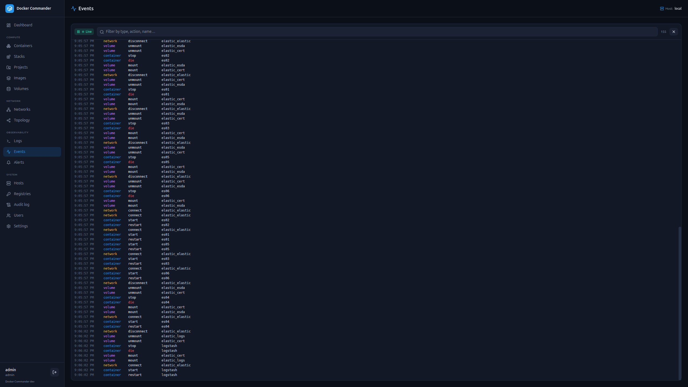

# Events

[← Manual index](README.md)

A live feed of **Docker daemon events** for the selected host, streamed over a
WebSocket.

Each row shows the time, object **type** (container / image / network / volume,
color-coded), the **action** (start, die, pull, create…) with destructive
actions highlighted, the object **name** and a short id (plus the full command
for `exec` actions).

## Using it
- **Pause** freezes the stream; **filter** by type / action / name; **clear**
  empties the view.
- It's a great companion to [Alerts](alerts.md): events are exactly what `state`
  and `restart` rules fire on — watch here to see what's happening, then codify
  it as a rule.

> Events reflect the host chosen in the sidebar switcher.
