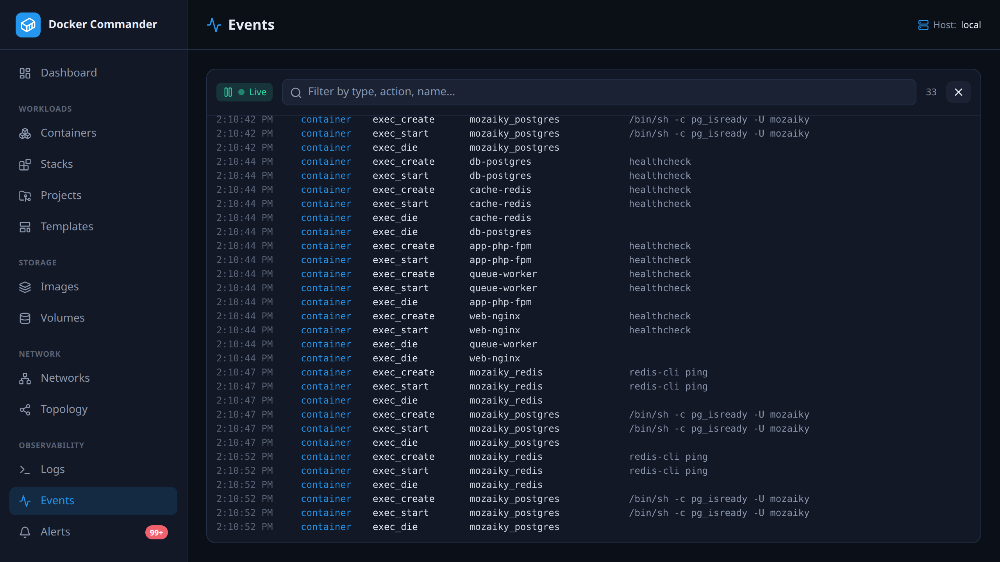

# Events

[← Manual index](README.md)

A live feed of **Docker daemon events** for the selected host, streamed over a
WebSocket.

Each row shows the time, object **type** (container / image / network / volume,
color-coded), the **action** (start, die, pull, create…) with destructive
actions highlighted, and the object **name** — or its short id when Docker
reports no name. Any action containing a colon is split into the verb and its
detail, so `exec_create: /bin/sh` and `health_status: unhealthy` both show the
part after the colon alongside the action.

## Using it
- **Pause** freezes the stream; the **filter** box matches the type, action,
  name and id together, not each separately; **clear** empties the view.
- The feed is live-only — it starts from the moment you open it and shows no
  history — and holds the most recent 2000 events, dropping the oldest.
- It's a great companion to [Alerts](alerts.md): events are exactly what `state`
  and `restart` rules fire on — watch here to see what's happening, then codify
  it as a rule.

> Events reflect the host chosen in the sidebar switcher.
