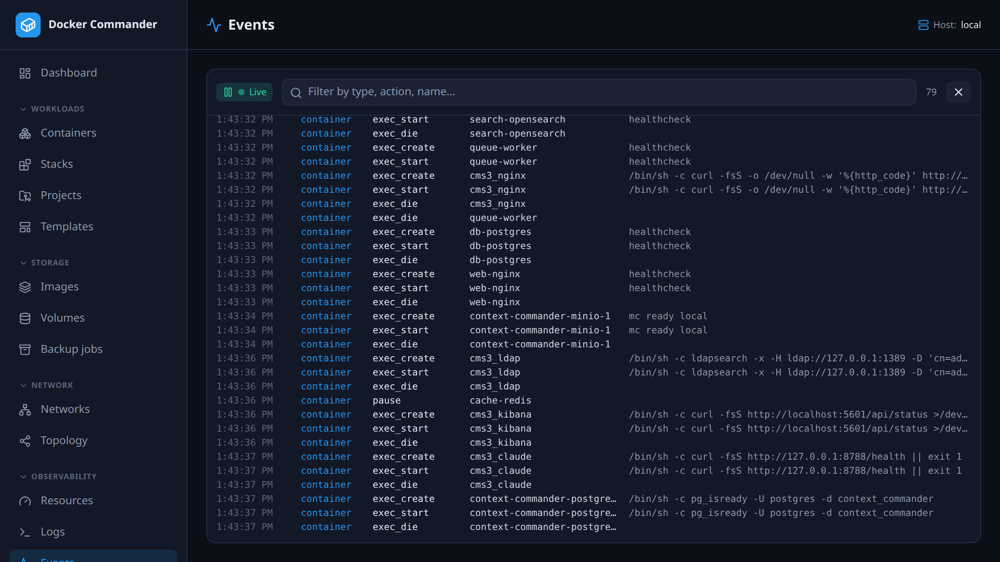

# Events

[← Manual index](README.md)

A live feed of **Docker daemon events** for the host selected in the sidebar:
containers starting and dying, images pulled, networks and volumes created. For
what users did in Docker Commander, see the [Audit log](audit.md).

## Common tasks

**Find out why a container keeps dying.** Type its name in the filter and wait
for the next `die`, `kill` or `oom`. Destructive actions are shown in red.

**See what a deploy really does.** Open Events, then deploy from another tab.
The `create`, `start` and `destroy` lines show which containers were actually
recreated.

**Spot commands run inside containers.** Filter by `exec`. The command shows
next to the action, e.g. `exec_create: /bin/sh`.

**Turn it into an alert.** Events are exactly what `state` and `restart` rules
in [Alerts](alerts.md) fire on. Watch here to learn the pattern, then codify it
as a rule.

## Using it

- Each row shows the time, the object **type** (container, image, network,
  volume, color-coded), the **action** and the object **name**, or its short id
  when Docker reports no name.
- An action with a colon is split into the verb and its detail, so
  `exec_create: /bin/sh` and `health_status: unhealthy` show the part after the
  colon next to the action.
- **Pause** freezes the stream. **Clear** empties the view.
- The **filter** matches type, action, name and id together, not each
  separately.

### Technical notes

- The feed is live only. It starts when you open the page, shows no history,
  and keeps the newest 2000 events, dropping the oldest.
- It streams over a WebSocket. If the connection drops, the badge changes from
  **Live** to **Reconnecting…** and it retries every 1.5 seconds. Events from
  the gap are not replayed.
- Events follow the host chosen in the sidebar switcher.
