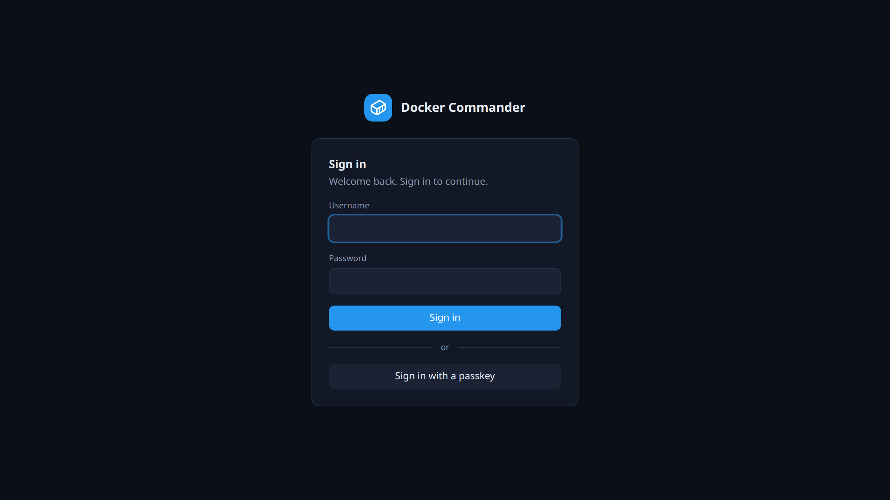
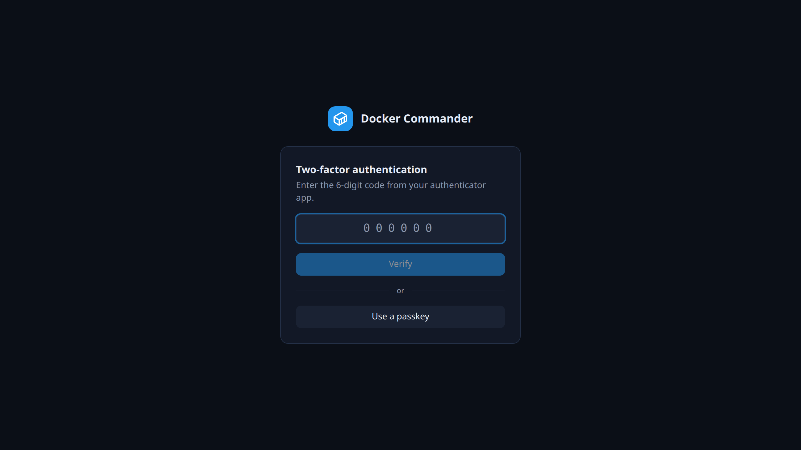

# Getting started

[← Manual index](README.md)

The first run, signing in, and where things are. To install on a server, see
[Deployment](deployment.md).

## First run

1. Start the binary (`./dockercmd`) and open <http://127.0.0.1:8470>.
2. **Create the admin account.** The first account is always an `admin`. On the
   same screen, choose **Enable now** for 2FA or **Skip for now**. Skipping turns
   on the localhost 2FA exemption for every account, so sign-ins from the machine
   itself need only a password. Handy on a local or dev box.
3. **If you enabled 2FA,** scan the QR code with an authenticator app (Google
   Authenticator, Aegis, 1Password…) and enter the 6-digit code to confirm.

From then on you sign in with username, password and the current code.

**New accounts** that an admin created, and LDAP accounts, have no second factor
yet. At their first sign-in they must pair an authenticator app before anything
else opens: scan the QR code, or type the secret shown under **Or enter this
secret manually**, then enter a code and click **Confirm & enable**. The
localhost exemption skips this step for sign-ins from the machine itself.

A **passkey** is the other kind of second factor. You pair it later under
*Profile → Security*. If the account has one, the second step offers it next to
the code box. If the account has *only* a passkey, the code box is not shown,
since it could never be filled in. If you turned on passkey sign-in for your
account, click **Sign in with a passkey** under the password form instead of
typing a password. The button shows only where the browser and the address
support passkeys.

## Common tasks

**Turn 2FA on for localhost later.** If you skipped it at setup, an admin
switches off the localhost exemption in [Settings](settings.md). Everyone then
needs a second factor, also on localhost.

**Deploy your first app.** Open [Projects](projects.md), click **New project**,
fill in **Project name**, pick a **Template** (for example *Nginx — static
site*) and click **Create**. Then click **Deploy** in the editor that opens.
The running containers show up in [Stacks](stacks.md) and
[Containers](containers.md).

**Manage another Docker machine.** Add it under [Hosts](hosts.md) (TCP+TLS or
SSH). Once there is more than one host, a host switcher appears at the top of
the sidebar.

**Get told when something breaks.** Set up [Alerts](alerts.md) with a webhook
or email. The server checks around the clock, so nobody needs to keep the UI
open.

**Give a colleague access.** Create an account under [Users & roles](users.md)
and grant only the sections they need, read or write.

## The layout

- The left **sidebar** groups pages into Workloads, Storage, Network,
  Observability and System. What you see depends on your role and permissions.
- The **host switcher** at the top of the sidebar appears once more than one
  host is enabled. It switches every page to the selected Docker host.
- The **account menu** at the bottom left shows who you are and signs you out.
- The **[Dashboard](dashboard.md)** is the home page: host facts, disk usage and
  running containers.
- **[Containers](containers.md)** is where you operate workloads: start and stop,
  open a shell, browse files, read logs.

## Security model

- Passwords are hashed with Argon2id. Sessions are `HttpOnly` cookies.
- **A second factor** is required for everyone unless an admin enables the
  localhost exemption. It can be an authenticator app (**TOTP**) or a
  **passkey**. An account may hold several of either, and the last one cannot be
  removed.
- A passkey that checks a PIN, fingerprint or face can also sign you in **on its
  own**, once you turn that on for the account. Your password keeps working. It
  is your way back if the key is lost, because no admin can reset another
  account's second factor. See [Your profile](profile.md).
- **Account type** is `admin` (full access and administration) or `user`. A
  `user` reaches only what they are granted: through **named roles** (a reusable
  set of sections, each read or write, optionally limited to specific **hosts**)
  and/or sections set directly on the account.
- Stored secrets (registry, SMTP and LDAP passwords) are encrypted at rest.

See [Users & roles](users.md) and [Settings](settings.md) for administration.

### Technical notes
- **Passkeys need a hostname.** An IP address cannot be a passkey's relying
  party, so `http://127.0.0.1:8470/` does not offer them. Use
  `http://localhost:8470/` or HTTPS with a domain. Details in
  [Your profile](profile.md).
