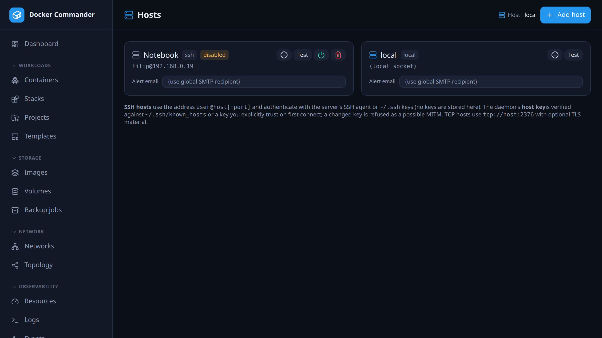

# Hosts

[← Manual index](README.md)

The Docker daemons Docker Commander talks to. The **local** host exists out of
the box; add remote ones over SSH or TCP and switch between them in the
sidebar. Every view and stream binds to the selected host, while the alert
engine watches all of them.



## Common tasks

**Add a server over SSH.** As the OS user that runs `dockercmd`, install an SSH
key on the server and check that `ssh user@server docker info` works without a
password. Then click **Add host**, keep the type **SSH**, enter a name and
`user@server`, and save with **Add host**. Click **Test** on the new card,
compare the fingerprint with the server's own and click **Trust this host**.
The commands are under [Connecting over SSH](#connecting-over-ssh).

**The host key changed.** **Test** shows *Host key CHANGED — possible MITM* and
the connection is refused. If you reinstalled or rebuilt the server yourself,
verify the new fingerprint and click **Re-trust new key**. If you didn't,
don't: this is exactly what an attack looks like.

**A server will be offline for a while.** Click the power button on its card to
**disable** it. The monitor stops trying to reach it, so there are no retries,
errors or unreachable alerts. Click it again when the server is back.

**Send one host's alerts to a different address.** Type it into **Alert email**
on the host card and click **Save**. It replaces the global recipient for alerts
from that host, unless the alert rule lists its own recipients.

**Deploys work, but the dashboard stays empty.** The remote `sshd` probably has
`AllowTcpForwarding no`. Deploys don't need forwarding, everything else does.
See [Connecting over SSH](#connecting-over-ssh).

**A host you know exists is missing.** Gone from the switcher only: it is
disabled. Not on this page either: it is outside your **host scope**, since the
list, the switcher and every per-host view only show hosts your grants reach.
See [Users & roles](users.md).

## Adding a host

| Type | Address | Credentials |
|---|---|---|
| **SSH** | `user@host[:port]` | The **server's own SSH agent or `~/.ssh` keys**. No key material is stored here. The Docker API is tunnelled over SSH to `/var/run/docker.sock` on the remote host; other socket paths (rootless Docker) aren't supported. |
| **TCP** | `tcp://host:2376` | Optional CA, client certificate and key (PEM) for TLS. |

You can also set an **alert email** for the host, at creation or later on the
host card. It overrides the global SMTP recipient for alerts from that host,
but not recipients set on the alert rule itself.

The remote server only needs **Docker installed and reachable**. It does **not**
need Docker Commander. One instance talks to many Docker daemons, never to
another Docker Commander.

### Connecting over SSH

SSH is the recommended way. Nothing is exposed to the network and no secrets
are stored here: the Docker API is tunnelled using the **SSH keys of the OS
user that runs `dockercmd`**.

On the **Docker Commander server**, as that user:

```bash
# 1. Have an SSH key (skip if you already do) and install it on the remote host:
ssh-keygen -t ed25519
ssh-copy-id deploy@10.0.0.42

# 2. Sanity check — this must succeed WITHOUT a password prompt:
ssh deploy@10.0.0.42 docker info
```

On the **remote host**, let the SSH user reach the Docker socket:

```bash
sudo usermod -aG docker deploy    # then reconnect so the group takes effect
```

Then **Hosts → Add host**, type **SSH**, a **Name**, address
`deploy@10.0.0.42` (or `deploy@host:2222` for another port), and **Add host**.
On the new card click **Test**, and **Trust this host** after verifying the
fingerprint (see [SSH host keys](#ssh-host-keys)).

- **Which keys are used.** Keys from the agent (`SSH_AUTH_SOCK`) first, then
  `~/.ssh/id_ed25519`, `id_rsa` and `id_ecdsa`. `~/.ssh/config` is ignored, so
  a `Host` alias, `User`, `Port` or `IdentityFile` there has no effect: put the
  real `user@host[:port]` in the address. The `ssh` sanity check above can pass
  through your config while the app fails.

- **Passphrase-protected key.** Key files with a passphrase are skipped. Make
  an agent available to the `dockercmd` process, e.g. a systemd service with
  `SSH_AUTH_SOCK`, or use a key without a passphrase.
- **Many keys in the agent.** `sshd` may reject them all and hit `MaxAuthTries`
  (default 6) before the right one. Prune the agent, or give `dockercmd` an
  agent that holds only the key it needs. There is no per-host key setting.
- **The remote `sshd` must allow forwarding.** The tunnel is an SSH channel,
  which `sshd` gates on **`AllowTcpForwarding`**. With `no`, connections fail
  with `ssh: rejected: connect failed`. Most distributions default to `yes`;
  Alpine ships `no`. `sshd` honours the **first** occurrence of a keyword, so a
  line appended to `sshd_config` can be silently ignored. Check the effective
  value with `sshd -T | grep -i allowtcpforwarding`.
- **Half-working host.** `docker compose` uses its own `dial-stdio` channel,
  which needs no forwarding. So without forwarding a **Projects deploy can
  succeed while monitoring and everything else fails**.

### Connecting over TCP + TLS

Prefer SSH: it exposes **no extra port**. Use TCP only when SSH really isn't
possible.

**The Docker daemon socket is root-equivalent.** Anyone who can reach it can
mount the host filesystem and run privileged containers, i.e. become root on
that machine.

- **Never** expose plaintext `2375`. That is an open root shell.
- `2376` **must** use **mutual TLS** (`--tlsverify`). A leaked **client cert is
  a root credential**; guard it like one.
- Even with TLS, **keep `2376` off the open internet.** Use a **private network
  or VPN (e.g. WireGuard)**, or a **firewall allowlist** for the Docker
  Commander server's IP, and bind the daemon to that interface, not `0.0.0.0`.

1. On the remote host, enable a TLS-protected TCP listener on `:2376` and
   create a CA, server and client certificates, following Docker's guide:
   <https://docs.docker.com/engine/security/protect-access/>.
2. In the UI: **Hosts → Add host**, type **TCP (+TLS)**, a **Name**, address
   `tcp://10.0.0.42:2376`, and paste the **CA cert**, **Client cert** and
   **Client key** (PEM). Save with **Add host**, then **Test** on the card.

Sanity check from the Docker Commander server:

```bash
docker --tlsverify --tlscacert=ca.pem --tlscert=cert.pem --tlskey=key.pem \
  -H tcp://10.0.0.42:2376 info
```

## Switching the active host

With more than one enabled host, a **Viewing host** switcher appears at the top
of the sidebar. Disabled hosts are left out of it. Picking a host rebinds
the whole app: dashboard, containers, images, logs, stats, exec. Nothing is
mixed across servers. The active host is shown as a badge in every page header,
and your browser remembers the choice.

## Host card

| Control | What it does |
|---|---|
| **Info** (i) | Hardware, OS and engine: hostname, CPUs, memory, architecture, OS, OS type and version, kernel, Docker version, storage and logging drivers, cgroup, live restore, root dir, container and image counts. |
| **Test** | Probes the host, with a short timeout so an unreachable one fails fast. Reports the Docker version and running count, or the connection or host-key problem. |
| **Power** | Disables or enables the host (remote hosts only). |
| **Delete** | Removes the host (remote hosts only). |
| **Alert email** | Per-host alert recipient. |

**Docker Desktop:** the engine runs in a Linux VM, so the info describes that VM,
not the Windows or macOS machine. The Docker API can't see the real OS. The
**kernel** is the best hint, e.g. `…-WSL2` means Windows/WSL2.

## Reachability monitoring

Besides the on-demand **Test**, the monitor **pings every enabled host every
30 seconds**. An unreachable daemon gets a red **unreachable** badge on its card
and in the host switcher. It clears once the daemon answers again.

A change of state also raises an [alert](alerts.md), with **no alert rule
needed**:

- going **offline** fires a *critical* event,
- **recovery** fires an *info* event that says how long the host was down.

Both land in the alerts feed and, if SMTP is set up, are e-mailed to the host's
own **Alert email**, or else the global recipient.

- **Recovery is automatic.** A failed probe drops the cached connection, so the
  next sweep dials afresh instead of reusing a socket that died with the peer.
- **No alert at startup.** The very first probe never alerts. A host already
  down when the server boots stays quiet until its state actually changes.
- **Disabled hosts** are not probed and never show the badge.

## Disabling a host

A **disabled** host is **ignored by the monitor**: no Docker events stream, no
stats sampling. It leaves the host switcher, and its cached connection is
dropped so nothing keeps reaching for it. This is the clean way to handle a
host that's offline on purpose, like a laptop put away or a server in
maintenance, instead of letting the monitor retry and log errors. Re-enable it
with the same button.

## SSH host keys

The daemon's host key is checked first against a key you trusted here, then
against `~/.ssh/known_hosts`:

- **Unknown** (in neither): **Test** shows the SHA-256 fingerprint and a
  **Trust this host** button (trust on first use). Verify the fingerprint
  out-of-band before trusting.
- **Changed** (differs from the trusted key, or from the `known_hosts` entry):
  refused as a possible **man-in-the-middle**. Re-trust only if you changed the
  host deliberately.

Remote alerting and metrics work without extra setup: the engine watches every
configured host, and alerts say which host they came from. Don't put a remote
host into use until its host key is verified.
