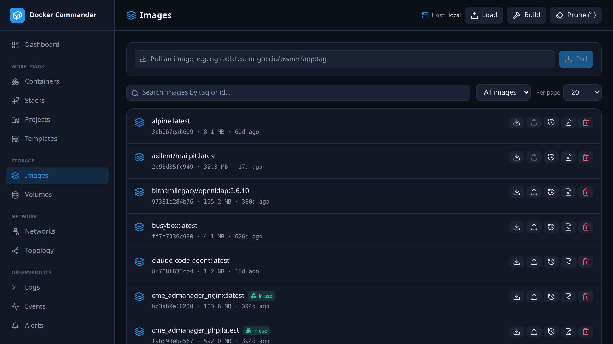

# Images

[← Manual index](README.md)

## The list
Each image shows its tags, short id, size and age, with badges for **in use**
(referenced by a container) and **dangling** (untagged). Filter by **in use /
unused / all**, search by tag or id, and paginate. Per-row actions: **Save**
(download as a tar), **Push**, **Scan**, **History**,
**Inspect** (raw JSON), **Remove** (with a *force* fallback when in use).

Header: **Prune** removes dangling images; **Build** and **Load** open dialogs.

## Vulnerability scanning
The **Scan** action (shield icon) runs [Trivy](https://trivy.dev) against the
image on the **selected host's** daemon and shows the findings: a count per
severity (critical / high / medium / low / unknown) and a table of CVEs with the
affected package, installed version and the version that fixes it (linked to the
advisory). Scans run **live** and aren't stored — re-scan to pick up newly
published CVEs.

> Trivy is an **optional** tool that must be installed on the host running
> Docker Commander (e.g. `apt install trivy`, or see trivy.dev). If it's absent,
> the scan dialog says so. The first scan also downloads Trivy's vulnerability
> database, so it takes longer than later ones.

## Pull
Type a reference (`nginx:latest`, `ghcr.io/owner/app:tag`) and pull — progress
streams **per layer** over a WebSocket. Private images use the matching
credentials from [Registries](registries.md).

## Build
Upload a **tar of your build context** (the directory containing the
Dockerfile), set one or more tags, an optional Dockerfile path and build args;
the daemon's build output streams live.

## Push
Enter a registry-qualified target (e.g. `registry.example.com/team/app:tag`).
The image is tagged to that reference if needed, then pushed using the
credentials resolved from [Registries](registries.md) by the target's host.

## Transfer (save / load / import)
- **Save** — download one image as a `docker save` tar.
- **Load** — upload a `docker save` archive to restore images (tags preserved).
- **Import** — upload a filesystem tarball and tag it as a new image.
- (Container filesystems are exported from the [container detail](containers.md).)

## Tips
- “In use” is cross-referenced against existing containers, so you know before
  removing. Use **force** only when you're sure.
- Build/push to private registries needs credentials configured first — see
  [Registries](registries.md).
