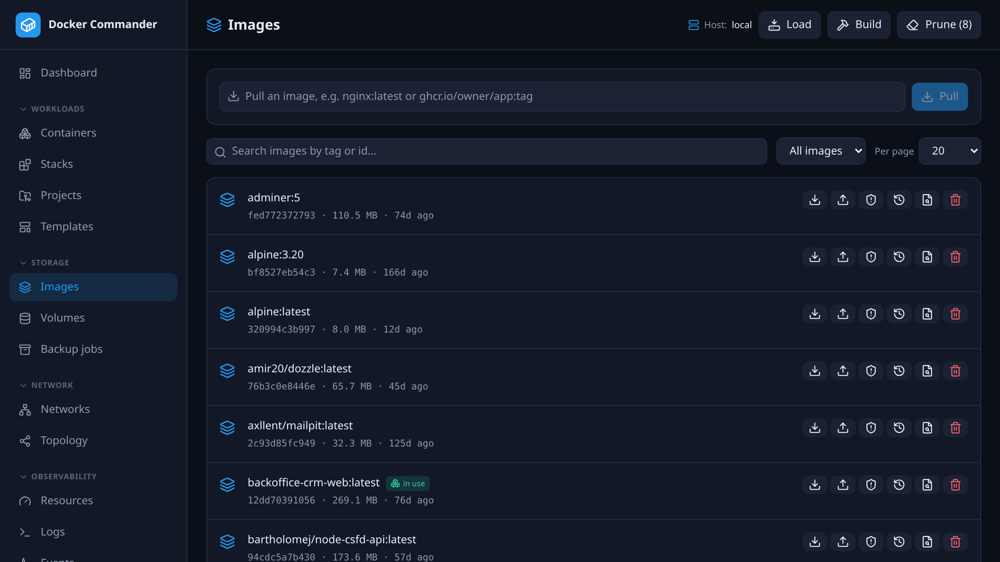

# Images

[← Manual index](README.md)

The images on the selected host. Pull, build, scan, push and move them between
machines. To see which images take the most disk, use
[Resources → Disk](resources.md#disk).

## Common tasks

**Get a newer version of an image.** Pull the same reference again, for example
`nginx:latest`. Running containers keep the old image until their stack or
project is redeployed or they are recreated.

**Free disk space.** Click **Prune** to remove dangling (untagged) images. For
tagged images nobody uses, set the filter to **Unused** and remove them one by
one.

**Check an image for vulnerabilities.** Click **Scan** (shield icon). Results
are not stored, so scan again later to catch newly published CVEs.

**Accept a CVE you have reviewed.** In the scan results, tick the finding and
click **Ignore selected**. It is ignored by CVE id, so it disappears from every
image's scan, not just this one. **Show ignored** brings it back with an
**Un-ignore** button.

**Move an image to a machine without a registry.** **Save** it here, then
**Load** the tar on the other host. Tags are preserved.

**Push to a private registry.** Add its credentials in
[Registries](registries.md) first. Then **Push** with a registry-qualified
target. A build whose `FROM` is a private image uses the same credentials.

## The list
Each image shows its tags, short id, size and age, with badges for **in use**
(referenced by a container) and **dangling** (untagged). Filter by **In use**,
**Unused** or **All images**, search by tag or id, and paginate. **In use** is checked
against existing containers, so you know before removing. Use **force** only when
you're sure.

| Row action | What it does |
|---|---|
| **Save** | Downloads the image as a tar. |
| **Push** | Pushes to a registry. |
| **Scan** | Vulnerability scan with Trivy. |
| **History** | The image's layers. |
| **Inspect** | Docker's raw JSON. |
| **Remove** | Deletes the image. If the daemon refuses, for example because it is in use, a **Force remove** button appears. |

Header: **Prune** removes dangling images. **Build** and **Load** open dialogs.

## Vulnerability scanning
**Scan** runs [Trivy](https://trivy.dev) against the image on the **selected
host's** daemon. It shows a count per severity (critical, high, medium, low,
unknown) and a table of CVEs. Each row has the affected package, the installed
version and the version that fixes it, linked to the advisory. Scans run **live**
and aren't stored.

Trivy is an **optional** tool that must be installed on the host running Docker
Commander, for example `apt install trivy` (see trivy.dev). If it's missing, the
scan dialog says so. The first scan also downloads Trivy's vulnerability
database, so it takes longer than later ones.

## Pull
Type a reference (`nginx:latest`, `ghcr.io/owner/app:tag`) and pull. Progress
streams **per layer** over a WebSocket. Private images use the matching
credentials from [Registries](registries.md).

## Build
Upload a **tar of your build context**, the directory containing the Dockerfile.
Set one or more tags, an optional Dockerfile path, **build args** (one
`KEY=VALUE` per line), and **No cache** to rebuild every layer. The daemon's
build output streams live.

The build sends every credential stored under [Registries](registries.md), so a
private base image (`FROM ghcr.io/…`) is pulled with it. A stored credential
that can't be decrypted is skipped, with a warning line in the build output.

Build args reach the daemon as `--build-arg` and can be recorded in the image's
history, so they are the wrong place for secrets.

## Push
Enter a registry-qualified target, for example
`registry.example.com/team/app:tag`. The image is tagged to that reference if
needed, then pushed with the credentials that [Registries](registries.md) has for
the target's host.

## Transfer (save / load / import)

| Action | What it does |
|---|---|
| **Save** | Downloads one image as a `docker save` tar. |
| **Load** | Uploads a `docker save` archive to restore images. Tags are preserved. |
| **Import** | The **Import** mode of the **Load** dialog. Uploads a filesystem tarball and tags it with the **Target reference** you enter. |

Container filesystems are exported from the [container detail](containers.md).

## Permissions
Pull, push, scan and **Save** need **write** access to Images. Scan only
reads, but it starts a heavy process and contacts outside servers, so a
read-only account can't launch it. Save hands over the image's full contents,
which read access doesn't cover, so its button isn't shown without write.
[Bulk pull](containers.md#the-list) also needs access to
Containers.
