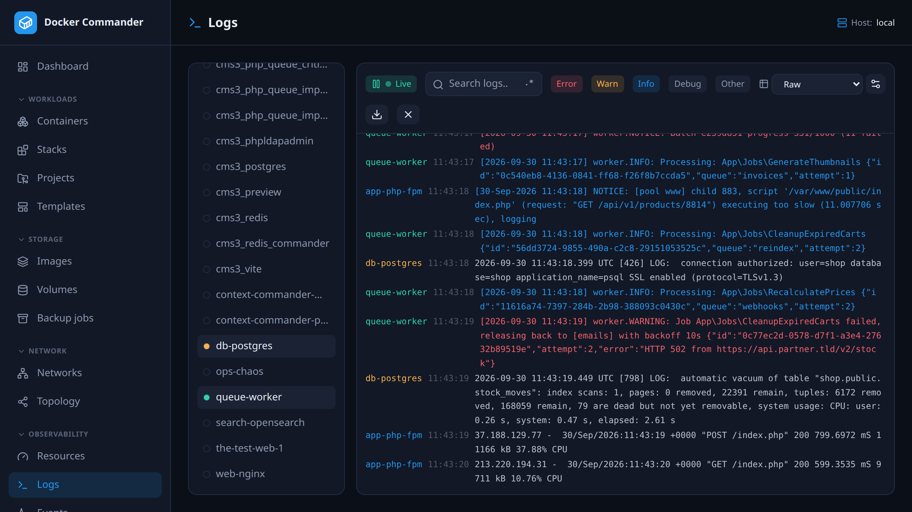

# Logs

[← Manual index](README.md)

Live logs from **many containers at once**, interleaved by time and color-coded
by source. For one container, its [detail page](containers.md) (Logs tab) is
quicker.

## Common tasks

**Find errors across a whole stack.** Select its containers on the left and
switch off every level except **error**. Lines with an HTTP 5xx status count as
errors and 4xx as warnings, so access logs filter too.

**Follow one request through several services.** Select them, turn on the
**`.*`** button and search for the request id, or a pattern such as
`timeout|refused`. Search ignores case in both modes.

**Read access logs as a table.** Click the gear icon, start from the **nginx**
preset, check the preview against the latest line, and click **Add rule**. Then
pick the rule in the toolbar dropdown.

**Get told next time.** Turn the pattern into a **Log pattern** rule in
[Alerts](alerts.md). Alerts watch the logs on the server, so nobody needs to
have this page open.

## Using it

- Pick sources on the left. Only running containers are listed, and the
  selection is remembered across visits.
- **Search** filters lines; the **`.*` button** switches to regular expressions.
  An invalid pattern is flagged and matches nothing, it never crashes the view.
- **Level filters** (error, warn, info, debug, other) show or hide lines by
  detected level. `stderr` lines are highlighted.
- **Pause** freezes the live tail. The view auto-scrolls while you are at the
  bottom. **Clear** empties it, and **Download** saves the filtered view as a
  `.log` file.

## Structured parsing

Parse rules turn free-text lines into **columns**.

1. Open the parse-rules manager (gear icon) and add a regex with **named
   groups**, e.g. `(?<ip>\S+) .* "(?<method>\S+) (?<path>\S+)`.
2. Or start from a **preset** (nginx, Apache, logfmt, level + message, ISO
   timestamp, key=value). A live preview tests it against the latest line.
3. Select the rule in the toolbar dropdown. Matching lines show as a table, one
   column per named group. Lines that don't match show as raw text.

Parsing runs in your browser on the lines already shown, so it is instant. Only
the rule itself is saved on the server.

### Technical notes

- Each source starts with its last 100 lines, then streams live.
- The view keeps the newest 3000 lines. Search, filters and Download only see
  those.
- Levels are guessed from keywords (`error`, `fatal`, `warn`, `debug`…) and from
  HTTP status codes in access-log lines.
- Rules use JavaScript regex syntax, since they run in the browser.

## Permissions

Parse rules are shared by all users. Adding or deleting one needs write access
to the **Logs** section. See [Users & roles](users.md).
