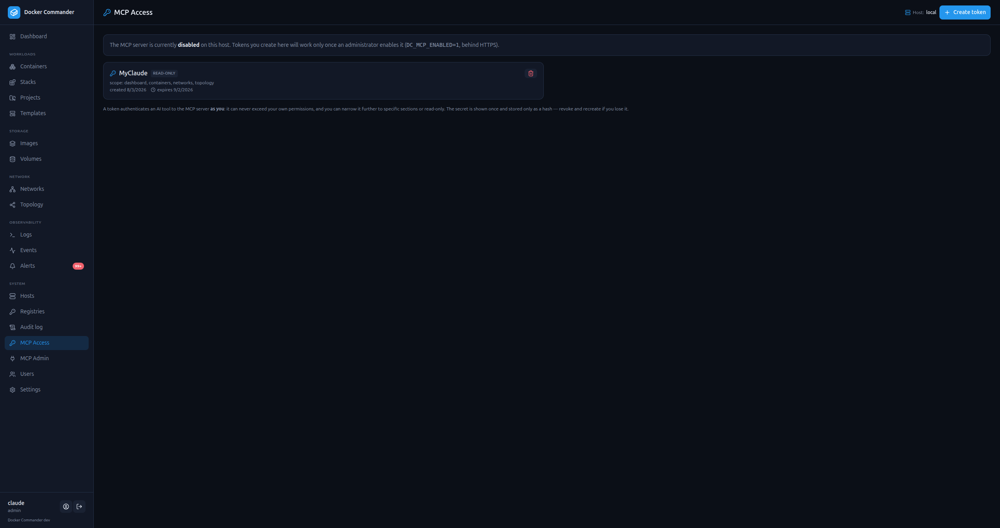
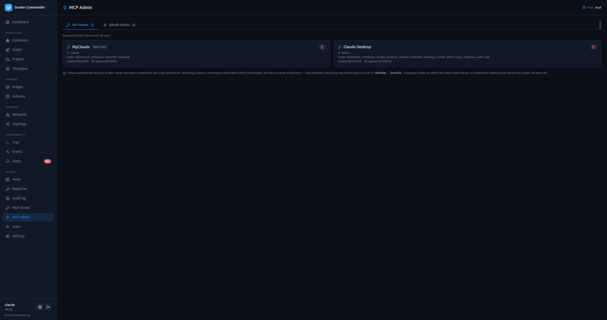

# MCP — remote control from AI tools

[← Manual index](README.md)

Docker Commander can expose a **Model Context Protocol (MCP)** server so AI tools
— **Claude Code**, **Claude Desktop**, **Cursor**, and any MCP-capable client —
can monitor and **safely operate** your Docker hosts *as you*, with the **same
permissions** you have in the UI.

It is **off by default** and, when enabled, never exceeds your rights: every call
goes through the app's RBAC, tokens can only **narrow** your access, and the tool
set is a deliberate allow-list of **reads + safe control** — there is no `exec`,
image export, volume-content read, `prune` or `remove`.

## Enabling it

The server is gated by a config knob and should run **behind HTTPS** (native TLS
or a reverse proxy):

```ini
# /etc/docker-commander/commander.conf
DC_MCP_ENABLED=1
# Only needed for the OAuth flow (Claude Desktop / Cursor); bearer tokens work without it:
DC_MCP_PUBLIC_URL=https://docker.example.com
```

When disabled, the MCP and OAuth routes are **not mounted** — a request to `/mcp`
is just an unknown path (it falls through to the SPA, or a plain `404` when no UI
is embedded), with no hint the feature exists. The startup log says `MCP server:
disabled` so you can confirm the state at a glance.

## Two ways to authenticate

| Client | Auth | Notes |
|--------|------|-------|
| **Claude Code**, scripts, Cursor (header mode) | **Bearer API token** | Simplest. Create one on the **MCP Access** page (see below). |
| **Claude Desktop**, claude.ai, Cursor (connector) | **OAuth 2.1** | Needs `DC_MCP_PUBLIC_URL`. You log in to Docker Commander in the browser and approve a consent screen. |

### Bearer API tokens (the MCP Access page)



Open **MCP Access** in the sidebar. Each user manages **their own** tokens:

- Give it a **name**, an optional **expiry**, and optionally restrict it to a
  **subset of your sections**, a **subset of Docker hosts**, and/or mark it
  **read-only**.

  Narrowing only ever subtracts. A token cannot reach a section or host its owner
  can't, and the owner's live permissions are re-checked on **every call** — so a
  token minted before a role was scoped down stops working the moment the role
  changes, rather than outliving it.
- The secret is shown **once** (only a hash is stored) — copy it now. The page
  also gives you a ready-to-paste command:

  ```bash
  claude mcp add --transport http docker-commander \
    https://docker.example.com/mcp \
    --header "Authorization: Bearer <token>"
  ```

A token can only ever *narrow* your rights; if your account is read-only, every
token you mint is read-only too. Revoke a token anytime — it stops working
immediately.

### Admin overview (the MCP Admin page)



Administrators get a second page, **MCP Admin** (under *System*), with a
fleet-wide view: **every user's** active API tokens (each labelled with its
owner) and all registered **OAuth clients**. From here an admin can **revoke**
any token or **remove** any OAuth client. Only metadata is shown; secrets are
never recoverable here. This makes a shared instance team-ready: you can audit
and cut off MCP access for the whole fleet from one place.

**Removing a client cuts access immediately**, which is worth spelling out
because it isn't how bearer tokens usually behave. Purging a client's
authorization codes and refresh tokens stops it getting a *new* access token,
but an access token is a **signed** credential — nothing about deleting a
database row reaches the copy a tool already holds, so it would normally keep
working until it expired (up to 15 minutes). Access tokens therefore carry the
client they were issued to, and every call checks that client is still
registered. "Revoked" means now, not within the token's lifetime.

Two consequences of that design worth knowing:

- Tokens issued before this shipped carry no client and so aren't revocable this
  way — they simply expire, within 15 minutes of the upgrade.
- Revocation is per **client**, not per session. Removing a connector cuts off
  every tool authorized through that client registration.

### OAuth (Claude Desktop / Cursor connector)

Add a **custom connector / remote MCP server** in your client pointing at
`https://<your-host>/mcp`. The client discovers the authorization server,
**registers itself** (dynamic client registration), and opens a browser to
Docker Commander. Sign in as usual, then **approve** the consent screen — you can
grant **full** or **read-only** access. Docker Commander never sees a password
here; it reuses your existing login session.

Under the hood this is a standard, self-contained **OAuth 2.1** server (PKCE,
exact redirect matching, audience-bound short-lived access tokens, rotating
refresh tokens). No external identity provider is required.

## What the AI can do

**Read** (`containers`, `images`, `projects`, `volumes`, `networks`, `logs`,
`events`, `dashboard`, `hosts`, `audit` sections — gated per token/user):

- list hosts, containers, images, volumes, networks, Compose projects
- inspect a container (config, mounts, health — **environment variables are
  omitted**), tail its **logs** (size-capped), read a project's **compose file**
- host **system info**, a resource **stats** snapshot and per-container **metrics
  history**, recent Docker **events**, and recent **audit** entries

**Diagnostics** — the questions that otherwise create pressure to open a shell:

- **container_processes** — what is actually running inside a container (`docker top`)
- **container_changes** — files added, modified or deleted since it started
  (`docker diff`); paths only, never contents
- **search_logs** — find a string or regex **across** the containers on a host,
  for when you don't yet know which one to look at

All three are read-only and bounded. They exist so an assistant can answer
"what's it doing?" and "what changed?" without `exec` — a shell would answer the
same questions and a great many others nobody intended to allow.

**Alerting:**

- **list_alerts** — the history, with the same filters the UI has (severity,
  lifecycle kind, container, rule, message text)
- **active_alert_conditions** — what is over threshold *right now*, and for how long
- **acknowledge_alert** — record that a human has seen one
- **alert_delivery** — whether an alert actually reached anyone. No attempts means
  it was never routed anywhere; a failed attempt means nobody was told, which is a
  different problem from nobody responding
- **list_alert_rules** — the rules and their thresholds. `MEM 61% of limit > 5%`
  cannot be judged without the rule behind it: this is how an assistant tells a
  real problem from a badly chosen threshold. It reports which channels a rule
  notifies through, but never the recipients or the webhook URL — those are
  delivery configuration, and a webhook URL routinely carries a token.

The split between the first two is deliberate. Since alerts became conditions
with a lifetime, "what happened" and "what is wrong now" are different questions,
and a model asking the first when it meant the second will confidently report a
problem that fixed itself an hour ago. `active_alert_conditions` is the one to
reach for when diagnosing.

**Safe control** (write — blocked for read-only tokens/users):

- **start / stop / restart** a container
- **acknowledge_alert** — records who acknowledged; it changes nothing about the container, but it is attributed, so a read-only principal cannot make that claim on someone's behalf
- **start / stop / restart** a Compose **stack** by project name — the whole stack,
  so prefer the per-container tools when one service is the problem
- **scan_image** — a Trivy vulnerability scan: severity summary plus the most
  serious findings. Gated as a write because it shells out and will pull the image
  if it is missing; it reports Trivy being absent rather than failing
- **preview_deploy** — what a deploy *would* change, without deploying: services
  that would be created, ones that would be recreated with a different image, and
  ones running but no longer in the compose file. Also reports an invalid compose
  file. A **read**, deliberately — a preview has to be cheaper to reach than the
  deploy it protects, so a read-only token can look even though it cannot leap
- **list_managed_projects** — the projects this caller may act on, as a read. It
  drops projects on hosts outside the caller's scope rather than erroring, because
  a project names its target host: listing one discloses that host's workloads, and
  whether they are deployed, to somebody who cannot reach it
- **deploy / down** a managed Compose project. `deploy` runs
  `docker compose up -d --build`, matching the web UI — a project with a `build:`
  section is rebuilt from its current files rather than redeployed from a stale
  image. This is not a wider surface than before: `up` has always built an image
  that was missing, so deploying such a project could already run its Dockerfile.
  Projects that target a **remote host** work here too. They authorize against
  that host — the `hosts` section plus the per-host scope, the same rule the web
  UI applies — and they resolve their compose environment exactly the way the UI
  does, so a remote deploy through MCP still ships the project's own bind mounts
  to the target and still **refuses** binds pointing outside the project folder
  unless the project is explicitly opted in. Anything remapped is reported back
  in the tool's output rather than left unsaid.

It also exposes MCP **resources** (the container inventory and compose files as
attachable context) and **prompts** (curated workflows like *diagnose an
unhealthy container* or *guided safe redeploy*).

### The whole tool list

Every tool, the **section** it is gated by, and whether it counts as a read or a
**write** (writes are refused for a read-only token or user, and are audited and
rate limited). This is the list a token's section subset narrows.

| Tool | Section | R/W | What it does |
|---|---|---|---|
| `list_hosts` | hosts | R | The hosts this server manages, with their ids |
| `list_containers` | containers | R | Containers on a host: id, name, image, state, published ports |
| `get_container` | containers | R | Inspect one container — **without** its environment variables |
| `container_logs` | logs | R | The tail of one container's logs, size-capped |
| `search_logs` | logs | R | A substring or regex **across** the containers on a host |
| `container_processes` | containers | R | What is running inside a container (`docker top`) |
| `container_changes` | containers | R | Files added/modified/deleted since it started (`docker diff`) — paths only |
| `list_images` | images | R | Images on a host: tags, size, age, whether in use |
| `list_volumes` | volumes | R | Volumes and who mounts them — never their contents |
| `list_networks` | networks | R | Networks: driver, scope, subnets, attached containers |
| `list_projects` | projects | R | Compose projects (stacks) discovered on a host |
| `get_compose` | projects | R | A project's compose file |
| `list_managed_projects` | projects | R | The app's managed projects; hosts out of scope are dropped from the list |
| `preview_deploy` | projects | R | What a deploy *would* change — also checks the project's own host |
| `stats_overview` | dashboard | R | Host CPU/memory plus a per-container snapshot |
| `system_info` | dashboard | R | Engine and host facts: versions, OS/kernel, drivers, counts |
| `metrics_history` | dashboard | R | Historical CPU%/memory% for one container (authorized against the container's host) |
| `recent_events` | events | R | Recent Docker daemon events on a host |
| `recent_audit` | audit | R | Recent audit entries — most tokens will not have this section |
| `list_alerts` | alerts | R | Alert history with the UI's filters |
| `active_alert_conditions` | alerts | R | What is over threshold **right now**, and for how long |
| `list_alert_rules` | alerts | R | Rules and thresholds; channels, never recipients or webhook URLs |
| `alert_delivery` | alerts | R | Whether an alert reached anyone (authorized against the alert's host) |
| `acknowledge_alert` | alerts | **W** | Record that a human saw it, attributed to the caller |
| `start_container` / `stop_container` / `restart_container` | containers | **W** | One container's lifecycle |
| `start_stack` / `stop_stack` / `restart_stack` | containers | **W** | A whole Compose stack by project name |
| `scan_image` | images | **W** | Trivy scan — a write because it shells out and may pull the image |
| `deploy_project` / `down_project` | projects (+ `hosts` for a remote target) | **W** | `docker compose up -d --build` / `down` on a managed project |

`host_id` defaults to the local host when omitted. Tools that take a **record id**
instead — a project, an alert, a container's metrics — resolve that record's host
and authorize against it; see the security model below.

> **Stack `remove` is deliberately absent** even though the app implements it:
> force-removing a stack's containers and networks is destruction, not safe
> control. Stopping a stack is offered; removing it is something to do by hand.
> A test asserts no destructive verb ever appears in the tool list, so adding one
> cannot happen by oversight.
>
> If destructive tools are ever wanted, the route is an **explicit opt-in the
> operator enables in the UI** — off by default, in a separate risky toolset,
> audited, and constrained by both token and role. The point is that "the
> assistant deleted it" should only ever be possible after somebody decided it
> could be.

> Deliberately **not** available — by design, to avoid turning an AI token into a
> data-exfiltration or destruction path: `exec`/shell, image `save`/export,
> reading volume **contents** or arbitrary files, `kill`, `prune`, and `remove`.

## Security model

- **RBAC is reused, not reinvented.** Every tool maps to a section + read/write
  and is checked against your **live** permissions on **every** request — disable
  a section for a user and the matching MCP tool stops working immediately.
- **Tokens only narrow.** A token's section subset and read-only flag are applied
  *before* your own RBAC; they can never grant more than you have.
- **Tokens expire by default.** New tokens last **30 days** unless another
  lifetime is chosen, and never-expiring ones are **off** until an admin turns
  them on. Revocation already existed, but revocation needs somebody to remember
  — and the tokens most worth revoking are the ones everyone has forgotten. An
  expiry date is the only control here that still works when nobody is paying
  attention. There is also a **ceiling** (a year by default), because otherwise
  "no never-expiring tokens" is a formality anyone can sidestep by asking for a
  hundred years. Admins set all three in **Settings → Security**, next to the other instance-wide credential rules; the **MCP Admin** page stays the operational view of who holds a token.

  It governs what may be **minted**. Tokens that already exist keep the expiry
  they were given, so tightening the policy will not cut off a running
  integration overnight — existing never-expiring tokens are listed on the MCP
  Admin page and can be revoked there.
- **Host scope reaches aggregates, not just arguments.** Tools that take an id
  rather than a host — a project, an alert — resolve the host that id belongs to
  and authorize against it, and list tools drop rows for hosts the caller cannot
  reach. Ids are sequential integers, so "you need the id first" is not an access
  control. A missing object and an out-of-reach one give the same answer, so the
  tools cannot be used to map what exists elsewhere.
- **Secrets are kept out.** Container env vars, audit detail, and raw event
  attributes are omitted from tool output; logs are size-capped.
- **Off by default, behind HTTPS.** Enable it consciously. Access tokens are
  signed with a key dedicated to MCP, separate from your login session secret.
- Every **control** call (start/stop/restart, deploy/down) is written to the
  [audit log](audit.md) under your account.
- **Changes are rate limited** — at most 30 per minute per user, with a burst of
  30. Every other control here answers *is this allowed*; this one answers *how
  much, how fast*, which is the question that matters when the caller is a model
  stuck in a loop or a token in the wrong hands. Both look exactly like an
  authorized user: each call is permitted, there are simply thousands of them.
  The cap turns "the whole estate stopped" into "a few containers stopped and the
  audit log is shouting". **Reads are not limited** — they change nothing, and
  throttling them would push an assistant toward acting without looking, which is
  the behaviour the cap exists to prevent. Reaching the ceiling writes **one**
  audit entry per episode, not one per rejected call, so a runaway cannot bury
  the evidence of itself. A large batch of changes made on purpose belongs in the
  web UI.

## Tips
- Keep MCP **behind a reverse proxy / HTTPS**; the OAuth and rate-limited
  registration endpoints assume it.
- Hand an AI tool a **read-only** token (or one scoped to a few sections) when you
  only want it to *look*, e.g. to review how your stacks are wired.
- Lost a token? You can't recover the secret — **revoke** it and create a new one.
