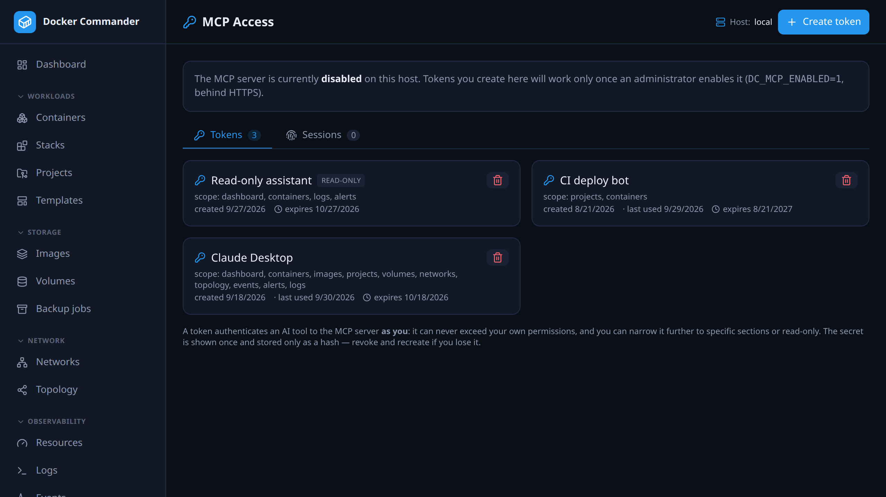
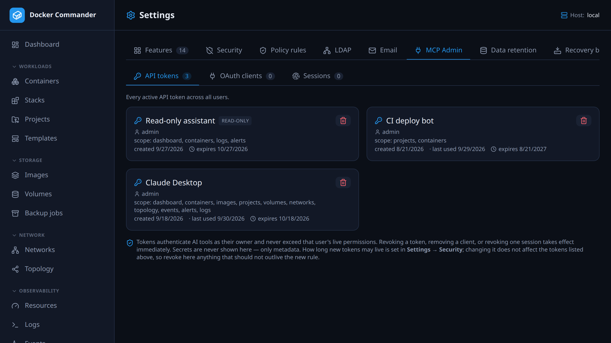

# MCP — remote control from AI tools

[← Manual index](README.md)

Docker Commander can run a **Model Context Protocol (MCP)** server, so AI tools
(**Claude Code**, **Claude Desktop**, **Cursor**, any MCP client) can monitor and
**safely operate** your Docker hosts *as you*, with the **same permissions** you
have in the UI.

It is **off by default**. When on, it never exceeds your rights: every call goes
through the app's RBAC, tokens can only **narrow** your access, and the tools are
an allow-list of **reads + safe control**. There is no `exec`, image export,
volume-content read, `prune` or `remove`.



## Common tasks

**Turn it on.** Add `DC_MCP_ENABLED=1` to the [config file](deployment.md#config-file)
and restart. For the OAuth flow, also set `DC_MCP_PUBLIC_URL` (see
[Enabling it](#enabling-it)). The startup log confirms the state: `MCP server:
disabled` means it is still off.

**Connect Claude Code (or a script).** Open **MCP Access**, create a token, copy
the secret (shown once) and run the command the page gives you:

```bash
claude mcp add --transport http docker-commander \
  https://docker.example.com/mcp \
  --header "Authorization: Bearer <token>"
```

**Connect Claude Desktop, claude.ai or Cursor.** Needs `DC_MCP_PUBLIC_URL`. In the
client, add a custom connector / remote MCP server pointing at
`https://<your-host>/mcp`. A browser opens: sign in to Docker Commander as usual and
approve the consent screen, choosing **full** or **read-only** access.

**Let an AI tool look but not touch.** Mark the token **read-only** (or pick
read-only on the OAuth consent screen). Restrict it to a few sections or hosts if
it only needs those, e.g. to review how your stacks are wired.

**A token is lost or leaked.** The secret can't be recovered. **Revoke** it on
MCP Access (it stops working immediately) and create a new one.

**Disconnect one machine's connector.** On MCP Access → **Sessions**, revoke that
session. Other sessions of the same connector keep working.

**See who has MCP access.** Admins open **Settings → MCP Admin** to see and revoke
every token, OAuth client and session ([below](#admin-overview-the-mcp-admin-page)).

## Enabling it

The server is gated by a config knob and should run **behind HTTPS** (native TLS
or a reverse proxy, see [Deployment → HTTPS](deployment.md#https)):

```ini
# /etc/docker-commander/commander.conf
DC_MCP_ENABLED=1
# Only needed for the OAuth flow (Claude Desktop / Cursor); bearer tokens work without it:
DC_MCP_PUBLIC_URL=https://docker.example.com
```

When disabled, the MCP and OAuth routes are **not mounted**. A request to `/mcp` is
just an unknown path (it falls through to the SPA, or a plain `404` when no UI is
embedded), with no hint the feature exists.

## Authentication

| Client | Auth | Notes |
|--------|------|-------|
| **Claude Code**, scripts, Cursor (header mode) | **Bearer API token** | Simplest. Create one on the **MCP Access** page. |
| **Claude Desktop**, claude.ai, Cursor (connector) | **OAuth 2.1** | Needs `DC_MCP_PUBLIC_URL`. You log in in the browser and approve a consent screen. |

### Bearer API tokens (the MCP Access page)

Open **MCP Access** in the sidebar. Each user manages **their own** tokens.

- Each token has a **name**, an optional **expiry**, and can be restricted to a
  **subset of your sections**, a **subset of Docker hosts**, and/or **read-only**.
- Narrowing only subtracts. A token can't reach a section or host its owner can't.
  The owner's live permissions are re-checked on **every call**, so if a role is
  scoped down, older tokens lose that access at once.
- If your account is read-only, every token you mint is read-only too.
- The secret is shown **once** (only a hash is stored). The page also gives a
  ready-to-paste `claude mcp add` command.
- Revoke a token anytime. It stops working immediately.

### OAuth (Claude Desktop / Cursor connector)

The client discovers the authorization server, **registers itself** (dynamic
client registration) and opens a browser to Docker Commander. You sign in and
approve **full** or **read-only** access. Docker Commander never sees a password
here; it reuses your existing login session.

It is a standard, self-contained **OAuth 2.1** server: PKCE, exact redirect
matching, audience-bound short-lived access tokens, rotating refresh tokens. No
external identity provider is required.

### Admin overview (the MCP Admin page)



Administrators also get **MCP Admin** (a tab of **Settings**, `/settings?tab=mcp`).
It shows **every user's** active API tokens (labelled with the owner), all
registered **OAuth clients**, and every live **connector session**. An admin can
**revoke** any token or session, or **remove** any OAuth client. Only metadata is
shown; secrets are never recoverable here. One place to audit and cut off MCP
access for the whole instance.

Two levels of revocation:

- **Session**: one authorized pairing (e.g. "Claude Desktop on my laptop").
  Revoking it kills that session's access and refresh tokens. Other sessions under
  the same client (the same connector on a second machine) keep working.
  Self-service for your own sessions (MCP Access → **Sessions**), or for any user's
  from MCP Admin.
- **Client**: the whole connector registration. Removing it cuts off *every*
  session ever authorized through it. Use it when the connector itself is
  compromised or retired.

**Both take effect immediately.** An access token is a signed credential, so
deleting database rows would not normally reach a copy a tool already holds; it
would keep working until it expired (up to 15 minutes). Docker Commander's access
tokens therefore carry the client and the **session** they were issued to, and
every call checks both are still registered. Revoked means now.

Tokens issued before per-session revocation existed carry no session (older ones,
no client either), so they can't be revoked that way. They expire within 15
minutes of the upgrade, or become a tracked session on their next refresh.

## What the AI can do

Every tool is listed in [the table below](#the-whole-tool-list). In short:

**Read**: list hosts, containers, images, volumes, networks and Compose projects;
inspect a container (**without its environment variables**); tail its **logs**
(size-capped); read a **compose file**; host **system info**, a **stats** snapshot,
per-container **metrics history**, recent Docker **events** and **audit** entries.
Each is gated by its section, per token and user.

**Diagnostics**, the questions that otherwise push you to open a shell:

- **container_processes**: what is running inside a container (`docker top`).
- **container_changes**: files added, modified or deleted since it started
  (`docker diff`). Paths only, never contents.
- **search_logs**: a string or regex **across** the containers on a host, for when
  you don't know which one to look at.
- **run_diagnostics**: sanity checks against a host. Overlapping Docker network
  subnets (with each other and with the host's real interfaces), a bridge MTU that
  doesn't match the host's default interface, duplicate port bindings, log drivers
  without rotation, low free disk where Docker stores its data, dangling
  networks/volumes. Each check reports ok/warn/fail/skipped. The host-network and
  disk checks report **skipped**, not a guess, when the host can't be probed (no
  SSH access, or a plain-TCP connection with no shell).

The first three are read-only and bounded, so an assistant can answer "what's it
doing?" and "what changed?" without `exec`. `run_diagnostics` is **write-gated**
(blocked for read-only tokens/users), because it actively inspects the target host
rather than reading Docker's own records.

**Alerting:**

- **list_alerts**: alert history, with the UI's filters (severity, lifecycle kind,
  container, rule, message text).
- **active_alert_conditions**: what is over threshold *right now*, and for how
  long. Use this one when diagnosing: `list_alerts` answers "what happened", and
  can report a problem that fixed itself an hour ago.
- **acknowledge_alert**: record that a human has seen an alert.
- **alert_delivery**: whether an alert reached anyone. No attempts means it was
  never routed anywhere; a failed attempt means nobody was told.
- **list_alert_rules**: rules and thresholds, so an assistant can tell a real
  problem from a badly chosen threshold. Shows which channels a rule uses, never
  the recipients or webhook URL (a webhook URL often carries a token).
- **list_maintenance_windows**: active/scheduled silences. Delivery is suppressed
  for their scope while active; events are still recorded.
- **create_maintenance_window**: start one now, for a duration and an optional
  scope (host/project/container/rule/severity). A reason is required.
- **end_maintenance_window**: stop one early. Editing a window's scope or schedule
  is UI/REST only.

**Safe control** (write; blocked for read-only tokens/users):

- **start / stop / restart** a container.
- **acknowledge_alert**: changes nothing on the container, but it is attributed,
  so a read-only principal can't claim it on someone's behalf.
- **start / stop / restart** a whole Compose **stack** by project name. Prefer the
  per-container tools when one service is the problem.
- **restart_stack_containers / stop_stack_containers**: a chosen **subset** (up to
  10) of one stack's containers, by project name and container ids. Every id is
  checked server-side to belong to that project; if one doesn't, the whole call is
  refused and nothing runs.
- **scan_image**: a Trivy scan (severity summary plus the most serious findings).
  A write because it shells out and pulls the image if missing. Reports when Trivy
  is absent instead of failing.
- **deploy / down** a managed Compose project. `deploy` runs
  `docker compose up -d --build`, like the web UI, so a project with `build:` is
  rebuilt from its current files. (`up` always built a missing image anyway, so
  this adds no new surface.) Projects on a **remote host** work too: they need the
  `hosts` section plus the per-host scope, as in the UI, and resolve their compose
  environment the same way. Bind mounts are shipped to the target, binds outside
  the project folder are **refused** unless the project opts in, and anything
  remapped is reported in the tool's output.

Two related **reads**:

- **preview_deploy**: what a deploy *would* change, without deploying. Services
  to create, to recreate with a different image, and running ones no longer in the
  compose file; also reports an invalid compose file. A read on purpose: a
  read-only token can look before anyone leaps.
- **list_managed_projects**: the projects this caller may act on. Projects on
  hosts outside the caller's scope are dropped rather than erroring, since a
  project names its host and listing it would disclose that host's workloads.

The server also exposes MCP **resources** (container inventory and compose files
as attachable context) and **prompts** (curated workflows like *diagnose an
unhealthy container* or *guided safe redeploy*).

### The whole tool list

Every tool, the **section** that gates it, and whether it is a read or a
**write**. Writes are refused for a read-only token or user, and are audited and
rate limited. A token's section subset narrows this list; its host subset decides
*where* each tool may act.

| Tool | Section | R/W | What it does |
|---|---|---|---|
| `list_hosts` | hosts | R | The hosts this server manages, with their ids |
| `list_containers` | containers | R | Containers on a host: id, name, image, state, published ports |
| `get_container` | containers | R | Inspect one container — **without** its environment variables |
| `container_logs` | logs | R | The tail of one container's logs, size-capped |
| `search_logs` | logs | R | A substring or regex **across** the containers on a host |
| `container_processes` | containers | R | What is running inside a container (`docker top`) |
| `container_changes` | containers | R | Files added/modified/deleted since it started (`docker diff`) — paths only |
| `run_diagnostics` | diagnostics | W | Sanity-check battery for a host: network overlaps (incl. vs. host interfaces), MTU mismatch, duplicate ports, log rotation, disk space, dangling resources |
| `list_images` | images | R | Images on a host: tags, size, age, whether in use |
| `list_volumes` | volumes | R | Volumes and who mounts them — never their contents |
| `list_networks` | networks | R | Networks: driver, scope, subnets, attached containers |
| `list_projects` | projects | R | Compose projects (stacks) discovered on a host |
| `get_compose` | projects | R | A project's compose file |
| `list_managed_projects` | projects | R | The app's managed projects; hosts out of scope are dropped from the list |
| `preview_deploy` | projects | R | What a deploy *would* change — also checks the project's own host |
| `stats_overview` | dashboard | R | Host CPU/memory plus a per-container snapshot |
| `system_info` | dashboard | R | Engine and host facts: versions, OS/kernel, drivers, counts |
| `metrics_history` | dashboard | R | Historical CPU%/memory% for one container (authorized against the container's host) |
| `recent_events` | events | R | Recent Docker daemon events on a host |
| `recent_audit` | audit | R | Recent audit entries — most tokens will not have this section |
| `list_alerts` | alerts | R | Alert history with the UI's filters |
| `active_alert_conditions` | alerts | R | What is over threshold **right now**, and for how long |
| `list_alert_rules` | alerts | R | Rules and thresholds; channels, never recipients or webhook URLs |
| `alert_delivery` | alerts | R | Whether an alert reached anyone (authorized against the alert's host) |
| `acknowledge_alert` | alerts | **W** | Record that a human saw it, attributed to the caller |
| `list_maintenance_windows` | alerts | R | Active/scheduled planned-work silences |
| `create_maintenance_window` | alerts | **W** | Start a silence now, for a duration and scope |
| `end_maintenance_window` | alerts | **W** | Stop a window early |
| `start_container` / `stop_container` / `restart_container` | containers | **W** | One container's lifecycle |
| `start_stack` / `stop_stack` / `restart_stack` | containers | **W** | A whole Compose stack by project name |
| `restart_stack_containers` / `stop_stack_containers` | containers | **W** | Up to 10 of one stack's own containers, membership verified server-side |
| `scan_image` | images | **W** | Trivy scan — a write because it shells out and may pull the image |
| `deploy_project` / `down_project` | projects (+ `hosts` for a remote target) | **W** | `docker compose up -d --build` / `down` on a managed project |

`host_id` defaults to the local host when omitted. Tools that take a **record id**
instead (a project, an alert, a container's metrics) resolve that record's host and
authorize against it; see the security model below.

### What is deliberately missing

- `exec`/shell, image `save`/export, reading volume **contents** or arbitrary
  files, `kill`, `prune` and `remove`. An AI token must not become a
  data-exfiltration or destruction path.
- **Stack `remove`**, although the app has it. Force-removing a stack's containers
  and networks is destruction, not safe control; do it by hand. A test asserts no
  destructive verb ever appears in the tool list, so one can't be added by
  oversight.
- If destructive tools are ever added, the plan is an **explicit opt-in the
  operator enables in the UI**: off by default, a separate risky toolset, audited,
  and limited by both token and role. "The assistant deleted it" should only be
  possible after somebody decided it could be.

## Security model

- **RBAC is reused.** Every tool maps to a section + read/write and is checked
  against your **live** permissions on **every** request. Disable a section for a
  user and the matching tool stops working immediately.
- **Tokens only narrow.** A token's section subset, **host subset** and read-only
  flag apply *before* your own RBAC and never grant more than you have.
- **Tokens expire by default.** New tokens last **30 days** unless another
  lifetime is chosen. Never-expiring tokens are **off** until an admin enables
  them, and there is a **ceiling** (a year by default) so nobody sidesteps that by
  asking for a hundred years. Admins set all three in **Settings → Security**.
  The policy governs what may be **minted**: existing tokens keep their expiry, so
  tightening it won't cut off a running integration. Existing never-expiring
  tokens are listed on MCP Admin and can be revoked there.
- **Host scope covers ids, not just arguments.** Tools that take a project or
  alert id resolve its host and authorize against it, and list tools drop rows for
  hosts the caller can't reach. Ids are sequential, so knowing one is not access
  control. A missing object and an out-of-reach one get the same answer, so the
  tools can't map what exists elsewhere.
- **Secrets are kept out.** Container env vars, audit detail and raw event
  attributes are omitted from tool output; logs are size-capped.
- **Off by default, behind HTTPS.** Access tokens are signed with a key used only
  for MCP, separate from the login session secret.
- **Audited.** Every **control** call (start/stop/restart, deploy/down) is written
  to the [audit log](audit.md) under your account.
- **Changes are rate limited**: at most 30 per minute per user, burst of 30 (see
  below).

## Tips

- Keep MCP **behind a reverse proxy / HTTPS**; the OAuth and rate-limited
  registration endpoints assume it.
- Prefer a **read-only** token, or one limited to a few sections, when the tool
  only needs to look.

## Technical notes

- **Why a rate limit.** Every other control answers *is this allowed*; this one
  answers *how much, how fast*. A model stuck in a loop and a stolen token both
  look like an authorized user making many permitted calls. The cap turns "the
  whole estate stopped" into "a few containers stopped and the audit log is
  shouting". The limit is per user, not per token.
- **Reads are not limited.** They change nothing, and throttling them would push an
  assistant to act without looking.
- **One audit entry per episode.** Hitting the ceiling writes one entry, not one
  per rejected call, so a runaway can't bury the evidence. Large intentional
  batches belong in the web UI.
- **Subset tools have their own cap.** The limit assumes one call is roughly one
  container. `restart_stack_containers`/`stop_stack_containers` therefore take at
  most 10 ids, all checked to belong to one named project. Without that, one call
  could act on any number of containers and defeat the limit.
- **Whole-stack calls are charged per container.** `start_stack`/`stop_stack`/
  `restart_stack` spend one unit per container the stack has, resolved before the
  action runs. A 30-container stack costs 30, the same as 30 single calls.
- **Charging is reserve-or-refuse.** A batch that doesn't fit is refused whole and
  spends nothing. A batch larger than the burst can never fit, and the refusal says
  so instead of "wait and retry".
- **No race with deploys.** The action runs on exactly the container ids the charge
  was sized for, not a re-resolved list. A container that joins the project
  mid-call (a concurrent deploy) is neither charged for nor touched.
