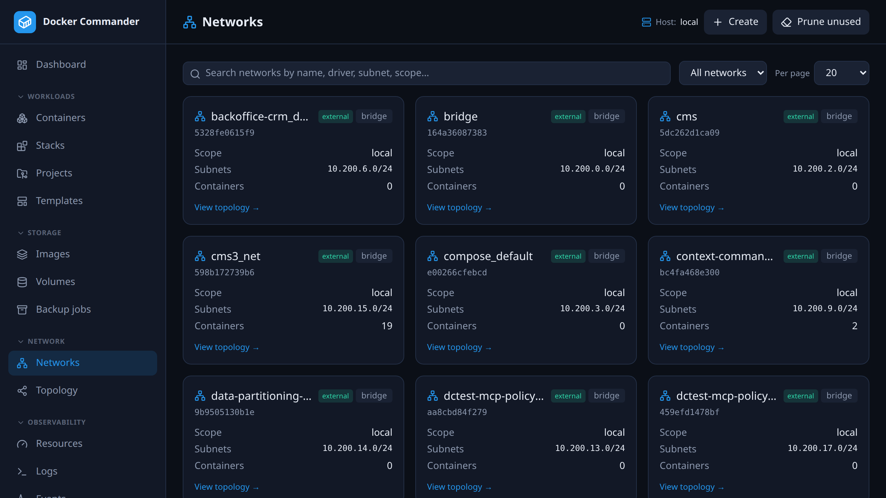
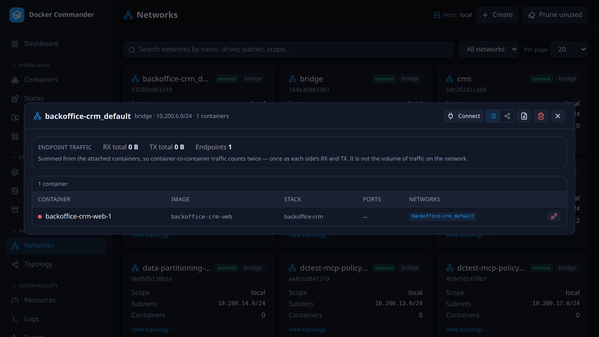
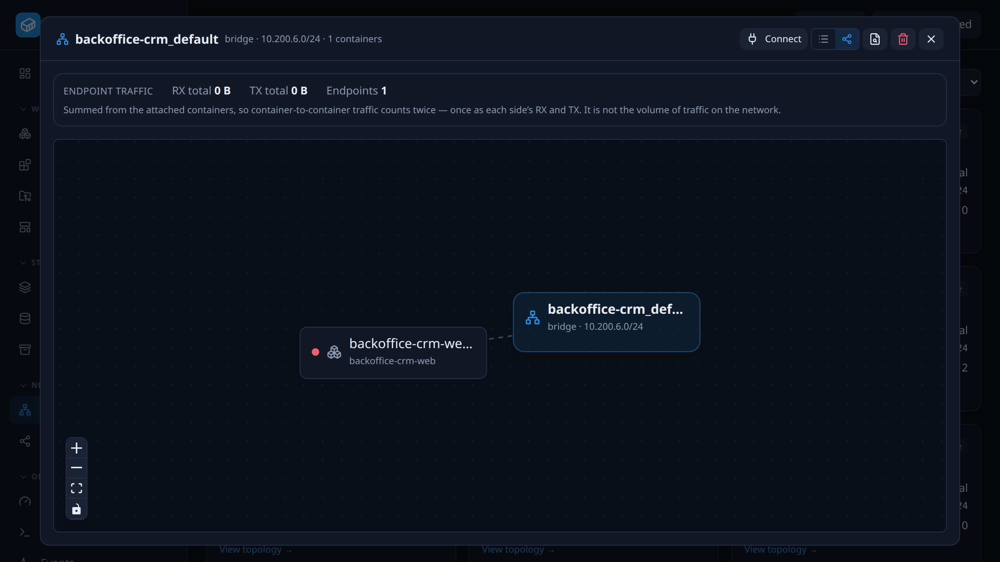
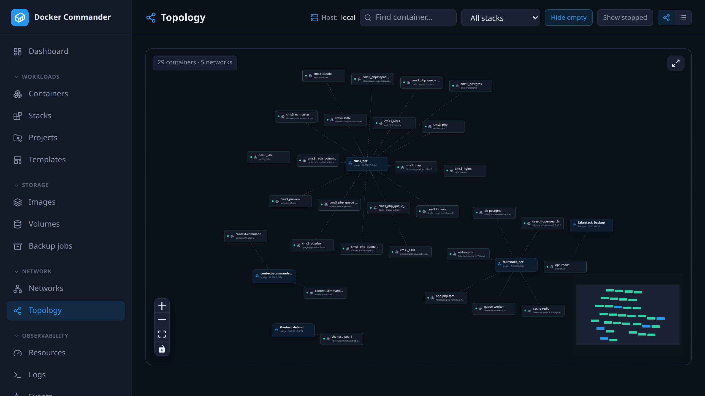

# Networks & Topology

[← Manual index](README.md)

The Docker networks on the selected host, and a graph of which containers sit on
which network. For a container's own traffic, open its
[detail page](containers.md#network).

## Common tasks

**Let two containers talk to each other.** Create a network, or open an existing
one, click **Connect**, pick a container and click **Connect** again. Repeat for
the other container. Containers on the same
user-defined network can reach each other.

**Find a container's IP.** Open the network and look at the **List** view. It
shows each container's IP on that network and its published ports.

**Remove a network.** Disconnect its containers first, using the per-row
**disconnect** in the network detail. The daemon refuses a network that still has
containers attached.

**Isolate a backend from the internet.** Create the network with **Internal**
ticked. Containers on it get no external connectivity.

**See what a stack is connected to.** Open **Topology** and pick the stack in
the **stack** dropdown.

## Networks
A card per network with driver, scope, subnets, an **internal** or **external**
badge and the
attached-container count. Search and filter (**in use, unused, internal, all**) as
elsewhere.

- **Create** (header): a user-defined network with a name, a **driver** (default
  `bridge`), an optional **subnet** and **gateway**, and two flags. **Internal**
  means no external connectivity. **Attachable** (on by default) lets standalone
  containers join a swarm overlay network; bridge networks accept any container
  either way.
- **Prune unused** (header): removes every network not used by any container.

### Network detail

Click a card to open its detail. It shows the attached containers as a **list**
or a **graph** (toggle, top-right).

| Control | What it does |
|---|---|
| **List** (default) | A compact table: state, image, stack, **published ports** and the container's **IP** on this network, with a **disconnect** per row. |
| **Graph** | The network and its containers as an interactive diagram, drawn like the Topology page. |
| **Connect** | Opens a picker that attaches one container not yet on the network. Hidden when every container is already attached. |
| **Inspect** | Docker's raw JSON. |
| **Remove** | Deletes the network. Predefined networks (`bridge`, `host`, `none`) can't be removed. |

The detail also shows **Endpoint traffic**: RX and TX totals summed from the
attached containers. See [Endpoint traffic](#endpoint-traffic) for what that
number does and doesn't mean.

## Topology

An interactive graph of **containers and networks**. Containers cluster around
their networks, and the graph spreads across the width instead of one tall
column.

- **Pan and zoom**, drag nodes to rearrange (edges re-route cleanly), and use the
  controls bottom-left, the minimap, or the **fullscreen** button top-right.
- Click a container node to jump to its [detail page](containers.md).
- **Find container** (name, image or stack) narrows the graph to the matches and
  the networks they're on. The **stack** dropdown filters to a single compose
  project. A badge shows the current node count.
- **Hide empty** (graph only) and **Show stopped** toggles. The default is a
  clean view: running containers and non-empty networks. The toggles, stack and
  view persist across reloads; the search does not.
- **List view** (toggle, top-right): a dense, filterable table of containers
  (state, image, stack, ports, networks). Easier to read on a large host.

On a busy host, use the search, the stack filter or the list view. Empty networks
are hidden automatically while a filter is active.

## Endpoint traffic
Docker does **not** report per-network counters, so the network detail sums the
attached containers' own totals. It says two things plainly instead of showing a
confident wrong number:

- It is **endpoint** traffic, not network traffic. Container-to-container traffic
  inside the network is counted **twice**: once as one side's TX and once as the
  other's RX.
- A container attached to **several** networks has counters covering all of them,
  and Docker gives no way to split them. Those containers are listed but left out
  of the totals, and the number left out is shown.

A container attached to exactly **one** network is unambiguous. That is the
common case, and it is what makes the number useful at all.

### Technical notes
- **Why no per-network counters.** `/containers/{id}/stats` is keyed by
  *interface* name (`eth0`, `eth1`…) and carries no network identity on Linux. The
  API has an `endpoint_id` field, but the daemon only fills it on Windows.
  `docker stats` itself shows a single aggregate `NET I/O` column for the same
  reason.
- **Graph layout.** The graph uses React Flow with a force-directed layout. The
  network detail graph uses the same renderer as the Topology page.
