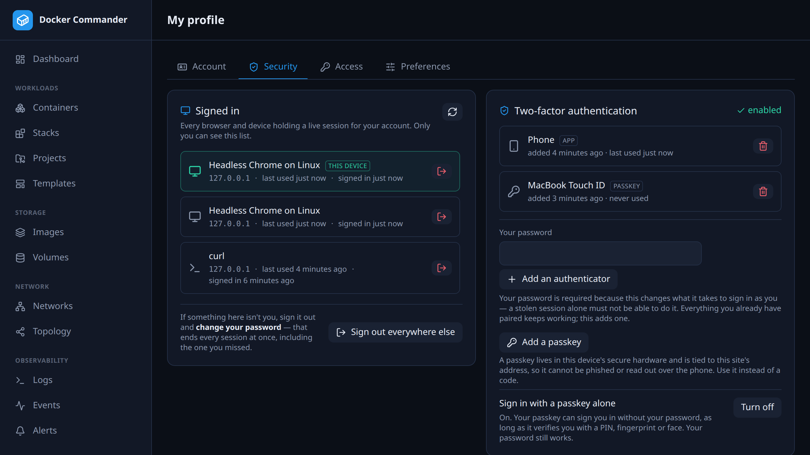

# Your profile

[← Manual index](README.md)

Every signed-in user has a profile page — the person icon beside *Sign out* — and
it is the same page whatever your permissions are. Four tabs:

- **Account** — username, account type, whether you sign in locally or through
  LDAP, when the account was created and last used, and your **alert e-mail**.
- **Security** — your **authenticators** and what is signed in as you.

  You can pair **as many authenticators as you like** — a phone and a tablet, or a
  new phone before you wipe the old one — and each is listed by a name you choose,
  with when it was added and when it last produced a code. Adding one leaves
  everything already paired working; there is no "replace".

  Pairing and removing both ask for your **password**. Both change what it takes to
  sign in as you, so a session on its own must not be enough: otherwise anyone who
  got hold of one could pair their own device, or strip yours one at a time. A
  first-time setup doesn't ask, because there is nothing yet to protect.

  **The last one cannot be removed.** 2FA is mandatory here, so an account with no
  authenticator could not sign in at all, and no admin can reset it for you. Pair
  the replacement first, then remove the old one.

  Replacing a lost device is therefore two steps: pair the new one, then remove the
  old entry. Pairing does not revoke anything on its own — which is the point, but
  it does mean the old device keeps working until you say otherwise.

  **Passkeys** are the other kind of second factor. *Add a passkey* uses whatever
  this device already has — a fingerprint, a face, a PIN, or a plugged-in security
  key — and the private key never leaves that device's secure hardware. Two things
  make it stronger than a code: there is nothing to type, so nothing to read out to
  someone on the phone, and the signature is bound to this site's address, so a page
  that looks exactly like this one cannot use what it captures.

  Passkeys need a **secure context**, which is the browser's rule, not ours: HTTPS,
  or `localhost`. They also need a **hostname** — an IP address cannot be a passkey's
  relying party, so `http://127.0.0.1:8470/` will not offer them even though it is a
  secure context; use `http://localhost:8470/` instead. Where they are unavailable
  the button says why rather than failing when you press it. See
  [Deployment](deployment.md) for TLS.

  **Reach the app by one hostname.** A passkey is bound to the name you paired it
  under, and the browser will only offer it back under that same name. Capitalisation
  does not matter, but a trailing dot does: `dc.example.com.` is a different name to
  the browser than `dc.example.com`, so a key paired under one will not be offered
  under the other. Pick one spelling and stay with it.

  

  **Signing in with a passkey alone** is off until you turn it on, in *Profile →
  Security*, and turning it on asks for your password. It works when the passkey can
  verify *you* — a PIN, a fingerprint, a face — because that is what makes the key
  two factors rather than one; a passkey that only proves possession is refused and
  says so.

  Worth knowing before you turn it on: if your passkey **syncs** between your devices
  (iCloud Keychain, Google Password Manager), the PIN or fingerprint can be satisfied
  on any device it reaches — so your account rests on that platform account too. Your
  password still works and always will: it is what gets you back in if the key is
  lost, since no admin can reset another account's second factor. LDAP accounts sign
  in with their directory password.

  Starting a passkey sign-in is rate limited per address, so repeatedly opening and
  cancelling the browser prompt will eventually ask you to wait a few minutes. Your
  password is unaffected — it has its own budget.

  A passkey counts as a second factor like any other: it appears in the same list,
  it can be removed the same way, and it cannot be the one you remove last. At
  sign-in you get whichever of the two your account actually has — the code box,
  the passkey button, or both.

  An account can hold ten authenticators and passkeys in total.

  Repeated wrong passwords on these actions are rate limited per **sign-in session**,
  so a device that has been fumbling cannot stop you doing the same thing from
  another one. When that limit is hit the app says so, rather than claiming the
  password was wrong.

  Starting a pairing is always safe: nothing changes until you enter a code from
  the new device, so cancelling leaves things exactly as they were.

  It also lists **what is signed in as you** — every browser and device holding a
  live session, named (*Firefox on Linux*, *Safari on iPhone*, *curl*) with the
  address it last came from, when it was last used and when it signed in. The one
  you are using is marked *this device*. Any row can be signed out, and **Sign out
  everywhere else** ends all the others in one go. Signing out the current row
  simply signs you out here.

  Only you see this list, and only for your own account: an admin view of
  everyone's sessions would be a record of when each person works and from where.
  The address and the device name are recognition aids — both are ultimately what
  the client claims, and the name is our reading of it — so treat them as "does
  this look like me?", not as proof. A client we cannot place is shown exactly as
  it identified itself.

  If something there is not you, sign it out **and change your password**: that
  ends every session at once, including the one you didn't spot.

  **Locked out entirely?** If you are the only admin and the password is gone,
  `dockercmd --reset-password <user>` sets a new one from the machine the instance
  runs on. It asks for the password at the terminal, ends every session for that
  account, and leaves the second factor in place — you will still be asked for your
  code or passkey. It needs access to the data directory, which is already
  equivalent to being an admin, so it grants nothing that access did not.
- **Access** — the roles you hold, plus every section you can reach (**You can**),
  on which hosts (**Where**) and which role granted it (**Granted by**). Handy for
  answering "why can I see this?" — or "why can't I?" — without an admin.
- **Preferences** — per-account UI settings that follow you across browsers.
  Today: whether alerts **pop up as a toast** while you have the app open. Turning
  that off changes nothing about the alerts themselves — still recorded, still
  counted in the sidebar badge, still delivered by webhook and e-mail.

It reads only your own account.

## Access

**What you can reach**, computed rather than described: a row per section with what
you may do there, on which hosts, and *which grant said so* — your own account, a
named role, or both. It is the answer to "why can I see this?" and, more often,
"why can I not?".

For an **admin** it says so plainly: admin is not a role and not a grant, it
bypasses the permission system, so there is no overlay to compute — every section,
read and write, on every host, plus administration itself.

The tab reads **only your own account**. There is no view of anyone else's
permissions here; that lives in [Users & roles](users.md) and needs administration
rights.

> A section an admin has switched off installation-wide disappears from the menu
> but is still reachable through its API by anyone holding the grant — a feature
> flag is not a permission. The tab says so where it applies.

## Preferences

Per-account interface settings, stored server-side rather than in the browser, so
they follow you to another machine: which alert severities raise a toast, and the
[Topology](networks.md#topology) view's own toggles and filters.

## Limits worth knowing

| | |
| --- | --- |
| Sessions last | **12 hours** by default (`-session-ttl`), after which you are signed out |
| Wrong passwords | **5 per 15 minutes** per address, then sign-in is refused for the rest of the window |
| Passkey sign-in attempts | **30 per 5 minutes** per address, counted separately so a dismissed prompt cannot lock the password form |
| Authenticators and passkeys | **10 per account**, counted together |

See [Limits](limits.md) for the rest.
