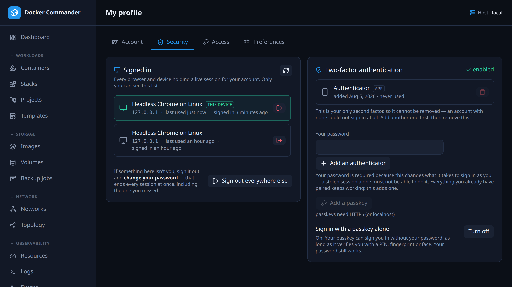

# Your profile

[← Manual index](README.md)

Your own account: how you sign in, what is signed in as you, and what you can
reach. Every signed-in user has this page, whatever their permissions. Open it
with the person icon beside *Sign out*. Other people's accounts are managed in
[Users & roles](users.md).

## Common tasks

**Move to a new phone.** On **Security**, click **Add an authenticator**, enter
your password and scan the code with the new phone. Then remove the old entry.
Pairing never revokes anything, so the old phone keeps working until you remove
it.

**Sign out a lost laptop.** On **Security**, find it in the list of sessions and
click **Sign out**, or use **Sign out everywhere else**. Then **change your
password**: that ends every session at once, including one you didn't spot.

**Use a fingerprint or security key instead of codes.** Click **Add a passkey**.
It only works over HTTPS or on `localhost`, and only under a hostname, not an IP
address (see [Passkeys](#passkeys)).

**Sign in with just the passkey.** Turn on **Sign in with a passkey alone** and
confirm with your password. Your password keeps working as the way back in.

**Find out why you can't see a page.** Open **Access**. It lists each section you
can reach, on which hosts, and which grant gave it to you. If the section isn't
there, ask an admin.

**Get alert e-mails.** Set your **Alert e-mail** on the **Account** tab.

## Tabs

| Tab | Shows |
|---|---|
| **Account** | Username, account type, whether you sign in locally or through LDAP, when the account was created and last used, and your **alert e-mail**. |
| **Security** | Your authenticators and passkeys, signing in with a passkey alone, and every session signed in as you. |
| **Access** | Your roles and, per section, what you can do (**You can**), where (**Where**) and why (**Granted by**). |
| **Preferences** | Whether alerts **pop up as a toast** while the app is open. |

## Authenticators

You can pair **as many authenticators as you like**, up to the account limit:
a phone and a tablet, or a new phone before you wipe the old one. Each is listed
by a name you choose, with when it was added and when it last produced a code.
Adding one leaves the others working. There is no "replace".

- **Pairing and removing ask for your password.** Both change what it takes to
  sign in as you. Otherwise anyone holding one of your sessions could pair their
  own device, or remove yours one at a time. A first-time setup doesn't ask,
  because there is nothing to protect yet.
- **The last one can't be removed.** 2FA is mandatory, so an account with no
  second factor couldn't sign in, and no admin can reset it for you. Pair the
  replacement first.
- **Starting a pairing is safe.** Nothing changes until you enter a code from the
  new device, so cancelling leaves everything as it was.

## Passkeys

A passkey is the other kind of second factor. **Add a passkey** uses what this
device already has: a fingerprint, a face, a PIN or a plugged-in security key.
The private key never leaves the device's secure hardware.

It is stronger than a code in two ways. There is nothing to type, so nothing to
read out to someone on the phone. And the signature is bound to this site's
address, so a lookalike page can't use what it captures.

A passkey counts as a second factor like any other. It is in the same list, is
removed the same way, and can't be the last one you remove. At sign-in you get
whatever your account has: the code box, the passkey button, or both.

**Where passkeys work.**
- They need a **secure context**. That's the browser's rule: HTTPS, or
  `localhost`. See [Deployment](deployment.md) for TLS.
- They need a **hostname**. An IP address can't be a passkey's relying party, so
  `http://127.0.0.1:8470/` won't offer them, even though it is a secure context.
  Use `http://localhost:8470/` instead.
- The hostname can't end in a dot (`http://localhost.:8470/`). It is the same
  name, but the WebAuthn library doesn't accept that form, so it is refused like
  an IP address.
- Where passkeys are unavailable, the button says why instead of failing when
  you press it.

**Use one hostname.** A passkey is bound to the name you paired it under, and the
browser only offers it back under that name. Capitalisation doesn't matter, but a
trailing dot does: `dc.example.com.` and `dc.example.com` are different names to
the browser. Pick one spelling and keep it.

### Signing in with a passkey alone

Off until you turn it on in *Profile → Security*, which asks for your password.

- It works only when the passkey verifies *you* with a PIN, fingerprint or face.
  That is what makes it two factors instead of one. A passkey that only proves
  possession is refused, with a message saying so.
- If your passkey **syncs** between devices (iCloud Keychain, Google Password
  Manager), the PIN or fingerprint can be given on any device it reaches. Your
  account then also depends on that platform account.
- Your password still works and always will. It is your way back in if the key
  is lost, since no admin can reset another account's second factor. LDAP
  accounts use their directory password.

## Sessions

**Security** lists every browser and device signed in as you. Each is named
(*Firefox on Linux*, *Safari on iPhone*, *curl*) with the address it last came
from, when it was last used and when it signed in. The one you are using is
marked *this device*.

- Any row can be signed out. Signing out the current row signs you out here.
- **Sign out everywhere else** ends all the others at once.
- If something there isn't you, sign it out **and change your password**.

Only you see this list, for your own account. An admin view of everyone's
sessions would be a record of when each person works and from where.

The address and device name are what the client claims, and the name is our
reading of it. Treat them as "does this look like me?", not as proof. A client we
can't place is shown exactly as it identified itself.

## Access

What you can reach, computed from your grants: a row per section with what you
may do, on which hosts, and *which grant said so* (your own account, a named
role, or both). It answers "why can I see this?" and, more often, "why can't I?".

For an **admin** it says so plainly. Admin is not a role or a grant: it bypasses
the permission system, so there is nothing to compute. Every section, read and
write, on every host, plus administration.

It reads only your own account. Other people's permissions are in
[Users & roles](users.md), for admins.

> A section an admin has switched off installation-wide disappears from the menu.
> Its API stays reachable for admins, because admins bypass the permission check.
> A feature flag is not a permission. The tab says so where it applies.

## Preferences

Stored on the server, not in the browser, so they follow you to another machine.

- **Pop up alerts.** Turning toasts off changes nothing about the alerts
  themselves. They are still recorded, still counted in the sidebar badge, and
  still delivered by webhook and e-mail.
- Your [Topology](networks.md#topology) view's toggles and filters, and list
  settings such as page size, are saved to your account the same way.

## Locked out entirely?

If you are the only admin and the password is gone, run
`dockercmd --reset-password <user>` on the machine the instance runs on.

- It asks for the new password at the terminal and ends every session for that
  account.
- It leaves the second factor in place. You still need your code or passkey.
- It needs access to the data directory, which already equals being an admin, so
  it grants nothing that access didn't.

### Limits

| | |
| --- | --- |
| Sessions last | **12 hours** by default (`-session-ttl`), then you are signed out |
| Wrong passwords | **5 per 15 minutes** per address, then sign-in is refused for the rest of the window |
| Passkey sign-in attempts | **30 per 5 minutes** per address, counted separately so a dismissed prompt can't lock the password form |
| Authenticators and passkeys | **10 per account**, counted together |

- Repeatedly opening and cancelling the passkey prompt eventually asks you to
  wait a few minutes. Your password has its own budget and is unaffected.
- Wrong passwords when pairing, removing or switching passwordless sign-in are
  limited per **sign-in session**. A device that has been fumbling can't stop you
  doing the same thing from another one. When the limit is hit, the app says so
  instead of claiming the password was wrong.

See [Limits](limits.md) for the rest.
