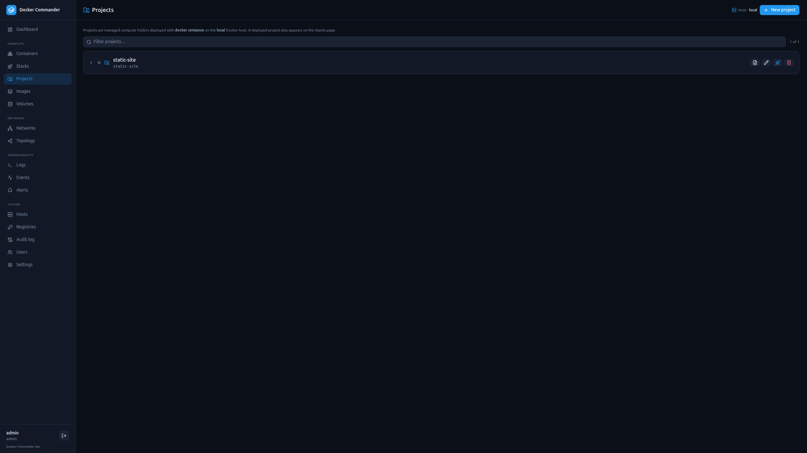
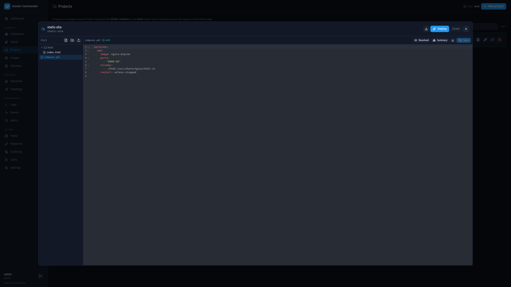

# Projects

[← Manual index](README.md)

A **Project** is a managed Compose *folder*: a compose file plus its sidecar
files (configs copied into containers, `.sh` scripts, init files, …) that Docker
Commander stores and edits for you, then deploys by running the real
**`docker compose` CLI** on the host. Because it uses the CLI, you get the full
Compose feature set — `depends_on`, profiles, `build:`, `configs`, init
containers — for free. A deployed project also appears on the
[Stacks](stacks.md) page, where its lifecycle and "view compose" live.

> **Local host only.** The `docker compose` CLI follows its own Docker context,
> independent of the host switcher, so Projects always target the **local**
> Docker daemon. Deploy/Down are disabled (with a note) if the `docker compose`
> CLI isn't installed where Docker Commander runs.

## Creating a project
- **New project** — give it a name; an identifier (slug) is derived from it
  (lowercased, diacritics transliterated). A starter `compose.yml` is created.
- **Template** — optionally start from a ready-made scaffold: **Nginx static
  site**, **Nginx + PHP-FPM**, **Postgres + Adminer**, or a **Node** app (with a
  Dockerfile). The template's files are seeded into the new project.
- **Import** — in the New-project dialog, choose a `.zip` to import an existing
  project folder (files are written through the same path sandbox). Import takes
  precedence over a template.

## The editor

A modal with a **file tree** on the left and a **CodeMirror** editor on the
right, with syntax highlighting for YAML, JSON, shell, Dockerfiles and
`.conf` / `.env` files.

- **New file / New folder / Upload** create inside the **current folder** —
  click a folder (or open a file) to set it as the target; the toolbar shows
  where new items land, with an × to go back to the project root. Upload accepts
  binary/data files too (shown download-only in the tree).
- **Save** writes the open file; an unsaved-changes dot marks edits.
- **Download** a single file (next to *Save*) or the **whole project as a
  `.zip`** (editor header).
- **Profiles** — if the compose file defines `profiles`, a toggle bar lets you
  pick which ones to enable; the selection is remembered and applied on deploy.

### Validation (live, while you edit)
Validation runs on the **unsaved** buffer (no save needed) and shows results as
**inline diagnostics** underlined on the relevant line, plus an at-a-glance
status chip:

- **Compose files** — `docker compose config` (the real deploy parser, so YAML
  anchors, merge keys `<<`, `${VAR}` interpolation and `extends`/`include`
  resolve as at `up` time). Unset-variable **warnings** are surfaced too.
- **Dockerfiles** — `docker build --check` (BuildKit's linter; no build runs).
- **YAML / JSON / `.env`** — instant client-side syntax lint.

On the compose file, two extra actions sit in the editor toolbar:

- **Resolved** — the fully-flattened compose (anchors / interpolation / extends
  resolved) — exactly what `docker compose up` deploys.
- **Summary** — an overview of services, published ports and volumes, with a
  **duplicate-host-port** check.

## Lifecycle
- **Deploy / Redeploy** — runs `docker compose up -d` (with the selected
  profiles). Redeploy re-applies after edits. The combined output is shown.
- **Down** — `docker compose down` (available once the project is deployed).
- **Rename** — changes the display name; the slug / compose project name stays
  the same, so deployments remain stable.
- **Delete** — refuses while the project is deployed (offers to bring it down
  first); deleting the last file offers to delete the now-empty project.

## Tips
- Sidecar files are referenced from the compose file relative to the project
  folder (e.g. `./html:/usr/share/nginx/html`), so configs/scripts land inside
  the containers exactly as the CLI would mount them.
- Restarting a deployed project's containers (without re-applying files) is
  available on the [Stacks](stacks.md) page.
