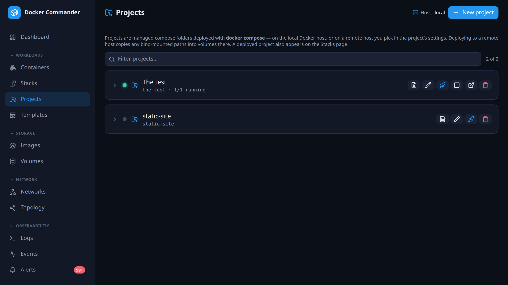
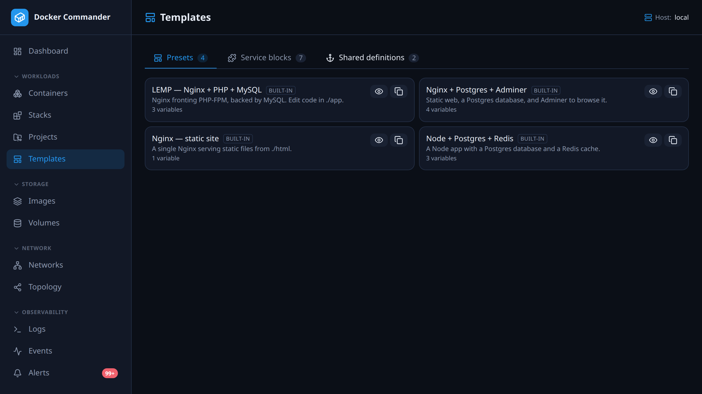
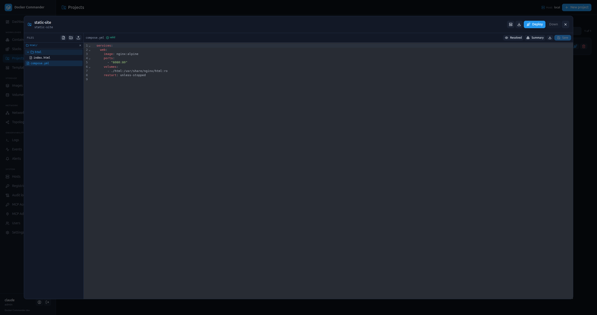

# Projects

[← Manual index](README.md)

A **Project** is a managed Compose *folder*: a compose file plus its sidecar
files (configs copied into containers, `.sh` scripts, init files, …) that Docker
Commander stores and edits for you, then deploys by running the real
**`docker compose` CLI** on the host. Because it uses the CLI, you get the full
Compose feature set — `depends_on`, profiles, `build:`, `configs`, init
containers — for free. A deployed project also appears on the
[Stacks](stacks.md) page, where its lifecycle and "view compose" live.

> **Local host only.** The `docker compose` CLI follows its own Docker context,
> independent of the host switcher, so Projects always target the **local**
> Docker daemon. Deploy/Down are disabled (with a note) if the `docker compose`
> CLI isn't installed where Docker Commander runs.
>
> Running under **systemd** and Deploy/Down are disabled even though
> `docker compose` works in your shell? It's the `ProtectHome=true` hardening —
> see the fix in [Deployment → Running as a service](deployment.md#running-as-a-service).

## Creating a project
Give the project a name (an identifier — *slug* — is derived from it, lowercased
with diacritics transliterated), then pick how to scaffold it. The files are
always rendered and written **server-side**:

- **Template** — start from a ready-made preset (e.g. **Nginx — static site**,
  **Nginx + Postgres + Adminer**, **LEMP** (Nginx + PHP + MySQL), **Node +
  Postgres + Redis**), or **Empty** for a bare starter `compose.yml`. Presets can
  declare **variables** (ports, database names, passwords) you fill in on a small
  form; blank fields fall back to a default, and `secret` ones can be
  auto-generated.
- **Builder** (the *skládačka*) — tick the service blocks you want — **Nginx**,
  **PHP-FPM**, **Node**, **Postgres**, **MySQL**, **Redis**, **Adminer** — and
  they're merged into one `compose.yml` you can edit afterwards. Add your own with
  **Custom service…** (name, service key, the service YAML, optional named
  volumes); it's saved and reappears in the builder. Under **Shared definitions**
  you can also include reusable **top-level YAML anchors** (e.g.
  `x-pg-common: &pg-common …`) — emitted above `services:` so a cluster of
  services can share one definition (security, cert mounts, …) and merge it with
  `<<: *pg-common`. Built-ins (Service defaults, Secured Postgres) ship in, and
  you can save your own with **Custom definition…**.
- **Import** — choose a `.zip` to import an existing project folder (files are
  written through the same path sandbox).

As you pick a template or builder blocks, a **live read-only preview** of the
resulting `compose.yml` renders alongside the form, so you see what you'll get
before creating the project.

**Save as preset** — the editor's 🗎 button snapshots the open project's files
into a reusable preset that then shows up under **Template** (and on the
Templates page). Built-in presets and blocks are read-only; the ones you save are
yours to edit or remove.

> Built-in presets/blocks ship with the binary; saved ones live in the data dir.
> A future catalog source could pull presets from a remote API.

## Managing templates

The **Templates** page (sidebar, under the Projects permission) is where your
presets and builder blocks live:

- **Presets** — edit a saved preset's files in the same multi-file editor,
  rename it / change its description, download it as a `.zip`, or delete it.
  Built-in presets open read-only so you can inspect what they scaffold.
- **Service blocks** — create a block, edit an existing one (name, service key,
  the service YAML, named volumes), or delete it; built-in blocks are read-only.
  Blocks you add here (and via the builder's **Custom service…**) appear in the
  builder.
- **Shared definitions** — create/edit/delete top-level YAML anchors (see the
  Builder above); built-in ones are read-only. They appear in the builder's
  **Shared definitions** list.

Built-in presets/blocks can't be modified; only the ones you save are editable.

## The editor

A modal with a **file tree** on the left and a **CodeMirror** editor on the
right, with syntax highlighting for YAML, JSON, shell, Dockerfiles and
`.conf` / `.env` files.

- **New file / New folder / Upload** create inside the **current folder** —
  click a folder (or open a file) to set it as the target; the toolbar shows
  where new items land, with an × to go back to the project root. Upload accepts
  binary/data files too (shown download-only in the tree).
- **Save** writes the open file; an unsaved-changes dot marks edits.
- **Image autocomplete** — on a compose `image:` line, suggestions appear for
  repository names (your locally-pulled images first, then a Docker Hub search)
  and, once you type a `:`, for that repo's tags (local tags + Docker Hub). The
  Create-container form's image field offers the same. It's best-effort —
  offline you still get your local images. For a host you've added under
  [Registries](registries.md), tag suggestions also come from that **private
  registry's** API (using its stored credentials); hosts you haven't configured
  are never contacted.
- **Compose autocomplete** — in a Compose file you also get schema-aware
  suggestions: top-level keys, service keys (at the right indent), nested
  `build` / `healthcheck` / `deploy` / `logging` keys, and known enum values
  (e.g. `restart:` → `always` / `unless-stopped`). Press <kbd>Ctrl</kbd>+<kbd>Space</kbd>
  to pop the list on a blank line. It's a typing aid, not a validator — the
  authoritative check is still `docker compose config` (the inline diagnostics).
- **Download** a single file (next to *Save*) or the **whole project as a
  `.zip`** (editor header).
- **Profiles** — if the compose file defines `profiles`, a toggle bar lets you
  pick which ones to enable; the selection is remembered and applied on deploy.

### Validation (live, while you edit)
Validation runs on the **unsaved** buffer (no save needed) and shows results as
**inline diagnostics** underlined on the relevant line, plus an at-a-glance
status chip:

- **Compose files** — `docker compose config` (the real deploy parser, so YAML
  anchors, merge keys `<<`, `${VAR}` interpolation and `extends`/`include`
  resolve as at `up` time). Unset-variable **warnings** are surfaced too.
- **Dockerfiles** — `docker build --check` (BuildKit's linter; no build runs).
- **YAML / JSON / `.env`** — instant client-side syntax lint.

On the compose file, two extra actions sit in the editor toolbar:

- **Resolved** — the fully-flattened compose (anchors / interpolation / extends
  resolved) — exactly what `docker compose up` deploys.
- **Summary** — an overview of services, published ports and volumes, with a
  **duplicate-host-port** check.

## Lifecycle
- **Deploy / Redeploy** — runs `docker compose up -d` (with the selected
  profiles) **on the project's target host**. Redeploy re-applies after edits.
  The combined output is shown.
- **Down** — `docker compose down` on the target host (available once deployed).
- **Settings** — changes the display name and the **target host**; the slug /
  compose project name stays fixed, so deployments remain stable.
- **Delete** — refuses while the project is deployed (offers to bring it down
  first); deleting the last file offers to delete the now-empty project.

## Deploying to a remote host
A project can target the **local daemon** (default) or any **remote host** you've
added under [Hosts](hosts.md) — pick it when creating the project or via its
**Settings**. Deploy/down/restart then run `docker compose` against that host's
daemon (over TCP, with the host's TLS certs, or SSH).

### Bind mounts on a remote host
A remote daemon can't see files inside Docker Commander's own data dir, so a
bind mount can't be handed to it as-is. On a remote deploy each bind mount whose
source lives **inside the project folder** (e.g. `./html:/usr/share/nginx/html`,
`./nginx.conf:/etc/nginx/nginx.conf`) is therefore **copied to a named volume on
that host** and the mount is repointed at it. Sidecar configs and scripts work on
a remote host the same way they do locally, with three things worth knowing:

- **It's a snapshot, not a live mount.** The files are copied at deploy time.
  Editing them in the project afterwards needs a **redeploy**, and writes made
  inside the container stay in the volume on the remote host — they don't flow
  back into the project files. (A local deploy still mounts the folder directly,
  so there it *is* live.)
- **Only paths inside the project folder are shipped.** A bind mount pointing
  outside it (`/etc/localtime`, `/var/run/docker.sock`, anything reached via a
  symlink out of the folder) names a path on the *remote* host, so it's
  **refused** with a message listing the offending mounts rather than mounted
  blind. If that is genuinely what you want, tick **Allow host paths** in the
  project's Settings: those mounts are then taken from the remote host's own
  filesystem, with whatever they hold there, and nothing is copied. The deploy
  output names them every time. Enabling it needs **write access to the Hosts
  section** — it is authority over the host, not over the project — and is
  recorded in the [audit log](audit.md).
- The seeded volumes are named `dcseed-<project>-<hash>` and are labelled with
  the project, so they're easy to spot on the [Volumes](volumes.md) page. Like
  any named volume they **survive a `down`**. **Deleting the project offers to
  remove them** — it lists them and asks, since they hold data; declining keeps
  them for a later redeploy.

> **Changing a deployed project's target host leaves it running on the old one.**
> Redeploying after switching hosts brings the stack up on the new host but does
> not tear down the old deployment (or its seeded volumes), so you end up with two
> live copies while the UI only shows the new host. Bring the project **down**
> before changing its host.

Remote deploy also works for **images, named volumes and builds**.

## Tips
- Sidecar files are referenced from the compose file relative to the project
  folder (e.g. `./html:/usr/share/nginx/html`), so configs/scripts land inside
  the containers exactly as the CLI would mount them.
- Restarting a deployed project's containers (without re-applying files) is
  available on the [Stacks](stacks.md) page.
