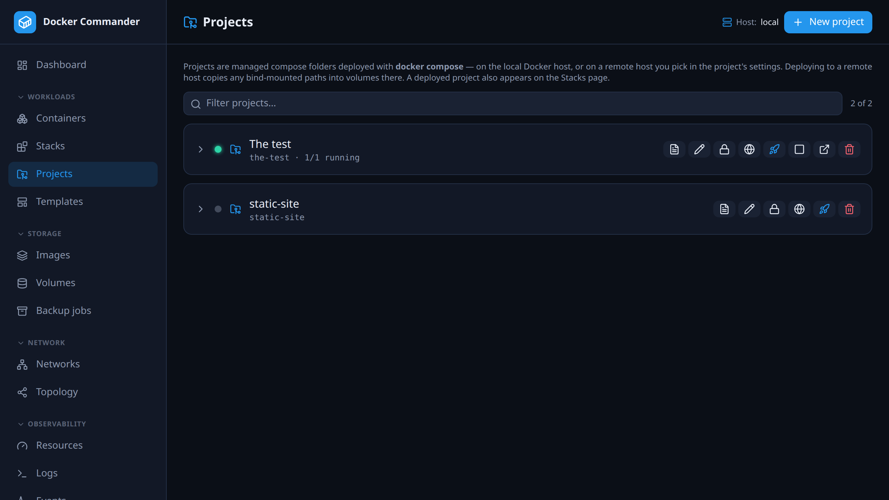
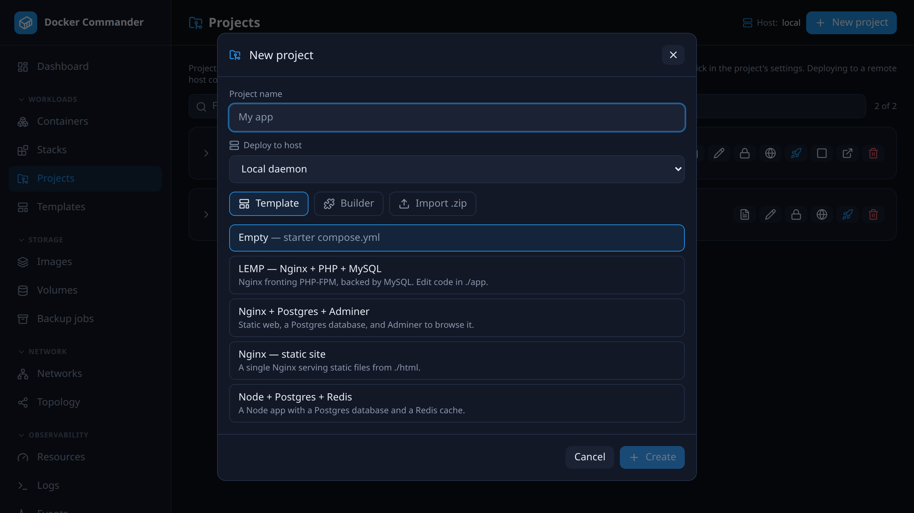
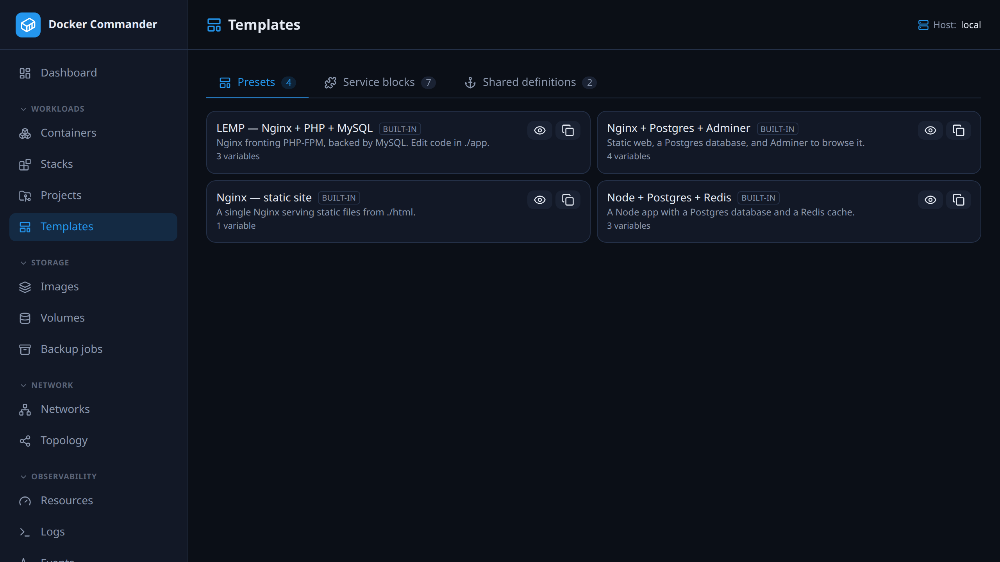
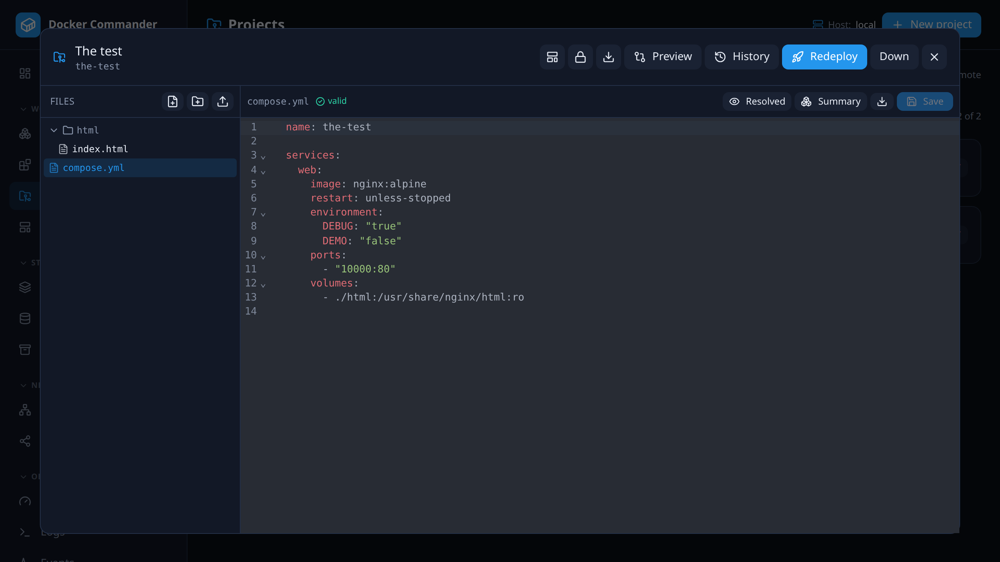

# Projects

[← Manual index](README.md)

A project is a Compose folder that Docker Commander stores and edits for you: a
compose file plus its sidecar files (configs copied into containers, `.sh`
scripts, init files). Deploying it runs the real `docker compose` CLI, so the
full Compose feature set works: `depends_on`, profiles, `build:`, `configs`,
init containers. A deployed project also appears on [Stacks](stacks.md), which
handles its lifecycle and "view compose".

## Common tasks

**Start a new app from a template.** Click **New project**, pick a preset such
as **Nginx + Postgres + Adminer**, and fill in its variables. Blank fields fall
back to a default, and secret fields can be generated for you. A preview of the
resulting `compose.yml` shows next to the form before anything is created.

**Check what a deploy will change.** Save, then click **Preview** in the editor.
It compares the saved files with what is running, lists each service that would
change, and marks the ones that will be **recreated**.

**Roll back a bad deploy.** In the editor, click **History**, find the last good
revision with **Diff vs current**, then click **Restore**. Images that had a
recorded digest are pinned to it, so a moved tag can't bring back something
different. Locally built images are restored by reference only.
Named volumes are not touched, so data changes such as a database migration are
not undone.

**Keep a password out of the compose file.** Click the lock icon on the project
card, add a secret, and write `${DB_PASSWORD}` in the compose file. The value is
supplied only at deploy time and never written to disk.

**Deploy to another server.** In the project's **Settings** (pencil), pick the
target host. Bind-mounted files from the project folder are copied there on each
deploy, so editing them later needs a redeploy. Paths outside the folder are
refused unless **Allow host paths** is ticked. See
[Deploying to a remote host](#deploying-to-a-remote-host).

**Put a service on a domain.** Click the globe icon and map `app.example.com`
to service `web`, port `8080`. Traffic is routed only when an admin has enabled
the embedded proxy (which needs ACME mode), and only for projects on the local
daemon. Otherwise the
mapping is just stored. See [Domains](#domains).

**Copy a project to another instance.** Download it as a `.zip` from the editor
header, then use **New project → Import .zip** there. Secrets are not files, so
they are not in the `.zip`. A [recovery bundle](recovery.md) can carry them, and
the domain mappings, too.

## Where it runs

- The `docker compose` CLI runs on the Docker Commander machine. The daemon it
  talks to can be anywhere: the **local** daemon (default) or any host added
  under [Hosts](hosts.md). The CLI is pointed at it with `DOCKER_HOST`, plus the
  host's TLS certs or an `ssh://` address.
- The target host is the project's own setting. It does **not** follow the
  sidebar host switcher.
- Deploy and Down are disabled, with a note, when the CLI is missing **on the
  Docker Commander machine**. That is the only place it has to exist.
- Under **systemd**, Deploy/Down disabled although `docker compose` works in
  your shell? That is the `ProtectHome=true` hardening. See the fix in
  [Deployment → Running as a service](deployment.md#running-as-a-service).

## Creating a project

Give the project a name, pick the **host to deploy to**, then choose how to
scaffold it. The identifier (the *slug*) is derived from the name, lowercased,
with diacritics transliterated. Files are always rendered and written on the
server. A **live read-only preview** of the `compose.yml` renders next to the
form.

| Mode | What you get |
|---|---|
| **Template** | A preset: **Nginx — static site**, **Nginx + Postgres + Adminer**, **LEMP** (Nginx + PHP + MySQL), **Node + Postgres + Redis**, or **Empty** for a bare starter `compose.yml`. Presets can declare **variables** (ports, database names, passwords) on a small form. Blank fields fall back to a default, and `secret` ones can be auto-generated. |
| **Builder** | Tick service blocks (**Nginx**, **PHP-FPM**, **Node**, **Postgres**, **MySQL**, **Redis**, **Adminer**). They are merged into one `compose.yml` you can edit afterwards. |
| **Import .zip** | An existing project folder, written through the same path sandbox. |

In the builder, **Custom service…** adds your own block (name, service key,
service YAML, optional named volumes). It is saved and reappears in the builder.
**Shared definitions** are reusable top-level YAML anchors such as
`x-pg-common: &pg-common …`. They are emitted above `services:`, so several
services can share one definition (security, cert mounts) and merge it with
`<<: *pg-common`. Tick **Merge** on a service in the **Services** tab to inject
it. **Service defaults** and **Secured Postgres** are built in; save your own
with **Custom definition…**.

**Save as preset.** The editor's preset button saves the open project's files as
a preset, listed under **Template** and on the Templates page. Built-in presets
and blocks ship with the binary and are read-only. Yours live in the data
directory and can be edited or removed.

Reference sidecar files relative to the project folder
(`./html:/usr/share/nginx/html`), so they land in the containers exactly as the
CLI would mount them.

## Managing templates

The **Templates** page (sidebar, Projects permission) holds your presets and
builder blocks. Built-in items open read-only so you can inspect them. Only the
ones you save are editable.

| Section | What you can do |
|---|---|
| **Presets** | Edit a saved preset's files in the multi-file editor, rename it or change its description, download it as a `.zip`, or delete it. |
| **Service blocks** | Create, edit (name, service key, service YAML, named volumes) or delete a block. Blocks added here or via **Custom service…** appear in the builder. |
| **Shared definitions** | Create, edit or delete top-level YAML anchors. They appear in the builder's **Shared definitions** list. |

## The editor

A file tree on the left and a code editor on the right, with highlighting for
YAML, JSON, shell, Dockerfiles and `.conf`/`.env` files. The header holds
**Save as preset**, **Secrets**, **Download** (whole project as `.zip`),
**Preview**, **History**, **Deploy/Redeploy** and **Down**.

- **New file**, **New folder** and **Upload** create items in the current
  folder. Click a folder, or open a file, to make it the target. The toolbar
  shows where new items land, with an × to go back to the project root. Upload
  accepts binary and data files too, shown as download-only in the tree.
- **Save** writes the open file; a dot marks unsaved changes. **Download** next
  to it saves the single file.
- **Image autocomplete.** On a compose `image:` line you get repository names:
  local images first, then a Docker Hub search. After a `:` you get that
  repository's tags, local and from Docker Hub. The Create-container form does
  the same. It is best-effort; offline you still get local images. For a
  registry added under [Registries](registries.md), tags also come from that
  **private registry's** API, with its stored credentials. Registries you
  haven't configured are never contacted.
- **Compose autocomplete.** Schema-aware suggestions for top-level keys, service
  keys at the right indent, nested `build`/`healthcheck`/`deploy`/`logging`
  keys, and known values (`restart:` → `always`/`unless-stopped`).
  <kbd>Ctrl</kbd>+<kbd>Space</kbd> opens the list on a blank line. It is a
  typing aid, not a validator; the real check is `docker compose config`.
- **Profiles.** When the compose file defines `profiles`, a toggle bar picks
  which to enable. The choice is remembered and applied on deploy. **Deployed
  with: …** shows the profiles used on the last successful deploy; the chips
  only show what is *selected for the next deploy*.

### Validation

Validation runs on the **unsaved** buffer. Problems are underlined on the line,
and a status chip sums them up.

| File | Checked with |
|---|---|
| Compose files | `docker compose config`, the parser deploy uses. Anchors, merge keys `<<`, `${VAR}` interpolation and `extends`/`include` resolve as at `up` time. Unset-variable **warnings** are shown too. |
| Dockerfiles | `docker build --check`, BuildKit's linter. No build runs. |
| YAML, JSON, `.env` | Instant syntax lint in the browser. |

On a compose file, two more buttons appear:
- **Resolved** shows the fully flattened compose (anchors, interpolation,
  `extends` resolved), exactly what `docker compose up` deploys.
- **Summary** lists services, published ports and volumes, checks for
  **duplicate host ports**, and badges each service Running, Partial, Stopped,
  **Not in active profile** or Not deployed. Badges compare against the live
  containers and the profiles actually deployed, so a service those profiles
  leave out reads "Not in active profile", not "Stopped".

## Lifecycle

| Action | What it does |
|---|---|
| **Deploy / Redeploy** | `docker compose up -d --build` with the selected profiles, **on the target host**. Redeploy re-applies after edits. The combined output is shown. Private images are pulled with the credentials stored under [Registries](registries.md#deploys), on any target host. |
| **Preview** | Compares the files with what is running, per service, and flags changes that recreate a container. |
| **History** | Every successful deploy as a revision: time, author, profiles, images. **Diff vs current** or **Restore**. |
| **Down** | `docker compose down` on the target host. Available once deployed. |
| **Settings** | Display name and **target host**. The slug (the Compose project name) stays fixed, so deployments remain stable. |
| **Delete** | Refused while deployed; it offers to bring the project down first. Deleting the last file offers to delete the empty project. |

Restarting the containers without re-applying files is done on
[Stacks](stacks.md). Deploys and restores are checked against
[Policy rules](policy-rules.md).

**Drift.** In Preview, a change you have reviewed can be marked **Ignore**. It
stops counting as drift but stays visible, and **Unignore** reverses it. The
next deploy clears all ignores. **Reconcile now** deploys to apply the changes.

**Restore** overwrites the project files with the revision's and redeploys with
its profiles. Unsaved editor edits are lost. Images with a recorded digest are
pinned to it. Named volumes are never touched. If any step fails, including the
deploy, the previous files are put back. The restore becomes a new revision, so
history only grows forward. The newest 50 revisions per project are kept by
default ([Settings](settings.md), [Limits](limits.md)).

### Why `--build`

`--build` makes "what's in the editor is what runs" true for a project with a
`build:` section. Plain `up -d` builds only when the image is **missing**. So
after editing a Dockerfile, or any file in its build context, the next deploy
would keep the old image and report only `Container Running`. Services that only
pull an image are unaffected, so image-only projects pay nothing. API callers
that don't want to re-send a large context can `POST` the deploy with
`{"build": false}`.

## Secrets

Named values such as `DB_PASSWORD` or `API_TOKEN`, used in the compose file like
any environment variable: `${NAME}`. Open them with the lock icon on the project
card or in the editor header.

- The value is passed as a process environment variable at deploy time only.
  It is never written to `.env` or any file, so it never ends up in a revision
  snapshot.
- It is encrypted at rest and can only be **replaced**, never read back, like a
  registry credential.
- Deleting a secret is immediate. A service still referencing it fails to
  resolve on the next deploy.
- Wherever a resolved value would be shown (Resolved, the deploy preview, a
  revision diff), it is replaced by `secret:<fingerprint>`. The same value
  always gives the same fingerprint and a different value a different one, so
  you see *that* something changed, not *what*.
- Redaction matches the **value**, not the variable name, so it still works for
  `DATABASE_PASSWORD: ${DB_PASSWORD}`.
- It only covers the project's *current* secrets. A container still running
  with the value of a since deleted or changed secret shows that stale value in
  a preview or diff, as there is nothing left to compare it with.
- This limits what Docker Commander's screens show. It doesn't change what
  anyone with direct `docker inspect` or exec access to the host can see.

## Domains

The **Domains** panel (globe icon on a project card) records that a domain
should route to one of the project's services: `app.example.com` → service
`web`, port `8080`. Without the embedded reverse proxy, it only stores intent
and has no effect on traffic. With the proxy, these limits apply:

- **Off by default.** An admin enables it with `DC_PROXY_ENABLED=1`
  (`-proxy-enabled`). It is a second public-facing surface, separate from the
  admin UI and API, so it is a conscious choice.
- **Needs ACME mode** for Docker Commander's own admin domain
  (`-acme-domains`/`DC_ACME_DOMAINS`). The proxy shares that listener, and SNI
  picks between the admin UI and each mapped domain. No second port is opened.
  It doesn't work with a static `-tls-cert`/`-tls-key` pair or without TLS.
  Enabled without ACME, the server logs that clearly and starts normally; the
  admin UI is never affected.
- **Local-host projects only.** A mapping for a project on a
  [remote host](#deploying-to-a-remote-host) is recorded, but never served and
  never gets a certificate.
- **A clean `502`** when the project has no running container for the mapped
  service and port (stopped, redeployed without that service, or a port nothing
  publishes), instead of stale or unrelated content.
- **Same network namespace as the daemon.** The proxy connects to a container's
  *published host port* directly. That works when Docker Commander runs on bare
  metal or a VM next to the daemon, the common case. It does **not** work when
  Docker Commander runs in a container per
  [Option D](../README.md#option-d--docker) *without* `--network host`, since
  the published port lives in the host's namespace. If the "local" daemon is
  really remote (`DOCKER_HOST=tcp://…` elsewhere), the proxy detects it and
  refuses. The containerized-on-the-same-machine case can't be detected that way
  and is not handled.

See [Deployment](deployment.md) for the full flag reference.

**Mapping rules.**
- A real, fully qualified hostname: no wildcards, bare hostnames or IP
  addresses. Punycode (`xn--…`) is accepted.
- Mapped only once per instance, compared case-insensitively
  (`App.Example.com` is `app.example.com`), and never Docker Commander's own
  admin domain.
- When the `docker compose` CLI is available, the service must exist in the
  current compose file, resolved with every profile enabled, so a service behind
  `profiles:` is accepted. The port is not validated, since a container can
  listen on a port its compose file never declares.
- **Service and port can be edited** (pencil icon). The domain can't; delete and
  recreate the mapping to point a hostname elsewhere.
- Mappings travel with the project in the [recovery bundle](recovery.md), like
  secrets and images. On import they follow the same rules as in the UI. Only
  the `acme` TLS mode exists, so a row with any other value is skipped with a
  warning.

## Deploying to a remote host

A project can target the **local daemon** (default) or any **remote host** added
under [Hosts](hosts.md), chosen at creation or in **Settings**. Deploy, down and
restart then run `docker compose` against that daemon, over TCP with the host's
TLS certs, or over SSH.

### Bind mounts on a remote host

A remote daemon can't see Docker Commander's data directory. So each bind mount
whose source is **inside the project folder** (`./html:/usr/share/nginx/html`,
`./nginx.conf:/etc/nginx/nginx.conf`) is **copied to a named volume on that
host**, and the mount points at the volume. Sidecar files then work as locally,
with three differences:

- **A snapshot, not a live mount.** Files are copied at deploy time, so edits
  need a **redeploy**. Writes inside the container stay in the remote volume and
  don't flow back. A local deploy mounts the folder directly, so there it *is*
  live.
- **Only paths inside the project folder are shipped.** A mount pointing outside
  it (`/etc/localtime`, `/var/run/docker.sock`, or anything reached through a
  symlink out of the folder) names a path on the *remote* host, so the deploy
  refuses it and lists the offending mounts. If that is what you want, tick
  **Allow host paths** in Settings: those mounts use the remote host's own
  files, nothing is copied, and the deploy output names them every time. This
  needs **write access to Hosts**, since it is authority over the host, not the
  project, and is recorded in the [audit log](audit.md).
- **Seeded volumes** are named `dcseed-<project>-<hash>` and labelled with the
  project, so they are easy to find on [Volumes](volumes.md). They **survive a
  `down`**. **Deleting the project offers to remove them**, listing them first
  since they hold data. Decline to keep them for a later redeploy.

**Changing a deployed project's host** offers to bring it down on the old host,
ticked by default, because changing the host usually means *moving* it. Its
containers are stopped and removed there, and its **seeded** volumes deleted.
**Named volumes holding your data are left alone.** Nothing starts on the new
host until you deploy. Untick it and the old copy keeps running while this page shows only the
new host: two live deployments, which can be legitimate but no longer happens by
accident. If the teardown fails, say the old host is unreachable, the project is
**not** moved, because a stack on a host the app no longer points at is the same
problem, only invisible.

### `build:` contexts on a remote host

Building on a remote daemon needs no extra setup, and works differently from
bind mounts:

- **Docker uploads a build context itself**, as a tar stream from the machine
  running the CLI. The remote daemon gets your local `./app` folder even though
  it can't see your filesystem. The image is built **on the remote host** and
  exists only there.
- **Nothing uploads a bind mount**, which is why Docker Commander seeds it into
  a volume and repoints it with a generated override.
- Both work in one deploy. A redeploy rebuilds the image from the edited context
  and copies the seeded files again.
- The build runs on the **target host's** architecture and daemon. A project
  that builds on your amd64 laptop can fail on an arm64 host; the error appears
  in the deploy output.

## Permissions

Secrets and domain mappings follow the project's **Projects** section grants.
A read grant lists secret names; adding, replacing or deleting a secret, or
changing a mapping, needs a write grant. There is no separate secrets
permission. **Allow host paths** also needs write access to **Hosts**. See
[Users & roles](users.md).

Deploying is full trust in the server: a compose file can run a privileged
container on the local daemon, which every role can reach. See the note under
[Roles](users.md#roles).
