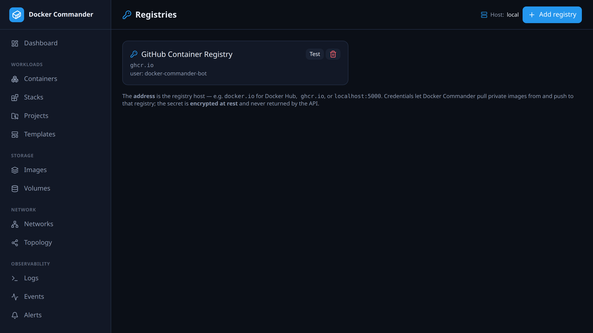

# Registries

[← Manual index](README.md)

Store credentials so Docker Commander can **pull private images** and **push**.

## Adding a registry
- **Name** — a label.
- **Address** — the registry host: `docker.io` (Docker Hub), `ghcr.io`,
  `registry.example.com`, `localhost:5000`…
- **Username** and **Password / token**.

The secret is **encrypted at rest** (AES-256-GCM) and never returned by the API
(the list only shows whether a password is set). **Test** asks the daemon to log
in and reports success or the error.

## How it's used
When you [pull](images.md) or [push](images.md) an image, the credentials are
matched by the **registry host** of the reference (Docker Hub aliases are
normalised). A push without matching credentials fails early with a clear
message rather than a raw 401.

## Tips
- For Docker Hub, use a **personal access token** as the password, not your
  account password.
- For a local insecure registry on `localhost`, the daemon allows plain HTTP by
  default.
