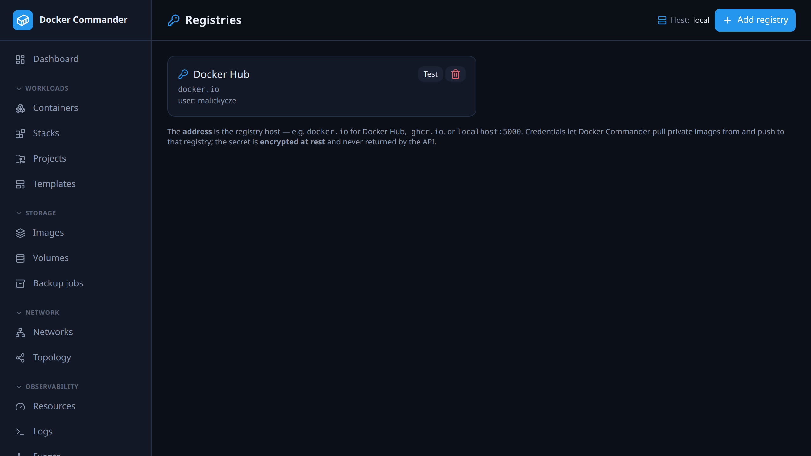

# Registries

[← Manual index](README.md)

Credentials that let Docker Commander **pull private images** and **push**. The
pulling and pushing itself happens on [Images](images.md).

## Common tasks

**Pull from a private registry.** Click **Add registry**, enter the registry
host (e.g. `ghcr.io`), your username and a token, and click **Test**. Then pull
the full reference, e.g. `ghcr.io/owner/app:tag`, on [Images](images.md). The
credential is picked by the host part of the reference.

**Push to Docker Hub.** Add `docker.io` with a **personal access token** as the
password, not your account password. Then push from [Images](images.md) to a
target like `youruser/app:tag`.

**Change a token that expired.** A stored credential can't be edited. Delete it
and add it again with the new token.

## Adding a registry

- **Name**: a label.
- **Address**: the registry host, e.g. `docker.io` (Docker Hub), `ghcr.io`,
  `registry.example.com`, `localhost:5000`.
- **Username** and **Password / token**.

The secret is **encrypted at rest** (AES-256-GCM) and never returned by the API.
The list shows only name, address and username, with no hint whether a secret
is stored. **Test** asks the daemon of the selected host to log in and shows
success or the error. That is the way to check it.

## How it's used

When you [pull](images.md) or [push](images.md), the credential is matched by
the **registry host** of the image reference. Docker Hub aliases are normalised,
so a `docker.io` entry also matches `nginx` or `user/app`.

- A pull with no matching credential runs anonymously.
- A push with no matching credential fails early with a clear message instead
  of a raw 401.
- For registries other than Docker Hub, the stored credential is also what lets
  the app list tags and check for newer images. A host with no stored
  credential is never contacted.
- A local insecure registry on `localhost` works over plain HTTP: the daemon
  allows that by default.

> **Project and stack deploys don't use these credentials.** A deploy runs
> `docker compose`, which logs in with the server's own Docker config
> (`DOCKER_CONFIG`, `/var/lib/dockercmd/.docker` on a packaged install). For a
> compose file with private images, run `docker login` for that config on the
> server, or pull the images on [Images](images.md) first. A normal deploy only
> pulls images that are missing. A deploy with **Pull** always asks the registry,
> so it needs the server-side login.
