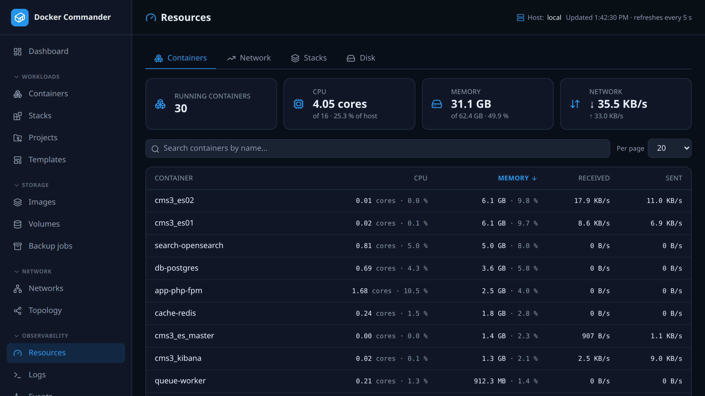
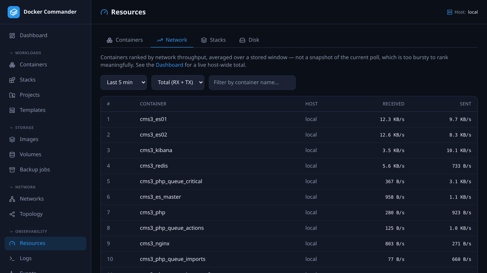
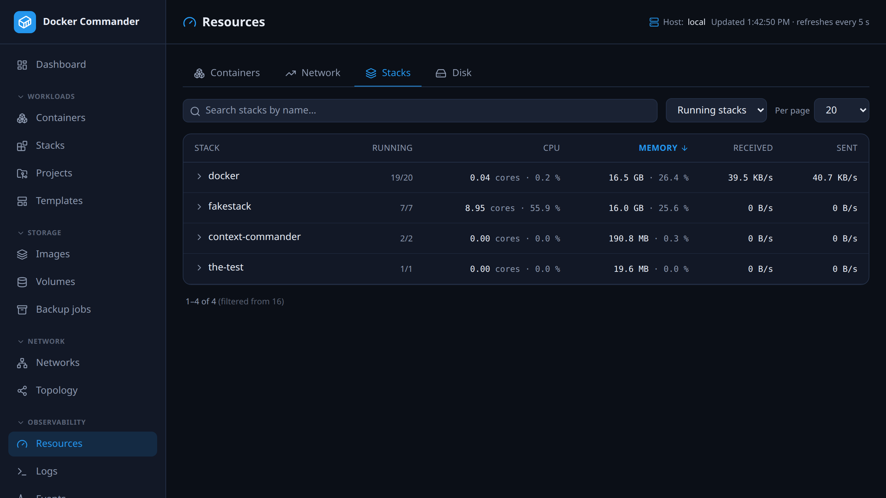
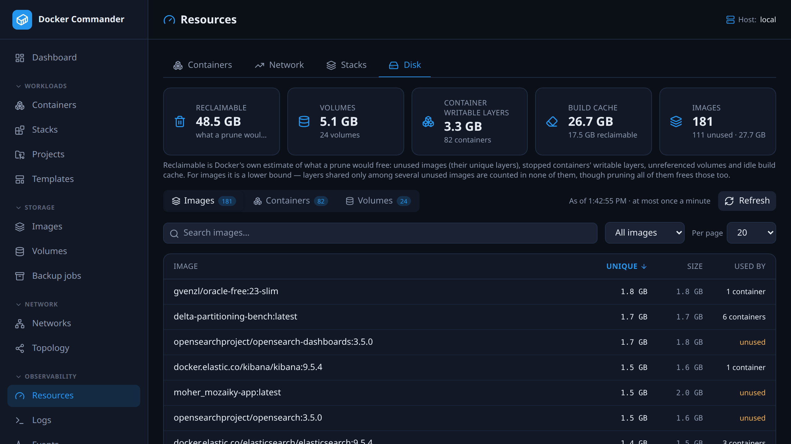

# Resources

[← Manual index](README.md)

**Observability → Resources** shows exact, sortable numbers: what each running
container and stack uses, who moves the most network traffic, and what takes
space on disk. For shares and summaries, use the [Dashboard](dashboard.md).

There are four tabs: **Containers**, **Network**, **Stacks** and **Disk**. Each
covers the host selected in the sidebar switcher.

## Common tasks

**Which container eats the CPU?** On **Containers**, click the **CPU** header.
Numeric columns sort largest first. Click the name to open its
[detail page](containers.md) and check the history chart.

**Who is flooding the network?** Open **Network**, choose *Last 15 min* or
*Last hour*, and set **Metric** to *Sent* or *Received*. The top row is your
answer. If you suspect a container that isn't listed, type its name in the
filter.

**Which stack uses the most memory?** On **Stacks**, the default sort is
**Memory**. Expand the row to see which member container is responsible.

**What would a prune free?** Open **Disk** and read **Reclaimable**. On the
**Images** or **Volumes** table, set the filter next to the search box to
*Unused only* to see what is unused, then prune
from [Images](images.md) or [Volumes](volumes.md). Disk only reports and deletes
nothing.

## How fresh the numbers are

| Tab | Updates |
|---|---|
| **Containers**, **Stacks** | The page re-reads the monitor's snapshot every 5 s; the header shows *Updated hh:mm:ss · refreshes every 5 s*. The snapshot itself is re-sampled about every 15 s (`DC_METRICS_INTERVAL`, see [Deployment](deployment.md)). |
| **Network** | Recomputed from stored history every 15 s. |
| **Disk** | Cached, refreshed at most once a minute. |

Because the snapshot is slower than the page, two refreshes can show the same
numbers. If a refresh fails, the last good table stays and the error shows
above it. Only Containers and Stacks poll the snapshot.

## Containers

Four cards summarise the host: **Running containers**, **CPU** (cores in use,
of how many, and % of the host), **Memory** (bytes in use, of total RAM, and %)
and **Network** (received and sent, summed over running containers).

| Column | Meaning |
|---|---|
| **CPU** | Cores in use, and the % of the host (100% = every core) |
| **Memory** | Bytes in use, and the % of the host's RAM |
| **Received / Sent** | Bytes per second, from the last two samples |

- Click a header to sort, click again to flip. The default is **Memory**,
  largest first. Ties sort by name.
- Search filters by name. **Per page** is 10, 20, 50 or 100. Both are
  remembered.
- A container that just started or was recreated shows `0 B/s` until it has two
  samples.

## Network

Containers ranked by network throughput over a window.

- **Window**: *Last 5 min* (default), *Last 15 min* or *Last hour*.
- **Metric**: *Total (RX + TX)* (default), *Received* or *Sent*. It sets the
  order. Both columns are always shown.
- **Filter by container name** applies before ranking, so it finds containers
  outside the top list.

Rows show rank and **Host** and link to the container. The list stops at 50,
with a note *Showing 50 of N — narrow the filter to find one outside this list*.

The figure is an **average rate over the window**, not a current sample and not
a total. Docker only gives counters that grow from container start. The rate is
the sum of every increase between consecutive stored samples in the window,
divided by the time from the first sample to the last. A step where the counter
drops (a restart reset it) adds nothing, so traffic on both sides of a restart
still counts.

- A container needs at least two stored samples in the window, or it is left
  out. If none qualify, the tab says *Not enough history yet*. Wait a few minutes
  or pick a longer window.
- Only running containers are ranked.
- A container on several networks has all its interfaces summed. Docker doesn't
  say which interface belongs to which network.
- Traffic between two containers counts twice: TX for one, RX for the other.

The Dashboard's **Top talkers** panel is the top 10 of *Last 5 min / Total*.
**View all →** opens this tab.

## Stacks

Each Compose stack's CPU, memory and network: the sum of its running
containers. **Running** shows running/total containers.

Click a row to see the member containers, largest memory first, each linking to
its detail page. Stopped containers add nothing. A stack with nothing running
says *No running containers*.

The filter starts on **Running stacks** and then remembers your last choice.
**All stacks** includes stopped ones.
Sorting, search and paging work as on Containers. This tab also needs the
**Containers** section (see [Access](#access)).

## Disk

What takes space on the host, largest first, from the daemon's
`docker system df -v`.

| Card | Shows |
|---|---|
| **Reclaimable** | Docker's estimate of what a prune would free: unused images (their unique layers), stopped containers' writable layers, unreferenced volumes and idle build cache. |
| **Volumes** | Total size of volumes with a known size, the count, and how many are *unknown*. |
| **Container writable layers** | Data containers wrote on top of their images. |
| **Build cache** | Size and reclaimable part. Records the daemon marks *shared* are left out of both. |
| **Images** | Count, how many are unused, and reclaimable bytes. No total size, because shared layers would be counted many times. |

Below the cards, switch between three tables. Each has search, a page size and
sortable headers.

| Table | Columns | Filter | Default sort |
|---|---|---|---|
| **Images** | Name (tags, or short id marked *untagged*), **Unique**, **Size**, **Used by** | *Unused only* | **Unique** |
| **Containers** | Name (with compose project), state, **Writable layer**, **Total** | *Stopped only* | **Writable layer** |
| **Volumes** | Name (with compose project), driver, **Size**, **Used by** | *Unused only* | **Size** |

- **Size** is the whole image, including shared layers. **Unique** is what
  deleting it would free.
- **Total** is the container's writable layer plus its image.
- **Used by** is the number of containers using it, or *unused* (highlighted).
  If it can't be determined it shows a dash, and the item is not treated as
  unused.
- **Unknown sizes** show as *unknown*, not `0`. This happens with non-local
  volume drivers and with images whose shared size wasn't computed. Unknown
  sorts last in either direction and is left out of the card totals.
- *As of hh:mm:ss* shows when the report was made. **Refresh** recomputes it
  unless it is under about 5 seconds old. The first read on a big host can take
  a few seconds.

## Access
The page and the `/api/stats/*` endpoints belong to the **dashboard** section,
like the [Dashboard](dashboard.md). Read access is enough. Without it the entry
is hidden and the API refuses. The **Stacks** tab also needs **Containers**.

Every read is checked against the host it names, so a role
[limited to specific hosts](users.md) sees numbers only for those hosts.
An admin sees all. A section [disabled app-wide](settings.md) hides the page for
everyone.

### Technical notes
- The tab is in the URL as `?tab=` (for example `/resources?tab=network`). A
  missing or unknown tab opens **Containers**.
- **Reclaimable** for images is a lower bound. Layers shared only among several
  unused images count toward none of them, although pruning all of them frees
  those too.
- The disk report is cached per host for about a minute, and the page re-reads
  it every minute while open.
