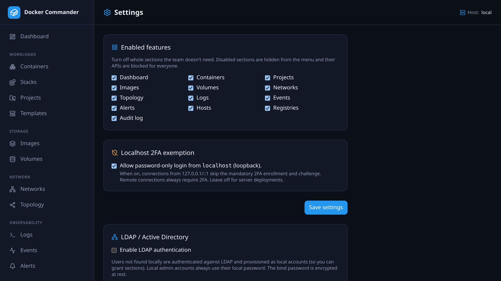

# Settings

[← Manual index](README.md)

_Admin only._ App-wide configuration.

## Feature flags (enabled features)
Turn whole menu sections **on/off for everyone**. A disabled section is hidden
from the menu and its API is blocked — useful to trim the app to what your team
actually uses. Admins re-enable them here.

## Localhost 2FA exemption
By default **2FA is mandatory** for all logins. Enable this to let connections
from **loopback** (`127.0.0.1` / `::1`) log in with a password only (skipping
both the enrollment gate and the TOTP challenge). Remote connections always
require 2FA.

- It trusts the connection's `RemoteAddr` only (not forwarded headers), so
  **keep it off behind a reverse proxy** — otherwise every proxied request looks
  like localhost.
- Good for a personal/local install; leave off for shared servers.
- This is the same toggle the **first-run setup** screen flips when you choose
  *"Skip 2FA for now"* — so you can decide up front and change it here later.

## LDAP / Active Directory
Optional external authentication.

- **Enable** + **Server URL** (`ldap://host:389` or `ldaps://host:636`),
  optional **StartTLS**.
- **Bind DN** + **password** — a service account used to search (encrypted at
  rest); leave password blank to keep the stored one.
- **User base DN** and **User filter** (must contain `%s`, e.g. `(uid=%s)` or
  `(sAMAccountName=%s)`).
- **Admin group DN** (optional) — members are provisioned as admins.
- **Group → section mappings** (optional) — grant RBAC sections by LDAP group
  membership: add a mapping (a group DN + the sections its members get). A user's
  sections are the **union** across every mapping whose group they belong to.
- **Test** verifies dial / bind / search.

**How login works:** local accounts always use their local password. A username
with no local account (while LDAP is enabled) is authenticated against the
directory and **provisioned as a local `user`** (or `admin` if in the admin
group). Such users can still enroll their own TOTP.

**Sections:** without group mappings, you grant an LDAP user's sections manually
in [Users](users.md), and they persist. **Once any group → section mapping is
configured, LDAP becomes authoritative** for non-admin users' sections: they're
recomputed from current group membership on **every login** (so adding/removing a
user from a group takes effect on their next sign-in, and manual section edits
are overwritten). Group DNs are matched on the full DN, case-insensitively;
unknown section names are ignored. The DN must match the form your directory
returns in `memberOf` (DNs aren't canonicalised, so avoid stray inter-RDN
spaces); if a mapping never applies, check the exact DN with **Test** or your
directory tooling. The match fails closed — a mismatch only ever denies. The admin role stays "sticky" once granted —
removing someone from the admin group does not auto-demote them (avoids lockout
if the directory is unreachable); demote them in [Users](users.md).
