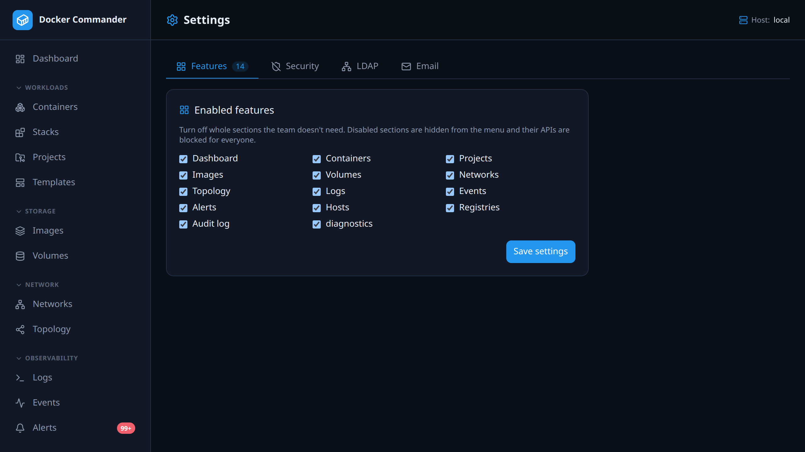
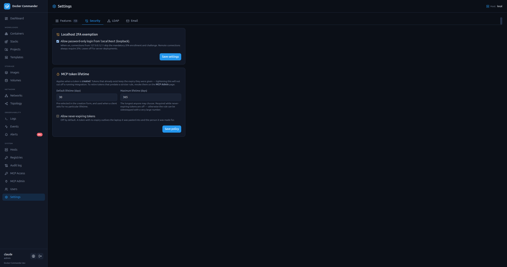
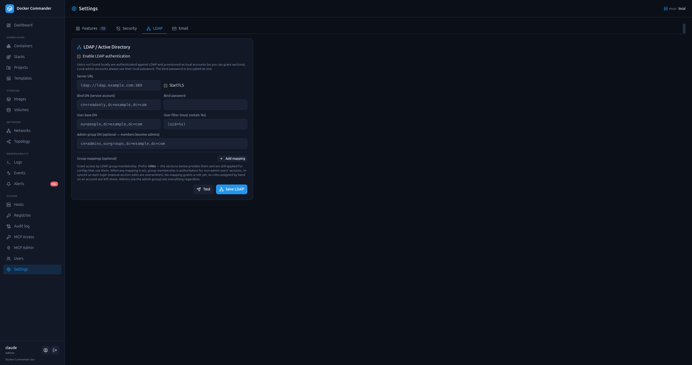
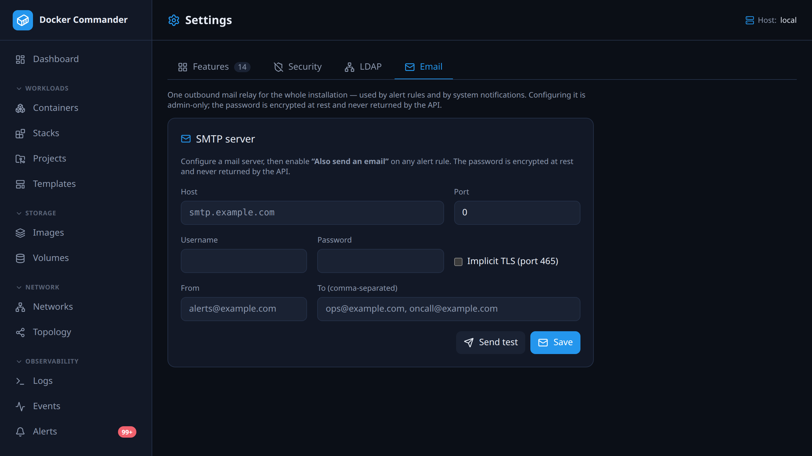

# Settings

_Admin only._ Four tabs: **Features**, **Security**, **LDAP** and **Email**.

[← Manual index](README.md)

_Admin only._ App-wide configuration.

## Feature flags (enabled features)
Turn whole menu sections **on/off for everyone**. A disabled section is hidden
from the menu and its API is blocked — useful to trim the app to what your team
actually uses. Admins re-enable them here.

## Security — localhost 2FA exemption
By default **2FA is mandatory** for all logins. Enable this to let connections
from **loopback** (`127.0.0.1` / `::1`) log in with a password only (skipping
both the enrollment gate and the TOTP challenge). Remote connections always
require 2FA.

- It applies only to a **direct** loopback connection. A request that arrived
  through a reverse proxy never qualifies, even when it resolves to `127.0.0.1`:
  a proxy on the same machine is itself loopback, and a client's forwarded header
  is only a claim. So the exemption cannot leak through a proxy — but it also
  cannot be used *by* one, which is the point.
- Good for a personal/local install; leave off for shared servers.
- This is the same toggle the **first-run setup** screen flips when you choose
  *"Skip 2FA for now"* — so you can decide up front and change it here later.

## Security — MCP token lifetime

Instance-wide rules for the API tokens users mint on the [MCP](mcp.md) page. Three
settings, all admin-only:

- **Default lifetime** — **30 days** out of the box. Pre-selected in the creation
  form, and used when a client asks for no particular expiry.
- **Maximum lifetime** — a ceiling, **365 days** by default. Without one, "no
  never-expiring tokens" is a formality anyone sidesteps by asking for 99999 days.
- **Allow never-expiring tokens** — **off**. Turn it on only for an integration
  that genuinely needs a permanent credential; the ceiling can then be cleared.

Revocation already existed, but it needs somebody to remember — and the tokens
most worth revoking are the ones everyone has forgotten. An expiry date is the
only control here that keeps working when nobody is paying attention.

The policy governs what may be **minted**, not what exists: tokens keep the expiry
they were given, so tightening it will not cut a running integration off
overnight. To retire tokens that predate a stricter rule, revoke them on the **MCP
Admin** page, which stays the operational view of who holds what. The creation
form only offers lifetimes the server will accept, and the server re-checks anyway
— a form is not a boundary.

Contradictory settings are repaired rather than stored: a default above the
ceiling is lowered to it, and clearing the ceiling while never-expiring tokens are
off puts the 365-day one back. The page shows what is actually in force after
saving, not what was typed.

## LDAP / Active Directory

Optional external authentication.

- **Enable** + **Server URL** (`ldap://host:389` or `ldaps://host:636`),
  optional **StartTLS**.
- **Bind DN** + **password** — a service account used to search (encrypted at
  rest); leave password blank to keep the stored one.
- **User base DN** and **User filter** (must contain `%s`, e.g. `(uid=%s)` or
  `(sAMAccountName=%s)`).
- **Admin group DN** (optional) — members are provisioned as admins.
- **Group mappings** (optional) — grant access by LDAP group membership: add a
  mapping (a group DN + the **roles** its members get, and/or raw sections). A
  user's access is the **union** across every mapping whose group they belong to.
  Prefer roles; the section pills predate them and remain for older configs.
- **Test** verifies dial / bind / search.

**How login works:** local accounts always use their local password. A username
with no local account (while LDAP is enabled) is authenticated against the
directory and **provisioned as a local `user`** (or `admin` if in the admin
group). Such users can still enroll their own TOTP.

**Sections:** without group mappings, you grant an LDAP user's sections manually
in [Users](users.md), and they persist. **Once any group → section mapping is
configured, LDAP becomes authoritative** for non-admin users' sections: they're
recomputed from current group membership on **every login** (so adding/removing a
user from a group takes effect on their next sign-in, and manual section edits
are overwritten). Group DNs are matched on the full DN, case-insensitively;
unknown section names are ignored. The DN must match the form your directory
returns in `memberOf` (DNs aren't canonicalised, so avoid stray inter-RDN
spaces); if a mapping never applies, check the exact DN with **Test** or your
directory tooling. The match fails closed — a mismatch only ever denies.

**Roles** follow the same matching but a different switch: they're re-synced from
the directory only once **at least one mapping actually grants a role**, so
upgrading doesn't strip roles from installs whose mappings predate them. See
[Roles from LDAP groups](users.md) for the full table. A mapping can never grant
admin — only the admin group DN does that — and a role id left behind by a deleted
role grants nothing rather than failing the login.

**Fallback role** (optional, shown once a mapping grants a role) — granted in place
of a mapped role that no longer exists, so deleting a role degrades its members to a
baseline instead of leaving them with nothing. It does not apply to users whose
groups map to no role at all, and the nominated role can't be deleted while it's the
fallback.

The admin role stays "sticky" once granted —
removing someone from the admin group does not auto-demote them (avoids lockout
if the directory is unreachable); demote them in [Users](users.md).

## Email (SMTP)

One outbound mail relay for the **whole installation** — used by alert rules that
opt into e-mail, and by system notifications. Set host/port, optional credentials,
and the From / To addresses (To takes a comma-separated list), then **Send test**
to check it end to end. The password is encrypted at rest and never returned by
the API.

**Transport security** is one checkbox, not a choice of two: tick **Implicit TLS**
for a relay that expects TLS from the first byte (port 465). Leave it off and the
connection starts in the clear and is upgraded with **STARTTLS if the server
offers it** — the usual arrangement on port 587. That upgrade is opportunistic, so
a relay that advertises no STARTTLS is talked to in plaintext rather than refused;
on an untrusted network, use implicit TLS.

> **Admin only.** This used to live under [Alerts → Email](alerts.md) and was
> reachable by anyone with the *alerts* section. Because it is a single
> instance-wide relay, that let a non-admin repoint the installation's mail — so
> it moved here. Managing alert rules, webhooks and the feed still only needs the
> *alerts* section; only the relay itself now needs an admin.
