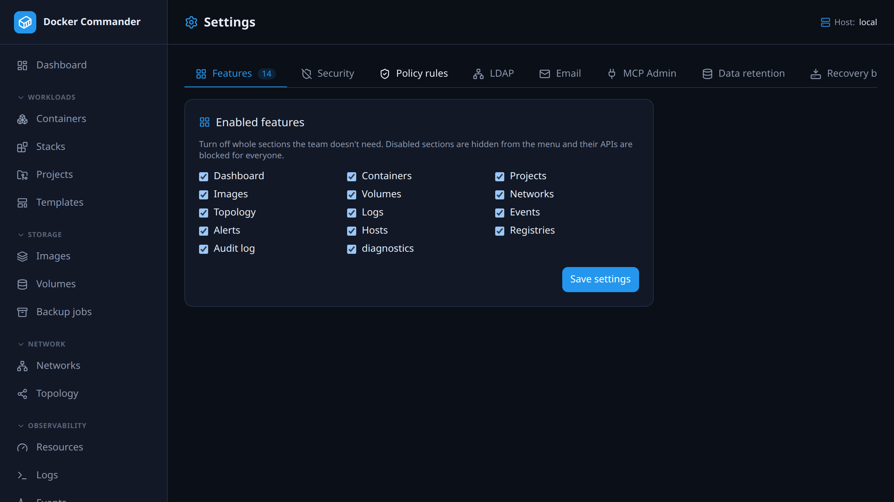
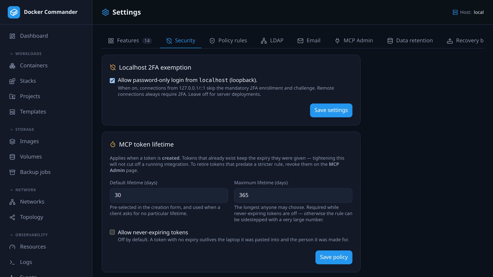
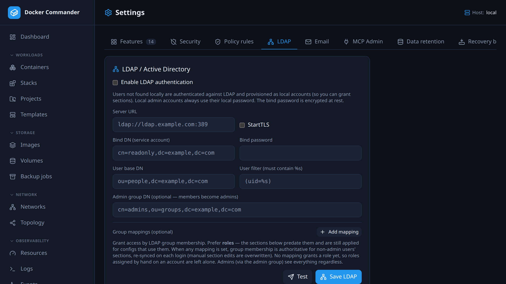
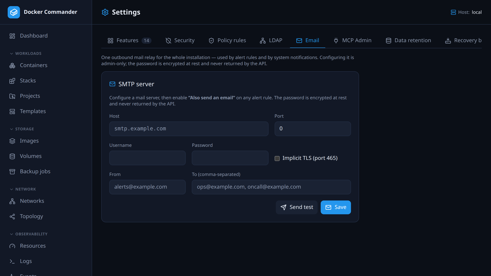
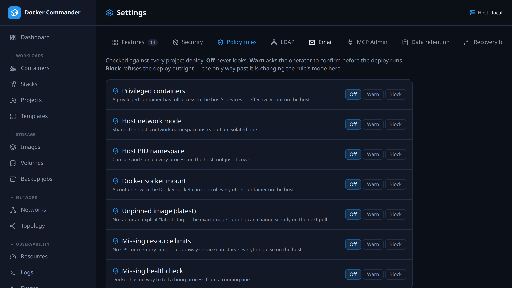
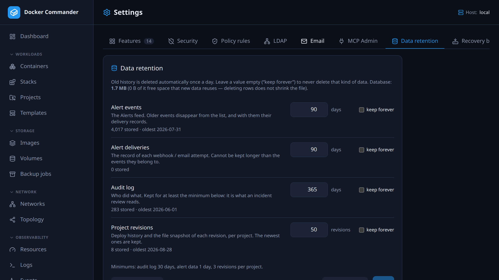
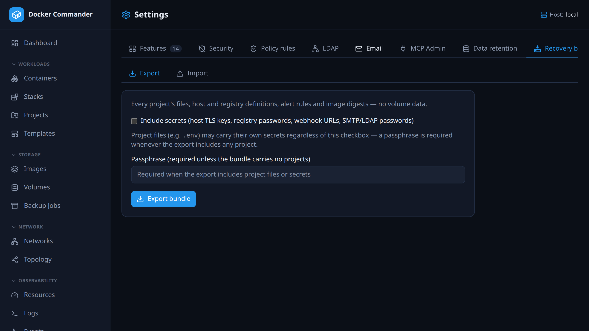

# Settings

[← Manual index](README.md)

_Admin only._ App-wide configuration: which sections exist, sign-in rules, LDAP,
outgoing mail and how long history is kept. Per-user access is set in
[Users & roles](users.md), and your own preferences in [Your profile](profile.md).

Tabs: Features, Security, Policy rules, LDAP, Email, MCP Admin, Data retention
and Recovery bundle. The tab is in the URL (for example `/settings?tab=retention`),
so a link or a reload opens the same tab.

## Common tasks

**Turn off a section nobody uses.** Untick it on **Features**. It disappears from
everyone's menu and its API is blocked for non-admins. Admins can still reach the
API, so a feature flag is not a way to lock admins out.

**Keep the audit log longer.** On **Data retention**, raise **Audit log** or set
it to **keep forever**, then save. The default is 365 days and the minimum is 30.
On an upgrade, do this before the first purge (see the note under
[Data retention](#data-retention)).

**Sign in with company accounts.** On **LDAP**, fill in the server, bind account,
user base DN and filter, then click **Test**. Add group mappings that grant
**roles**, so the directory decides access. Set an admin group DN only if you want
directory admins.

**Get alerts by e-mail.** On **Email**, set the relay and the From/To addresses
and click **Send test**. For a relay on port 465, tick **Implicit TLS**.

**Install patch releases automatically.** On **Security**, tick **Automatically
apply new releases** and set **Granularity** to **Patch only (1.2.x)**.

## Features

Turn whole menu sections **on or off for everyone**. A disabled section is hidden
from the menu and its API, including the matching [MCP](mcp.md) tools, is blocked
for non-admins.

The sections are Dashboard, Containers, Projects, Images, Volumes, Networks,
Topology, Logs, Events, Alerts, Hosts, Registries, Audit log and Troubleshooting.
The same list is what [Users & roles](users.md) grants per user.

## Security

### Localhost 2FA exemption

By default **2FA is mandatory** for every login. With this on, connections from
**loopback** (`127.0.0.1` / `::1`) sign in with a password only. They skip both
the enrollment step and the code. Remote connections always need 2FA.

- It applies only to a **direct** loopback connection. A request doesn't qualify
  if its peer is a proxy listed in `DC_TRUSTED_PROXIES`, or if it carries any
  forwarding header (`Forwarded`, `X-Forwarded-*`, `X-Real-Ip`, `Via`), even an
  empty one.
- A local proxy that is not listed and adds none of those headers makes every
  client look local. Behind a proxy, set `DC_TRUSTED_PROXIES` or leave this off.
  See [Deployment](deployment.md#b--reverse-proxy-recommended-for-anything-non-trivial).
- Good for a personal or local install. Leave it off on shared servers.
- It is the same toggle the **first-run setup** flips when you choose **Skip for
  now**. You can change it here later.

### MCP token lifetime

Instance-wide rules for the API tokens users create on the [MCP](mcp.md) page.

| Setting | Default | Meaning |
|---|---|---|
| **Default lifetime** | 30 days | Pre-selected in the creation form, and used when a client asks for no particular expiry. |
| **Maximum lifetime** | 365 days | A ceiling. Without one, "no never-expiring tokens" is easy to sidestep by asking for 99999 days. |
| **Allow never-expiring tokens** | off | Turn on only for an integration that really needs a permanent credential. The ceiling can then be cleared. |

Revoking needs someone to remember; an expiry keeps working when nobody is
paying attention.

- The policy governs what may be **created**, not what exists. Tokens keep the
  expiry they were given, so tightening it won't cut off a running integration
  overnight. To retire older tokens, revoke them on **MCP Admin**.
- The creation form only offers lifetimes the server accepts, and the server
  checks again anyway.
- Contradictory settings are corrected, not stored. A default above the ceiling
  is lowered to it. Clearing the ceiling while never-expiring tokens are off puts
  the 365-day ceiling back. The page shows what is in force after saving, not
  what was typed.

### Self-update auto-apply

[Self-update](deployment.md#self-update) lets an admin apply a new release by
hand from the update banner. This setting applies releases automatically.

- **Off by default.**
- **Granularity** caps how far an automatic update may jump: **patch only**,
  **patch & minor** (the default once enabled), or **everything, including
  major**. It is a ceiling, so "patch & minor" also lets a patch through.
- It checks on the same schedule as the update banner, and downloads and
  verifies the release the same way **Update & restart** does. It never runs at
  the same time as a manual update.
- The ceiling is checked against the exact release being installed, not an
  earlier cached check, so a release published between two checks can't slip
  past it.
- Every automatic update is recorded in the [audit log](audit.md). Each admin
  sees a one-time "you're now on vX.Y.Z, applied automatically" notice at their
  next login, until they dismiss it.
- The control is disabled, with an explanation, when auto-apply could never run:
  the update check is off (`DC_UPDATE_CHECK=0`), or self-update is unavailable
  (`DC_SELF_UPDATE=0`, or a platform that can't restart itself in place, such as
  Windows). So a saved policy is never silently inactive.

## LDAP / Active Directory

Optional external sign-in.

| Field | Notes |
|---|---|
| **Enable**, **Server URL** | `ldap://host:389` or `ldaps://host:636`. Optional **StartTLS**. |
| **Bind DN**, **password** | A service account used to search. The password is encrypted at rest; leave it blank to keep the stored one. |
| **User base DN**, **User filter** | The filter must contain `%s`, for example `(uid=%s)` or `(sAMAccountName=%s)`. |
| **Admin group DN** | Optional. Members are created as admins. |
| **Group mappings** | Optional. A group DN plus the **roles** its members get, and/or raw sections. Access is the **union** of every mapping the user's groups match. Prefer roles; the section pills predate them and stay for older configs. |
| **Fallback role** | Optional, shown once a mapping grants a role. See below. |

**Test** checks connecting, binding and searching.

**How login works.** Local accounts always use their local password. A username
with no local account (while LDAP is on) is checked against the directory and
**created as a local `user`**, or `admin` if in the admin group. These users can
still enroll their own TOTP.

**Sections.** Without group mappings, you grant an LDAP user's sections by hand in
[Users](users.md), and they stay. **Once any group mapping exists, LDAP decides**
a non-admin's sections. They are recalculated from group membership on **every
login**, so a group change applies at the next sign-in and manual edits are
overwritten.

**Roles** use the same matching but a different switch. They are synced from the
directory only once **at least one mapping grants a role**, so an upgrade doesn't
strip roles from installs whose mappings predate them. See
[Roles from LDAP groups](users.md#roles-from-ldap-groups) for the full table.

- A mapping can never grant admin. Only the admin group DN does that.
- A role id left behind by a deleted role grants nothing, instead of failing the
  login.

**Fallback role** is granted in place of a mapped role that no longer exists, so
deleting a role drops its members to a baseline instead of nothing. It doesn't
apply to users whose groups map to no role at all. The nominated role can't be
deleted while it is the fallback.

**Admin stays once granted.** Removing someone from the admin group does not
demote them, which avoids a lockout when the directory is unreachable. Demote them
in [Users](users.md).

**Matching.** Group DNs are matched on the full DN, ignoring case, and unknown
section names are ignored. The DN must match the form your directory returns in
`memberOf`. DNs aren't normalised, so avoid stray spaces between the parts. If a
mapping never applies, check the exact DN with **Test** or your directory tools.
A mismatch only ever denies access.

## Email (SMTP)

One outgoing mail relay for the **whole installation**. Alert rules that use
e-mail and system notifications both send through it. Set host and port,
optional credentials, and the From and To addresses (To takes a comma-separated
list). Then click **Send test** to check it end to end. The password is encrypted
at rest and never returned by the API.

**Transport security** is one checkbox. Tick **Implicit TLS** for a relay that
expects TLS from the first byte (port 465). Leave it off and the connection
starts in plain text and upgrades with **STARTTLS if the server offers it**, the
usual setup on port 587. That upgrade is opportunistic: a relay without STARTTLS
is used in plain text, not refused. On an untrusted network, use implicit TLS.

> **Admin only.** This used to be under [Alerts → Email](alerts.md), open to
> anyone with the *alerts* section. Because it is one relay for the whole
> instance, that let a non-admin redirect the installation's mail. Alert rules,
> webhooks and the feed still only need the *alerts* section.

## Policy rules

Checks that run on every project deploy: privileged container, host network,
host PID namespace, Docker socket mount, `:latest` image, no limits, no
healthcheck. Each rule is Off, Warn or Block. Details in
[Policy rules](policy-rules.md).

## MCP Admin

All API tokens, OAuth clients and sessions of all users, with revoke. See
[MCP → Admin overview](mcp.md#admin-overview-the-mcp-admin-page).

## Data retention

Old history is deleted once a day. This tab sets how long each kind is kept. It
is on by default.

| Area | Default | Notes |
| --- | --- | --- |
| Alert events | 90 days | The [Alerts feed](alerts.md#the-feed). |
| Alert deliveries | 90 days | Webhook and e-mail attempts. Deleted with their event, so this can't be longer than the events. |
| Audit log | 365 days | 30 days at the minimum. |
| Project revisions | newest 50 per project | A count, not an age. The snapshot file of a deleted revision is removed too. At least 3. |

Set a row to **keep forever** to never delete it. **Reset to defaults** fills in
the form without saving.

Each row shows how many entries are stored and the age of the oldest. The
database size is at the top. SQLite doesn't shrink the file after a delete; it
reuses the free space, so the size stays the same.

- **Purge now** runs the purge immediately, after a confirmation. It uses the
  saved policy, so it is disabled while the form has unsaved changes.
- **Last purge** shows when it ran, whether it was scheduled or manual, what it
  deleted, how long it took, the database size before and after, and any error.

> **Upgrading to 1.7.0:** the defaults are on, so the first purge deletes alert
> history older than 90 days and audit entries older than a year. To keep more,
> change the values here within a few minutes of the server starting.

Limits are listed in [Limits](limits.md#history-retention).

### Technical notes

- **Schedule.** The first purge runs about two minutes after the server starts,
  then every 24 hours. It deletes in small batches. Snapshot files with no
  revision left (from a failed purge) are removed on the next run.
- **Logging.** Each run writes a line to the process log. If it deleted something
  or failed, it also adds a `retention.purge` entry to the [audit log](audit.md).
- **Unreadable policy.** If the saved policy can't be read, nothing is deleted.
  The page shows a warning and the defaults. Save a policy to resume.

## Recovery bundle

Export your setup to one file and import it on another instance. See
[Recovery bundle](recovery.md).
