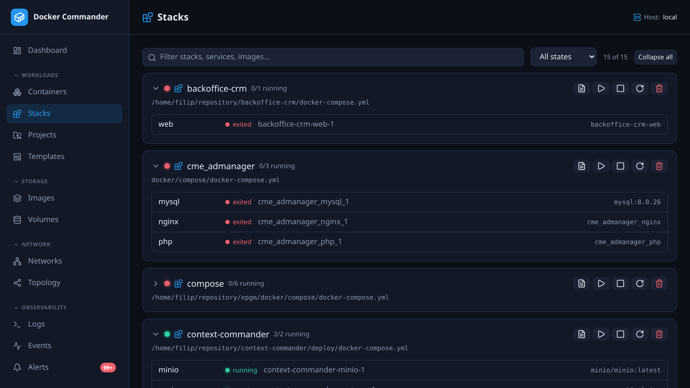

# Stacks

[← Manual index](README.md)

A **stack** is a group of containers that share a Compose project — Docker
Commander discovers them from the standard `com.docker.compose.project` label,
so **stacks started with the `docker compose` CLI on the host show up here too**,
not just ones deployed from a [Project](projects.md).

Each stack card shows a coloured **status LED** — 🟢 all running, 🟡 partially
running or an unhealthy container, 🔴 stopped — its services, and (for
DC-managed projects) a link back to the [Project](projects.md).

## Browsing
- **Filter** by name / service / image, and by state (🟢 running / 🟡 issues /
  🔴 stopped). The filter is remembered per user.
- **Collapse / expand** a stack (or all at once) to keep a long list scannable.
- **Hover** a service to see a floating card with its state, image, full status
  and published ports. Click a container name to open its
  [detail page](containers.md).

## Actions (whole stack)
- **Start / Stop / Restart** — applied to every container in the stack.
- **Remove** — force-removes the stack's containers and its Compose networks;
  named volumes are kept (like `docker compose down`).
- **View compose file** — reads the stack's `compose.yml` from the host (the
  path comes from the `com.docker.compose.project.config_files` label): directly
  for the local daemon, over **SSH** for SSH hosts. Plain-TCP hosts can't reach
  the host filesystem. **Copy** or **download** it from the viewer.

## Editing and redeploying a CLI stack

For a stack the app didn't create, the viewer doubles as an **editor**: change the
YAML, **Save** it back to the host, then **Redeploy** to apply it. Saving and
redeploying are separate steps, so you can leave a half-finished edit on disk
without restarting anything.

**The file is edited where it already lives** — it is *not* copied into a managed
[Project](projects.md). That is deliberate: a compose file's relative paths (bind
mounts, `env_file`, `build.context`, `include`) resolve against the project's
working directory, so moving the file would silently repoint every one of them.
`./nginx.conf` would stop meaning your config and start meaning whatever sits
beside the copy — usually nothing, which deploys an *empty* file rather than
failing loudly. Redeploy therefore runs `docker compose up -d --build` in the
stack's original working directory, exactly where it ran the first time.

`--build` is there because `up` builds a service only when its image is
**missing**: a stack with a `build:` section would otherwise keep running the
image from its first deploy however much its Dockerfile or context changed on the
host, while reporting nothing worse than `Container Running`. It is a no-op for
services that only pull an image.

What that costs, stated plainly:

- **Requires the `containers` section with write.** Read-only grants can view the
  file but not save or redeploy.
- **SSH hosts run `docker compose` on the host itself**, unlike managed Projects
  (where the CLI runs on the Docker Commander machine and only tunnels the API).
  The host therefore needs the Compose plugin installed, and the SSH user needs
  write access to the compose file.
- **Plain-TCP hosts stay read-only** — there is no filesystem to reach. So does a
  stack whose containers carry no `working_dir` label. The viewer says which.
- **`--remove-orphans` is not passed.** Delete a service from the file and its
  container keeps running; Compose warns about it in the output. Removing one
  stays an explicit act.

Safety rails, so an edit can't become an incident:

- The replacement is **validated with `docker compose config` before** anything is
  replaced. A file Compose rejects never reaches the running stack's definition.
- The previous version is kept beside the file as **`<name>.dc-prev`**.
- The new file is moved into place with a rename, so an interrupted write can't
  leave a half-file where a stack's definition used to be, and the original file's
  permissions are preserved.
- The compose file must sit **inside the stack's working directory** — for saving
  *and* for redeploying. The path comes from a container label, i.e. from whoever
  started the container rather than from you, so this bounds what that label can
  steer. Paths that aren't `.yml` / `.yaml` are refused too. To be precise about
  what this does and doesn't buy: setting those labels needs direct Docker API
  access, which is already root-equivalent on that host, so the rule is defence in
  depth rather than a barrier against anything reachable through Docker Commander
  itself.
- The previous version is written with a **rename, never a plain write**. A plain
  write follows a symlink sitting at the destination, so anyone who could create
  files in the stack's directory could have pointed `compose.yml.dc-prev` at, say,
  `/etc/cron.d/` and had the app write through it. The same applies on SSH hosts,
  where the temporary files come from `mktemp`.

## Tips
- A stack you created from a [Project](projects.md) shows a folder icon linking
  straight to its editor; conversely, a Project links to **Open in Stacks**
  (which filters to and expands that stack).
- Managing one stack from both DC and the host `docker compose` CLI can drift —
  prefer managing a given stack from one place.
