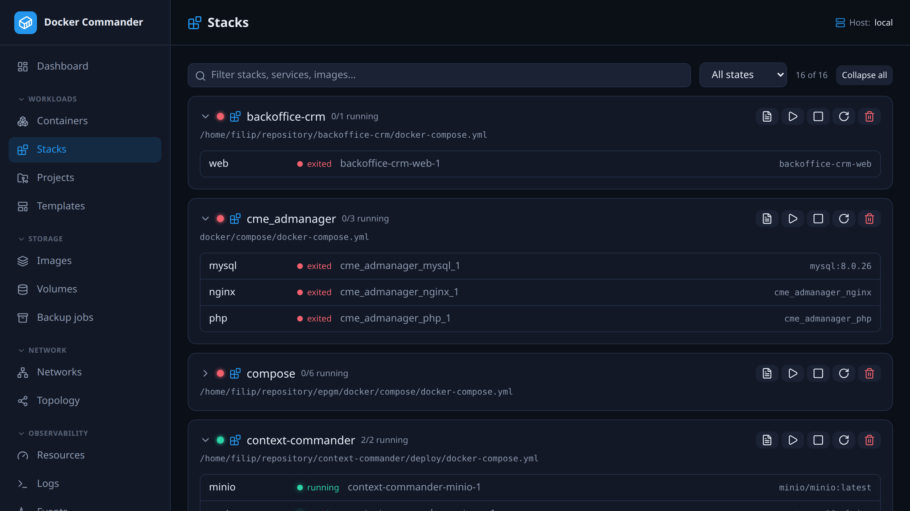

# Stacks

[← Manual index](README.md)

Every Compose stack on the selected host, including stacks started with the
`docker compose` CLI on the host, not just ones deployed from a
[Project](projects.md). To build or change a stack from Docker Commander, use
[Projects](projects.md).

## Common tasks

**Find a stack with a problem.** Set the state filter to **Issues**. A stack is
yellow when only some of its containers run or one of them is unhealthy. Hover a
service to see its full status, then click the container name to open its
[detail page](containers.md).

**Change a stack started from the CLI.** Click **View compose file**, edit it,
click **Save**, then **Redeploy**. Redeploy uses the saved file only, so save
first. Containers whose definition changed are recreated, which means a brief
interruption.

**Undo a bad edit.** The previous version is kept beside the file as
`<name>.dc-prev`. Copy it back on the host, then **Redeploy**.

**Drop a service from a stack.** Delete it from the compose file and redeploy.
Its container keeps running, because redeploy does not remove orphans. Stop or
remove it in [Containers](containers.md).

**Tear a stack down.** Click **Remove**. It removes the containers and the
stack's Compose networks but keeps named volumes, like `docker compose down`.

## Browsing
Each stack card shows its services and a **status light**: green when all
containers run, yellow when only some run or one is unhealthy, red when stopped.

- **Filter** by name, service or image, and by state (running, issues, stopped).
  The filter is remembered per user.
- **Collapse or expand** a stack, or all at once, to keep a long list readable.
- **Hover** a service to see its state, image, full status and published ports.
  Click a container name to open its [detail page](containers.md).
- A stack created from a [Project](projects.md) has a folder icon linking to its
  editor. A Project links back with **Open in Stacks**, which filters to and
  expands that stack.

## Actions (whole stack)

| Action | What it does |
|---|---|
| **Start / Stop / Restart** | Applied to every container in the stack. |
| **Remove** | Force-removes the stack's containers and its Compose networks. Named volumes are kept. |
| **View compose file** | Reads the stack's `compose.yml` from the host. **Copy** or **download** it from the viewer. |

The compose file is read directly for the local daemon and over **SSH** for SSH
hosts. Plain-TCP hosts can't reach the host filesystem.

## Editing and redeploying a CLI stack
For a stack the app didn't create, the viewer is also an **editor**. **Save**
writes the file back to the host. **Redeploy** applies it. They are separate
steps, so you can leave a half-finished edit on disk without restarting anything.

- **The file is edited where it already lives.** It is not copied into a managed
  [Project](projects.md). Redeploy runs `docker compose up -d --build` in the
  stack's original working directory, exactly where it ran the first time.
- **Requires the `containers` section with write.** Read-only grants can view the
  file but not save or redeploy.
- **SSH hosts run `docker compose` on the host itself.** Managed Projects differ:
  there the CLI runs on the Docker Commander machine and only tunnels the API. So
  the host needs the Compose plugin, and the SSH user needs write access to the
  compose file. It also pulls private images with that host's own
  `docker login`: credentials stored under [Registries](registries.md#deploys)
  aren't copied to the host, and the redeploy output says so. On the local daemon
  a redeploy uses them.
- **Plain-TCP hosts stay read-only**, since there is no filesystem to reach. So
  does a stack whose containers carry no `working_dir` label. The viewer says
  which.
- **`--remove-orphans` is not passed.** Delete a service from the file and its
  container keeps running. Compose warns about it in the output. Removing one
  stays an explicit act.

Managing one stack from both Docker Commander and the host's `docker compose`
CLI can drift. Manage a given stack from one place.

### How stacks are found
A stack is any group of containers sharing the `com.docker.compose.project`
label, which `docker compose` sets on everything it creates. The compose file's
path comes from the `com.docker.compose.project.config_files` label.

### Why the file stays in place
A compose file's relative paths (bind mounts, `env_file`, `build.context`,
`include`) resolve against the project's working directory. Moving the file would
silently repoint every one of them. `./nginx.conf` would stop meaning your config
and start meaning whatever sits beside the copy. Usually that is nothing, which
deploys an *empty* file instead of failing loudly.

### Why `--build`
`up` builds a service only when its image is **missing**. Without `--build`, a
stack with a `build:` section would keep running the image from its first deploy,
however much its Dockerfile or context changed on the host, while reporting
nothing worse than `Container Running`. It is a no-op for services that only pull
an image.

### Safety rails
- **Validated first.** The new file is checked with `docker compose config`
  before anything is replaced. A file Compose rejects never reaches the running
  stack's definition.
- **Previous version kept** beside the file as **`<name>.dc-prev`**.
- **Atomic replace.** The new file is moved into place with a rename, so an
  interrupted write can't leave a half-file where the stack's definition used to
  be. The original file's permissions are preserved.
- **Inside the working directory.** The compose file must sit inside the stack's
  working directory, for saving *and* for redeploying. Paths that aren't `.yml` or
  `.yaml` are refused too. The path comes from a container label, so from whoever
  started the container rather than from you, and this rule bounds what that label
  can steer. To be precise: setting those labels needs direct Docker API access,
  which is already root-equivalent on that host. So this is defence in depth, not a
  barrier against anything reachable through Docker Commander itself.
- **No writes through symlinks.** The previous version is written with a rename,
  never a plain write. A plain write follows a symlink sitting at the destination,
  so anyone who could create files in the stack's directory could have pointed
  `compose.yml.dc-prev` at, say, `/etc/cron.d/` and had the app write through it.
  The same applies on SSH hosts, where the temporary files come from `mktemp`.
