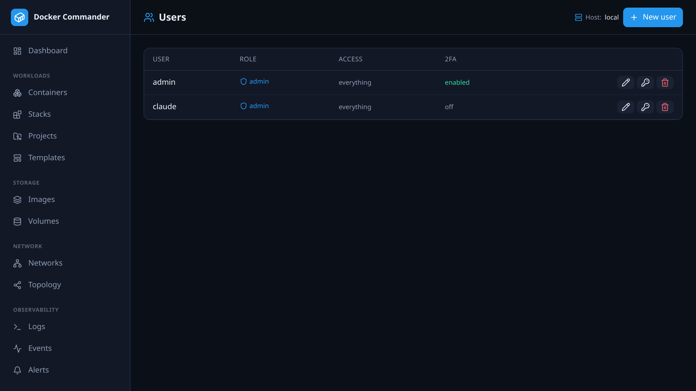

# Users & roles

[← Manual index](README.md)

_Admin only._ Manage accounts and what each can do.

## Roles
- **admin** — full access plus administration (users, settings, all hosts).
- **user** — limited to the **sections** you grant, and optionally **read-only**
  (can view those sections but every mutating action — start/stop, exec, upload,
  delete, create… — is blocked).

## Managing accounts
- **New user** — username, password (min 10 chars), role, read-only flag, and
  for a `user` the **allowed sections** (checkboxes matching the menu).
- **Edit access** — change role / read-only / sections later.
- **Reset password** — set a new password.
- **Delete** — with guards: you can't delete your own account or the last admin,
  and you can't demote the last admin.

## How enforcement works
Permissions are checked on the server for every request: the path maps to a
section, and a non-admin must have that section granted (and write access for
mutating calls). The menu also hides what you can't reach. Globally
[disabled sections](settings.md) are hidden and blocked for everyone.

> LDAP users are provisioned here automatically on first login (as `user`, or
> `admin` if in the configured admin group) — then you grant their sections like
> any other account. See [Settings → LDAP](settings.md).

## Note on the live stream
RBAC is enforced on the REST API **and** on the shared live stats/logs
WebSocket (`/api/ws`): each subscription is authorised per channel, and both the
**stats** and **logs** streams require the **containers** section. A signed-in
user without it can no longer stream a container's data.
