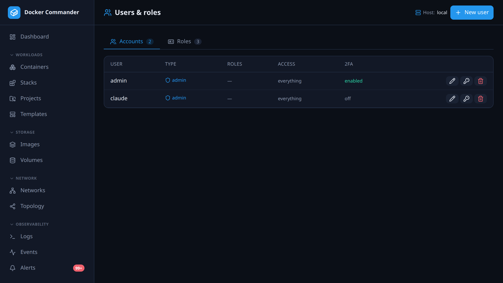

# Users & roles

[← Manual index](README.md)

_Admin only._ Manage accounts and what each can do.

## Account types
- **admin** — full access plus administration (users, roles, settings, all hosts).
- **user** — limited to what you grant, and optionally **read-only** for the whole
  account (can view, but every mutating action — start/stop, exec, upload, delete,
  create… — is blocked).

## Named roles
A **role** is a reusable bundle of section grants, so you don't tick thirteen
checkboxes per account. Each section in a role is either **read-only** or
**writable**, which is finer-grained than the account-level read-only flag.

Two roles ship built in and cannot be edited — **Duplicate** one to make an
editable copy, the same way [project templates](projects.md#managing-templates)
work:

| Role | Grants |
|---|---|
| **Viewer** | Every section, read-only. |
| **Operator** | Day-to-day work — containers, projects, images, volumes, networks, topology, logs, events, alerts — writable. Deliberately **not** hosts, registries or the audit log, which are authority over the installation itself. |

A user can hold several roles, and can still have per-account sections on top.
Their **effective access** is the union, so the more permissive grant wins.

> Only an **admin** can create, edit or assign roles. Anyone able to edit a role
> could widen their own access, so no combination of section grants reaches role
> management.

Manage them on **Users & roles → Roles**. Each card shows the role's grants, how
many accounts hold it, whether it's limited to specific hosts, and whether it's
built-in or yours. The editor sets every
section to **—** (not granted), **read** or **write**, with all thirteen visible at
once. Built-in roles open read-only — use **Duplicate** for an editable copy.

## Managing accounts
- **New user** — username, password (min 10 chars), account type, read-only flag,
  any **roles**, and optionally per-account **sections** (checkboxes matching the
  menu).
- **Edit access** — change type / read-only / roles / sections later. Changes take
  effect on the user's **next request** — nothing is cached in their session, so
  revoking a role is immediate.
- **Reset password** — set a new password.
- **Delete** — with guards: you can't delete your own account or the last admin,
  and you can't demote the last admin.

## Limiting a role to specific hosts
A role can be limited to a set of Docker hosts, so *"may restart containers"* can
mean *"on staging, not production"*. Pick the hosts in the role editor.

- **An empty host list means every host.** That's the backwards-compatible
  default: every role and account keeps exactly the reach it had before scoping
  existed, and a role you create without thinking about hosts isn't silently
  scoped to nothing.
- **The local daemon is always in scope.** Making it scopeable would let a
  single-host install lock itself out of its own Docker.
- **Scope is per grant, and grants union.** Hold *Operator on staging* and
  *Viewer everywhere* and you read everywhere but change only staging. Sections
  granted directly on your account carry no scope — they reach every host, as they
  always did.
- The **read-only flag still caps everything**: being in scope decides *where*,
  not *what*.

Your own profile page shows the resulting reach per section under **Where**.

Scoping **hides as well as blocks**. A host outside your scope doesn't appear in
the host list, its projects aren't listed, its alerts don't reach your feed (nor
the unread badge), its entries don't appear in the audit log, and a container's
metrics history is refused even if you know the container id. The per-host views —
dashboard counts, disk usage, published ports, topology, the events feed — are
each authorized against the host they name.

That holds for objects addressed by **id** as well, not only for views that name a
host: a project, a host record, an alert. Those resolve the host from the record
itself and authorize against it, so knowing an id buys nothing — ids are
sequential, and a record you can't reach answers exactly like one that doesn't
exist. Being able to *see* something and being allowed to *change* it stay
separate, though: a read-only grant on a visible project is told **403**, not 404,
because pretending it vanished would only mislead the person looking at it.

> **The one thing scoping still doesn't cover.** The **alert engine** watches every
> host by design: it is background work with no user context. So if a rule lists
> you as an e-mail recipient, you can receive mail about a host you can't see in
> the app. That's a property of how you configure recipients, not something the
> app decides per viewer — set the rule's recipients accordingly.

## How enforcement works
Permissions are checked on the server for every request: the path maps to a
section, and a non-admin must have that section granted — with **write** access
for mutating calls. The menu also hides what you can't reach. Globally
[disabled sections](settings.md) are hidden and blocked for everyone.

The order the rules apply in, which matters when they disagree:

1. **admin** bypasses section, read-only and host checks.
2. Grants are the **union** of the account's roles and its own section list.
3. The account-level **read-only flag caps everything** to reads — a writable role
   cannot lift it.
4. An app-wide **disabled section** is removed last, so a role can never re-enable
   a feature an admin turned off.
5. The **host scope** of the grant is checked last of all: the right section on the
   wrong host is a 403.

> LDAP users are provisioned here automatically on first login (as `user`, or
> `admin` if in the configured admin group). Grant them access by hand, or let
> the directory decide with **group mappings** — see below.

## Roles from LDAP groups
A group mapping in [Settings → LDAP](settings.md) grants **roles** (and, for older
configs, raw sections) to members of an LDAP group, matched on the group's full DN.
A user's access is the union over every mapped group they belong to, re-derived on
**each login**, so moving someone between groups in the directory takes effect the
next time they sign in — including having a role taken away.

Two things it deliberately cannot do:

- **It cannot make anyone an admin.** Only the configured *admin group DN* does
  that. A role cannot contain role management either, so no mapping — however
  generous — hands out the keys.
- **It cannot lock anyone out by referencing a deleted role.** A stale role id in
  a mapping simply grants nothing — or the **fallback role**, if you set one.

### The fallback role
Pick one in *Settings → LDAP*. It's granted **in place of a mapped role that no
longer exists**, so deleting a role degrades its members to a known baseline
(**Viewer** is the obvious choice) instead of quietly leaving them with no access
at all. The two built-in roles can't be deleted, and the role you nominate as the
fallback can't be deleted either while it holds that job — point the fallback
somewhere else first.

It deliberately does **not** apply to a user whose groups map to no role at all.
That's the ordinary "not entitled" case, and granting a baseline there would hand a
role to every account in the directory that can authenticate. The fallback covers a
*broken* mapping, not an *absent* one. It also doesn't stack on top of a mapping
that resolves fine.

Whether the directory is authoritative for roles depends on whether you use them:

| Your mappings | What a login does |
|---|---|
| No mapping grants a role | Roles assigned by hand on the account are left alone |
| Any mapping grants a role | Roles are replaced by what the groups grant — hand-assigned ones are dropped |

That's so upgrading doesn't quietly strip roles from installs whose mappings were
written before roles existed. Once you map a role anywhere, assign roles in the
directory rather than per account. **Sections** work the other way round and always
have: as soon as *any* mapping exists, group membership is authoritative for a
non-admin's sections and manual edits are overwritten on the next login.

## Note on the live stream
RBAC is enforced on the REST API **and** on the shared live stats/logs
WebSocket (`/api/ws`): each subscription is authorised per **channel and host**,
and both the **stats** and **logs** streams require the **containers** section.
A subscribe frame names its own host, so streaming a container on a host outside
your scope is refused there too. A signed-in
user without it can no longer stream a container's data.

## Your own profile
Every signed-in user has a **profile page** (the person icon beside *Sign out*),
regardless of permissions:

- **Account** — username, account type, whether you sign in locally or through
  LDAP, when the account was created and last used, and your **alert e-mail**.
- **Security** — your **authenticators** and what is signed in as you.

  You can pair **as many authenticators as you like** — a phone and a tablet, or a
  new phone before you wipe the old one — and each is listed by a name you choose,
  with when it was added and when it last produced a code. Adding one leaves
  everything already paired working; there is no "replace".

  Pairing and removing both ask for your **password**. Both change what it takes to
  sign in as you, so a session on its own must not be enough: otherwise anyone who
  got hold of one could pair their own device, or strip yours one at a time. A
  first-time setup doesn't ask, because there is nothing yet to protect.

  **The last one cannot be removed.** 2FA is mandatory here, so an account with no
  authenticator could not sign in at all, and no admin can reset it for you. Pair
  the replacement first, then remove the old one.

  Replacing a lost device is therefore two steps: pair the new one, then remove the
  old entry. Pairing does not revoke anything on its own — which is the point, but
  it does mean the old device keeps working until you say otherwise.

  **Passkeys** are the other kind of second factor. *Add a passkey* uses whatever
  this device already has — a fingerprint, a face, a PIN, or a plugged-in security
  key — and the private key never leaves that device's secure hardware. Two things
  make it stronger than a code: there is nothing to type, so nothing to read out to
  someone on the phone, and the signature is bound to this site's address, so a page
  that looks exactly like this one cannot use what it captures.

  Passkeys need a **secure context**, which is the browser's rule, not ours: HTTPS,
  or `localhost`. They also need a **hostname** — an IP address cannot be a passkey's
  relying party, so `http://127.0.0.1:8470/` will not offer them even though it is a
  secure context; use `http://localhost:8470/` instead. Where they are unavailable
  the button says why rather than failing when you press it. See
  [Deployment](deployment.md) for TLS.

  **Reach the app by one hostname.** A passkey is bound to the name you paired it
  under, and the browser will only offer it back under that same name. Capitalisation
  does not matter, but a trailing dot does: `dc.example.com.` is a different name to
  the browser than `dc.example.com`, so a key paired under one will not be offered
  under the other. Pick one spelling and stay with it.

  **Signing in with a passkey alone** is off until you turn it on, in *Profile →
  Security*, and turning it on asks for your password. It works when the passkey can
  verify *you* — a PIN, a fingerprint, a face — because that is what makes the key
  two factors rather than one; a passkey that only proves possession is refused and
  says so.

  Worth knowing before you turn it on: if your passkey **syncs** between your devices
  (iCloud Keychain, Google Password Manager), the PIN or fingerprint can be satisfied
  on any device it reaches — so your account rests on that platform account too. Your
  password still works and always will: it is what gets you back in if the key is
  lost, since no admin can reset another account's second factor. LDAP accounts sign
  in with their directory password.

  Starting a passkey sign-in is rate limited per address, so repeatedly opening and
  cancelling the browser prompt will eventually ask you to wait a few minutes. Your
  password is unaffected — it has its own budget.

  A passkey counts as a second factor like any other: it appears in the same list,
  it can be removed the same way, and it cannot be the one you remove last. At
  sign-in you get whichever of the two your account actually has — the code box,
  the passkey button, or both.

  An account can hold ten authenticators and passkeys in total.

  Repeated wrong passwords on these actions are rate limited per **sign-in session**,
  so a device that has been fumbling cannot stop you doing the same thing from
  another one. When that limit is hit the app says so, rather than claiming the
  password was wrong.

  Starting a pairing is always safe: nothing changes until you enter a code from
  the new device, so cancelling leaves things exactly as they were.

  It also lists **what is signed in as you** — every browser and device holding a
  live session, named (*Firefox on Linux*, *Safari on iPhone*, *curl*) with the
  address it last came from, when it was last used and when it signed in. The one
  you are using is marked *this device*. Any row can be signed out, and **Sign out
  everywhere else** ends all the others in one go. Signing out the current row
  simply signs you out here.

  Only you see this list, and only for your own account: an admin view of
  everyone's sessions would be a record of when each person works and from where.
  The address and the device name are recognition aids — both are ultimately what
  the client claims, and the name is our reading of it — so treat them as "does
  this look like me?", not as proof. A client we cannot place is shown exactly as
  it identified itself.

  If something there is not you, sign it out **and change your password**: that
  ends every session at once, including the one you didn't spot.

  **Locked out entirely?** If you are the only admin and the password is gone,
  `dockercmd --reset-password <user>` sets a new one from the machine the instance
  runs on. It asks for the password at the terminal, ends every session for that
  account, and leaves the second factor in place — you will still be asked for your
  code or passkey. It needs access to the data directory, which is already
  equivalent to being an admin, so it grants nothing that access did not.
- **Access** — the roles you hold, plus every section you can reach (**You can**),
  on which hosts (**Where**) and which role granted it (**Granted by**). Handy for
  answering "why can I see this?" — or "why can't I?" — without an admin.
- **Preferences** — per-account UI settings that follow you across browsers.
  Today: whether alerts **pop up as a toast** while you have the app open. Turning
  that off changes nothing about the alerts themselves — still recorded, still
  counted in the sidebar badge, still delivered by webhook and e-mail.

It reads only your own account.
