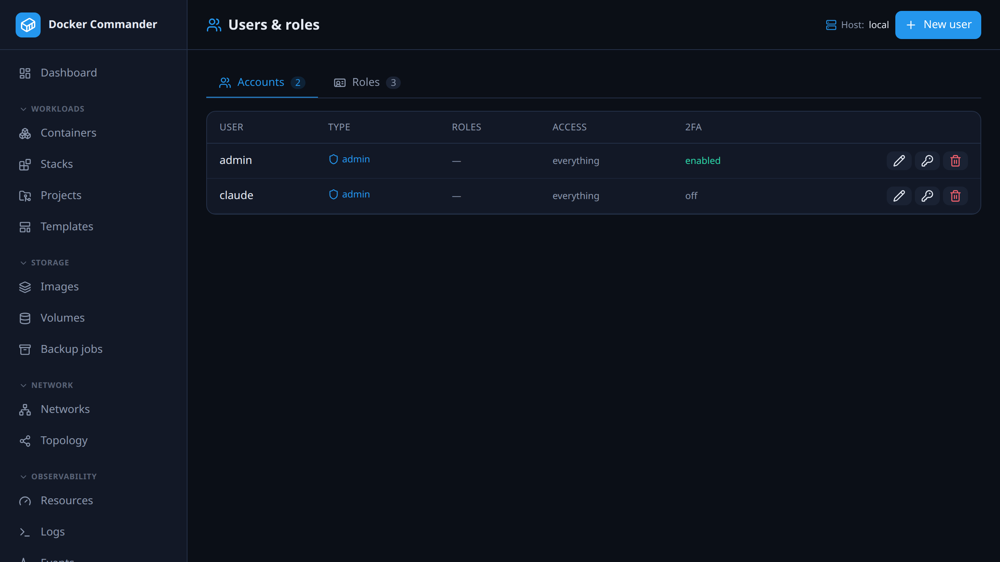

# Users & roles

[← Manual index](README.md)

_Admin only._ Create accounts and decide what each one can do, on which hosts.
To see your own access or manage your own sign-in, use [Your profile](profile.md).

## Common tasks

**Give a colleague read-only access to one host's containers.** On **Roles**,
click **New role**, set **Containers** to **read** and pick that host under
**Hosts**. Then create the user on **Accounts** and assign the role. Don't also
tick Containers among the account's own sections: those carry no host scope and
would reach every host.

**Make a role that is almost Operator.** Built-in roles can't be edited. Click
**Duplicate** on **Operator**, then change the copy. Members of the original are
not affected.

**Take access away now.** Use **Edit access** to remove the role or section.
It applies on the user's next request, because nothing is cached in their
session.

**Make someone read-only everywhere.** Tick the account's **read-only** flag. It
caps every grant to reads, and no writable role can lift it.

**Reset a forgotten password.** Use **Reset password**. It also signs the user
out of every session. Their second factor stays as it is: no admin can reset
another account's 2FA, so they still need their authenticator or passkey.

**Let the directory decide access.** Map LDAP groups to roles in
[Settings → LDAP](settings.md). See [Roles from LDAP groups](#roles-from-ldap-groups).

## Account types

| Type | Access |
|---|---|
| **admin** | Everything, plus administration: users, roles, settings, all hosts. |
| **user** | Only what you grant. Can be marked **read-only** for the whole account: it can view, but every change (start/stop, exec, upload, delete, create…) is blocked. |

## Managing accounts

- **New user**: username, password (at least 10 characters), account type,
  read-only flag, any **roles**, and optional per-account **sections**
  (checkboxes matching the menu).
- **Edit access**: change type, read-only, roles or sections later. Revoking a
  role is immediate.
- **Reset password**: set a new password. All of the user's sessions end.
- **Delete**: you can't delete your own account or the last admin. You also
  can't demote the last admin.

## Roles

A **role** is a reusable set of section grants, so you don't tick fourteen
checkboxes per account. Each section in a role is **read-only** or **writable**,
which is finer than the account-level read-only flag.

Two roles are built in. They can't be edited; **Duplicate** one to get an
editable copy, as with [project templates](projects.md#managing-templates).

| Role | Grants |
|---|---|
| **Viewer** | Every section, read-only. |
| **Operator** | Day-to-day work, writable: containers, projects, images, volumes, networks, topology, logs, events, alerts, diagnostics. Not hosts, registries or the audit log. Those are authority over the installation itself. |

> **Write access to Containers or Projects is full trust in the server.** Access
> to a Docker daemon is equivalent to root on its machine: whoever can start a
> container or deploy a project can run a privileged one and read that machine's
> files. The local daemon is in every role's reach, even a role limited to other
> hosts, so on a typical install this includes the Docker Commander server
> itself, its data dir and encryption key. Give these grants only to people you
> would give root on the server.

Manage roles on the **Roles** tab. Each card shows the role's grants, how many
accounts hold it, whether it is limited to specific hosts, and whether it is
built in or yours. The editor shows all fourteen sections, each set to **—**
(not granted), **read** or **write**. Built-in roles open read-only.

A user can hold several roles and still have per-account sections on top. The
**effective access** is the union, so the more permissive grant wins.

> Only an **admin** can create, edit or assign roles. Anyone who could edit a role
> could widen their own access, so no combination of section grants reaches role
> management.

## Limiting a role to specific hosts

A role can be limited to a set of Docker hosts. Then *"may restart containers"*
can mean *"on staging, not production"*. Pick the hosts in the role editor.

- **An empty host list means every host.** Existing roles and accounts keep the
  reach they had before scoping existed, and a new role isn't silently scoped to
  nothing.
- **The local daemon is always in scope.** Otherwise a single-host install could
  lock itself out of its own Docker.
- **Scope is per grant, and grants combine.** With *Operator on staging* and
  *Viewer everywhere*, you read everywhere but change only staging. Sections
  granted directly on the account have no scope and reach every host.
- **The read-only flag still caps everything.** Scope decides *where*, not *what*.

The user's [profile](profile.md) shows the resulting reach per section under
**Where**.

Scoping **hides as well as blocks**. A host outside your scope doesn't appear in
the host list. Its projects aren't listed, its alerts don't reach your feed or
the unread badge, and its entries don't appear in the audit log. A container's
metrics history is refused even if you know the container id. Per-host views
(dashboard counts, disk usage, published ports, topology, the events feed) are
each checked against the host they name.

## Roles from LDAP groups

A group mapping in [Settings → LDAP](settings.md) grants **roles** to members of
an LDAP group, matched on the group's full DN. Older configs may also grant raw
sections. A user's access is the union over every mapped group they belong to.
It is recalculated on **each login**, so a group change in the directory applies
the next time they sign in. That includes a role being taken away.

What a mapping cannot do:

- **Make anyone an admin.** Only the configured *admin group DN* does that. A
  role can't contain role management either, so no mapping hands out the keys.
- **Lock anyone out by referencing a deleted role.** A stale role id grants
  nothing, or the **fallback role** if you set one.

### The fallback role

Pick one in *Settings → LDAP*. It is granted **in place of a mapped role that no
longer exists**. Deleting a role then drops its members to a known baseline
(**Viewer** is the obvious choice) instead of leaving them with no access.

- It does **not** apply to a user whose groups map to no role at all. That is the
  normal "not entitled" case, and a baseline there would give a role to every
  account in the directory that can sign in. The fallback covers a *broken*
  mapping, not an *absent* one.
- It doesn't stack on top of a mapping that resolves fine.
- The built-in roles can't be deleted. Neither can the role currently set as the
  fallback; point the fallback elsewhere first.

Whether the directory owns roles depends on whether your mappings use them:

| Your mappings | What a login does |
|---|---|
| No mapping grants a role | Roles assigned by hand on the account are left alone. |
| Any mapping grants a role | Roles are replaced by what the groups grant. Hand-assigned ones are dropped. |

This keeps an upgrade from stripping roles on installs whose mappings predate
roles. Once you map a role anywhere, assign roles in the directory, not per
account. **Sections** work differently: as soon as *any* mapping exists, group
membership decides a non-admin's sections, and manual edits are overwritten on
the next login.

> LDAP users are created here automatically on first login, as `user`, or
> `admin` if they are in the admin group. Grant access by hand, or use group
> mappings.

### Technical notes

**Where it is enforced.** Every request is checked on the server. The path maps
to a section, and a non-admin must hold that section, with **write** access for
changes. The menu hides what you can't reach. Sections an admin
[disabled](settings.md) app-wide are hidden from everyone's menu and blocked
for everyone except admins.

**Order of rules**, which matters when they disagree:

1. **admin** bypasses section, read-only and host checks.
2. Grants are the **union** of the account's roles and its own sections.
3. The account's **read-only flag** caps everything to reads. A writable role
   can't lift it.
4. An app-wide **disabled section** is removed next, so a role can't re-enable a
   feature an admin turned off.
5. The grant's **host scope** is checked last. The right section on the wrong
   host is a 403.

**Records addressed by id.** A project, a host record or an alert is checked
against the host stored in the record itself. Ids are sequential, so knowing one
buys nothing: a record you can't reach answers exactly like one that doesn't
exist. Seeing and changing stay separate, though. A read-only grant on a project
you can see gets **403**, not 404, because pretending it vanished would only
mislead you.

**Live stream.** The live stats/logs WebSocket (`/api/ws`) is checked per
**channel and host**. Both the **stats** and **logs** streams need the
**containers** section. Each subscribe message names its host, so streaming a
container on a host outside your scope is refused there too.

**What scoping doesn't cover: alert e-mail.** The alert engine watches every
host by design. It is background work with no user attached. If a rule lists you
as an e-mail recipient, you can get mail about a host you can't see in the app.
Choose each rule's recipients with that in mind.
