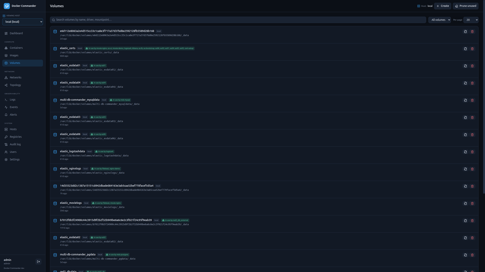

# Volumes

[← Manual index](README.md)

List volumes with driver, scope and mountpoint. Each volume shows **which
containers mount it** (cross-referenced from container mounts) so you know what
you'd affect before removing one. Filter by **in use / unused / all**, search
and paginate as elsewhere.

## Actions
- **Create** — a named volume with an optional driver (defaults to `local`).
  You can optionally **seed** the new volume by extracting an archive
  (`.zip` / `.tar` / `.tar.gz`) into it.
- **Browse files** — see below.
- **Inspect** — raw JSON (driver options, labels, mountpoint…).
- **Remove** — delete a volume; a **force** fallback appears if the daemon
  refuses it (e.g. still referenced). The daemon will not remove a volume that
  is actively mounted by a running container.
- **Prune unused** (header) — remove all volumes not used by any container.

## File browser
A named volume has no path reachable through the Docker API, so **Browse files**
runs a tiny throwaway helper container with the volume mounted and reuses the
in-container file operations against it (so it works on local / TCP / SSH hosts):

- **Navigate** directories and **create** new folders.
- **Upload** files, or **upload & extract** an archive (`.zip` / `.tar` /
  `.tar.gz`) into the current directory.
- **Download** a file (binary-safe) and **delete** files/folders.

The helper container is hidden from the Containers view and reaped automatically
(on close, at startup, and after a TTL), so it never clutters the host.

## Tips
- A volume marked **in use by …** is mounted by those containers — stop/remove
  them first, or use the volume inspector to understand the dependency.
- Reclaimable volume space is summarised on the [Dashboard](dashboard.md).
