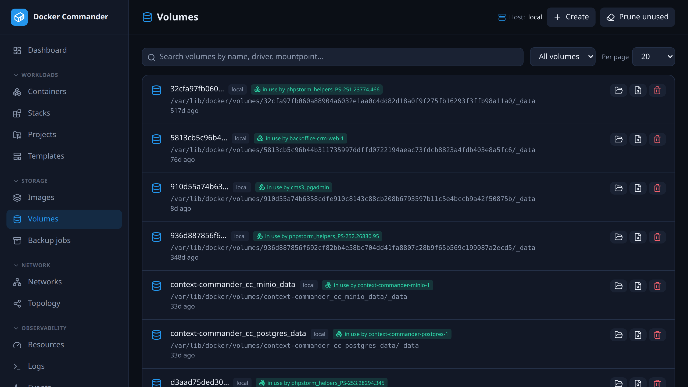

# Volumes

[← Manual index](README.md)

The volumes on the selected host, which containers use them, and what's inside.
The [Dashboard](dashboard.md) shows their total size;
[Resources → Disk](resources.md#disk) shows each one and what a prune would free.

## Common tasks

**Look inside a volume.** Click **Browse files**. You can open folders, download
files and upload new ones without starting a container yourself.

**Create a volume with data already in it.** Click **Create** and pick a `.zip`,
`.tar` or `.tar.gz` under **Seed from archive**. It is extracted into the new
volume.

**Remove a volume that's still in use.** Check **in use by …** on its row, or
**Inspect** the volume to understand the dependency. Stop and remove those
containers first. Force does not help here: the daemon refuses
an in-use volume either way.

**Clean up leftovers.** Click **Prune unused** to delete every volume no
container uses. This deletes their data permanently, so check the **Unused**
filter first.

**Check a volume's backup.** Admins see a **backup: ok**, **failed** or **never
run** badge on a volume that has a single-volume [backup job](backup-jobs.md) on
this host. Hover a **failed** badge for the error.

## The list
Each volume shows its driver, mountpoint and age, and **which containers mount
it**. That way you know what you'd affect before removing one. Filter by **In
use**, **Unused** or **All volumes**, search and paginate as elsewhere.

| Action | What it does |
|---|---|
| **Create** | A named volume with an optional driver (default `local`). Optionally **seed** it by extracting a `.zip`, `.tar` or `.tar.gz` into it. |
| **Browse files** | Opens the [file browser](#file-browser). |
| **Inspect** | Docker's raw JSON: driver options, labels, mountpoint. |
| **Remove** | Deletes the volume. If the daemon refuses, a **Force remove** button appears. |
| **Prune unused** (header) | Removes every volume not used by any container. |

**What force is for.** It is not a way past "volume is in use": the daemon
rejects that immediately, with or without force. It helps with a volume whose
last container has just gone away. Teardown is asynchronous, so a removal can fail
a moment before it would have succeeded.

## File browser
- **Navigate** directories and **create** folders.
- **Upload** one file at a time, or **Extract** an archive (`.zip`, `.tar`,
  `.tar.gz`) into the current directory.
- **Download** a file (binary-safe), or the current folder as `.tar` with
  **Dir**, and **delete** files and folders.

Uploads follow the same [limits](limits.md#uploads-and-files) as container files.
Read-only access to Volumes lists files but can't download, upload or delete
them.

### How it works
A named volume has no path reachable through the Docker API. So **Browse files**
runs a tiny throwaway helper container with the volume mounted, and uses the same
in-container file operations as the container Files tab. That's why it works on
local, TCP and SSH hosts.

The helper is hidden from the Containers view and removed automatically: when you
close the browser, at startup (local host only), and once it is over 2 hours old,
the next time a volume browser opens on that host. A helper left on a remote host
stays until then.
